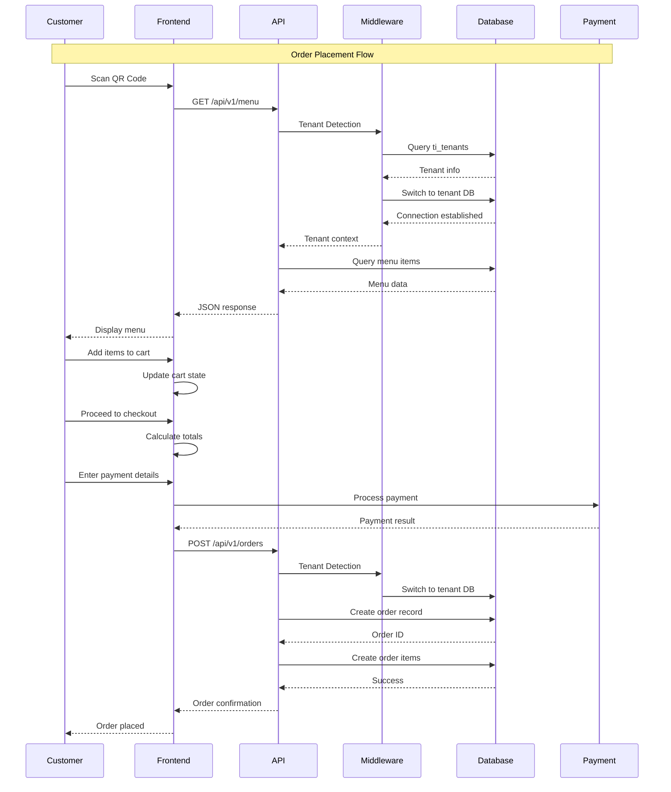
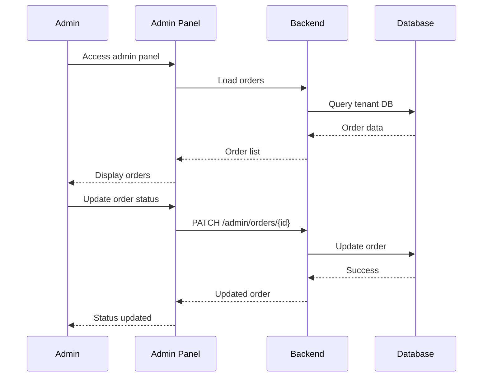
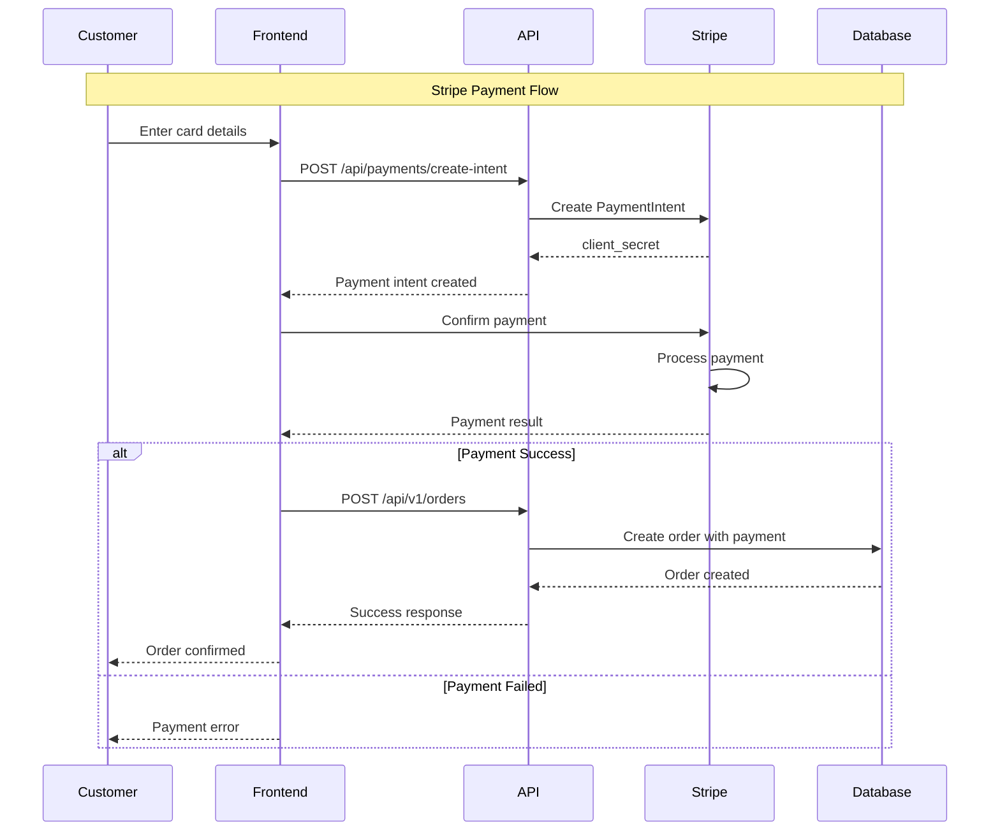
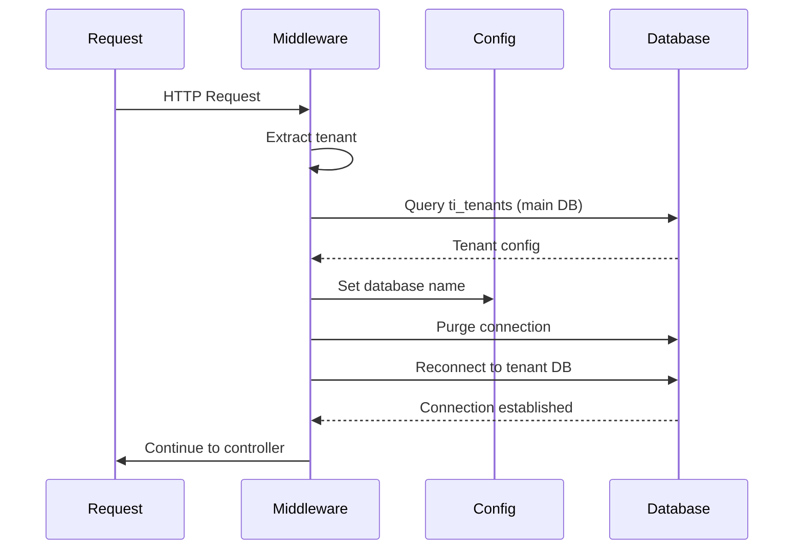

# Architecture and Tenancy

**System architecture, multi-tenant design, and cross-layer data flow** for the PayMyDine restaurant ordering system. This document consolidates high-level architecture, tenant detection, database switching, and security isolation patterns.

## 📋 System Overview

PayMyDine is a **multi-tenant restaurant ordering system** built on:
- **Backend**: TastyIgniter v3 (Laravel 8.x) with custom multi-tenant middleware
- **Frontend**: Next.js 15.2.4 with TypeScript and Tailwind CSS
- **Database**: MySQL 8.0 with database-per-tenant isolation
- **Payments**: Stripe, PayPal, Apple Pay, Google Pay integration

## 🏗️ High-Level Architecture

### System Components
```
┌─────────────────┐    ┌─────────────────┐    ┌─────────────────┐
│   Frontend      │    │   Backend       │    │   Database      │
│   (Next.js)     │◄──►│   (Laravel)     │◄──►│   (MySQL)       │
│                 │    │                 │    │                 │
│ • QR Scanner    │    │ • API Routes    │    │ • Multi-tenant  │
│ • Order Flow    │    │ • Admin Panel   │    │ • Tenant DBs    │
│ • Payment UI    │    │ • Middleware    │    │ • Shared Tables │
└─────────────────┘    └─────────────────┘    └─────────────────┘
```

### Core Modules
- **Admin Module**: Restaurant management interface ↩︎ [app/admin/]
- **Main Module**: Customer-facing functionality ↩︎ [app/main/]
- **System Module**: Core framework components ↩︎ [app/system/]

### Key Services
- **PaymentGateways**: Payment processing management ↩︎ [app/admin/classes/PaymentGateways.php:1-50]
- **BasePaymentGateway**: Payment gateway base class ↩︎ [app/admin/classes/BasePaymentGateway.php:1-50]
- **TenantDatabaseMiddleware**: Multi-tenant database switching ↩︎ [app/Http/Middleware/TenantDatabaseMiddleware.php:1-48]

## 🔄 Cross-Layer Flow Diagrams

### Customer Order Flow


### Admin Management Flow


### Payment Processing Flow


## 🏢 Multi-Tenant Architecture

### Tenant Detection Process
1. **Subdomain Extraction**: From HTTP host header ↩︎ [app/Http/Middleware/TenantDatabaseMiddleware.php:14-48]
2. **Database Lookup**: Query `ti_tenants` table for tenant info ↩︎ [app/Http/Middleware/TenantDatabaseMiddleware.php:19-22]
3. **Connection Switch**: Dynamic database connection changes ↩︎ [app/Http/Middleware/TenantDatabaseMiddleware.php:25-30]

### Subdomain Format
- **Pattern**: `{tenant}.paymydine.com`
- **Examples**: 
  - `restaurant1.paymydine.com`
  - `mypizza.paymydine.com`
  - `cafe123.paymydine.com`

### Domain Extraction Logic
```php
private function extractTenantFromDomain(Request $request)
{
    $hostname = $request->getHost();
    // Extract subdomain logic
}
```
↩︎ [app/Http/Middleware/TenantDatabaseMiddleware.php:46-48]

## 🗄️ Database Switching Mechanism

### 1. Tenant Detection
```php
// Get tenant from domain
$tenant = $this->extractTenantFromDomain($request);

if ($tenant) {
    // Find tenant in main database
    $tenantInfo = DB::connection('mysql')->table('ti_tenants')
        ->where('domain', $tenant . '.paymydine.com')
        ->where('status', 'active')
        ->first();
```
↩︎ [app/Http/Middleware/TenantDatabaseMiddleware.php:14-22]

### 2. Configuration Update
```php
if ($tenantInfo) {
    // Switch to tenant database
    Config::set('database.connections.mysql.database', $tenantInfo->database);
    
    // Reconnect with new database
    DB::purge('mysql');
    DB::reconnect('mysql');
    
    // Store tenant info in request for later use
    $request->attributes->set('tenant', $tenantInfo);
}
```
↩︎ [app/Http/Middleware/TenantDatabaseMiddleware.php:24-33]

### Connection Lifecycle


## 🔒 Tenant Isolation and Security

### Database Isolation
- **Per-tenant databases**: Each restaurant has isolated data
- **Shared tenant table**: `ti_tenants` for tenant management ↩︎ [db/paymydine.sql:2494-2530]
- **Middleware enforcement**: All requests go through tenant detection

### Tenant Database Schema
```sql
CREATE TABLE `ti_tenants` (
  `id` int NOT NULL AUTO_INCREMENT,
  `name` varchar(255) NOT NULL,
  `domain` varchar(255) NOT NULL,
  `database` varchar(255) NOT NULL,
  `email` varchar(255) NOT NULL,
  `phone` varchar(20) NOT NULL,
  `start` date NOT NULL,
  `end` date NOT NULL,
  `type` varchar(255) DEFAULT NULL,
  `country` varchar(255) NOT NULL,
  `description` varchar(1000) NOT NULL,
  `status` varchar(255) NOT NULL,
  `created_at` timestamp NULL DEFAULT CURRENT_TIMESTAMP,
  `updated_at` timestamp NULL DEFAULT CURRENT_TIMESTAMP ON UPDATE CURRENT_TIMESTAMP,
  PRIMARY KEY (`id`),
  UNIQUE KEY `unique_domain` (`domain`(191)),
  UNIQUE KEY `unique_database` (`database`(191))
) ENGINE=MyISAM AUTO_INCREMENT=24 DEFAULT CHARSET=utf8mb4;
```
↩︎ [db/paymydine.sql:2494-2530]

### Security Risks and Validation

#### Critical Security Risks
1. **Cross-Tenant Data Access**
   - **Risk**: Accidental access to other tenant's data through shared connections
   - **Evidence**: Database switching happens at runtime, but no validation that queries are properly isolated ↩︎ [app/Http/Middleware/TenantDatabaseMiddleware.php:24-30]
   - **Mitigation**: Verify all queries use tenant-specific database

2. **Tenant Configuration Bypass**
   - **Risk**: Routes that bypass tenant middleware could access wrong tenant data
   - **Evidence**: Some routes explicitly bypass tenant middleware ↩︎ [app/admin/routes.php:200-203]
   - **Mitigation**: Audit all routes that bypass tenant middleware

3. **Database Connection Leakage**
   - **Risk**: Database connections not properly purged could leak tenant data
   - **Evidence**: Connection purging happens but no validation of cleanup ↩︎ [app/Http/Middleware/TenantDatabaseMiddleware.php:28-29]
   - **Mitigation**: Implement connection cleanup validation

#### Isolation Validation Tests
```php
// Test that tenant A cannot access tenant B's data
public function testTenantDataIsolation()
{
    // Create tenant A with orders
    $tenantA = $this->createTenant('restaurant-a');
    $orderA = $this->createOrder($tenantA, 'Order A');
    
    // Create tenant B with orders
    $tenantB = $this->createTenant('restaurant-b');
    $orderB = $this->createOrder($tenantB, 'Order B');
    
    // Switch to tenant A
    $this->switchToTenant($tenantA);
    
    // Verify tenant A cannot see tenant B's orders
    $orders = Order::all();
    $this->assertCount(1, $orders);
    $this->assertEquals('Order A', $orders->first()->name);
    
    // Verify tenant A cannot access tenant B's order by ID
    $this->assertNull(Order::find($orderB->id));
}
```

## 🚀 Deployment Architecture

### Development
- **Frontend**: `localhost:3000` (Next.js dev server)
- **Backend**: `localhost:8000` (Laravel dev server)
- **Database**: `localhost:3306` (MySQL)

### Production
- **Multi-tenant**: Subdomain-based routing
- **Load Balancing**: Multiple tenant instances
- **Database**: Separate databases per tenant
- **CDN**: Static asset delivery

## 🔍 Known Issues

### Critical Issues
1. **Missing Authentication**: API endpoints lack authentication ↩︎ [routes/api.php:1-207]
2. **No Rate Limiting**: Endpoints vulnerable to abuse
3. **Missing Transactions**: Order creation not wrapped in transactions ↩︎ [app/admin/routes.php:248-405]
4. **Race Conditions**: Order ID generation using `max() + 1` ↩︎ [app/admin/routes.php:248-405]

### Performance Issues
1. **No Caching**: Menu data fetched on every request
2. **Complex Queries**: Multiple joins without optimization ↩︎ [app/admin/routes.php:23-62]
3. **No Pagination**: Large datasets not paginated

## 📚 Related Documentation

- **Database**: [02-database-and-backend.md](02-database-and-backend.md) - Database design and relationships
- **Admin Panel**: [03-admin-and-frontend.md](03-admin-and-frontend.md) - Admin panel and frontend architecture
- **Operations**: [04-ops-quality-roadmap.md](04-ops-quality-roadmap.md) - Deployment and quality management