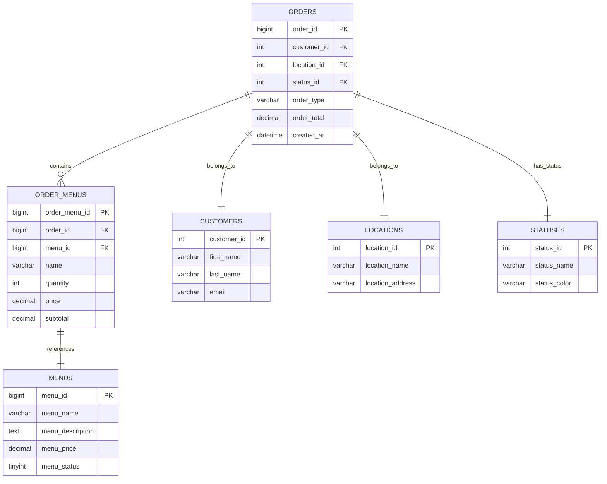
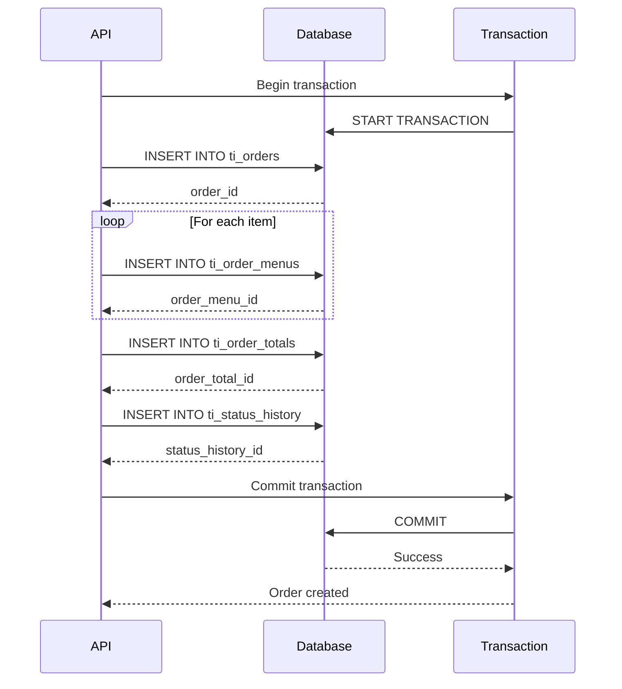

# Database and Backend

**Database schema, backend architecture, API endpoints, and data management** for the PayMyDine system. This document consolidates database design, backend services, API specifications, and data flow patterns.

## 📋 Database Overview

PayMyDine uses **MySQL 8.0** with **database-per-tenant** multi-tenancy:
- **Main Database**: Shared tenant registry and system data
- **Tenant Databases**: Isolated data per restaurant
- **Schema**: TastyIgniter-based restaurant management schema
- **Isolation**: Complete data separation between tenants

## 🗄️ Database Schema and ERD

### Multi-Tenant Structure
```
Main Database (paymydine)
├── ti_tenants (tenant registry)
├── ti_users (system users)
└── ti_settings (global settings)

Tenant Database (restaurant-specific)
├── ti_orders (restaurant orders)
├── ti_menus (restaurant menu)
├── ti_tables (restaurant tables)
├── ti_customers (restaurant customers)
└── ti_locations (restaurant locations)
```

### Core Entities

#### Orders
```sql
CREATE TABLE `ti_orders` (
  `order_id` bigint unsigned NOT NULL AUTO_INCREMENT,
  `customer_id` int DEFAULT NULL,
  `first_name` varchar(128) NOT NULL,
  `last_name` varchar(128) NOT NULL,
  `email` varchar(96) NOT NULL,
  `telephone` varchar(128) NOT NULL,
  `location_id` int NOT NULL,
  `address_id` int DEFAULT NULL,
  `cart` text NOT NULL,
  `total_items` int NOT NULL,
  `comment` text,
  `payment` varchar(128) NOT NULL,
  `order_type` varchar(128) NOT NULL,
  `created_at` datetime NOT NULL,
  `updated_at` datetime NOT NULL,
  `order_time` time NOT NULL,
  `order_date` date NOT NULL,
  `order_total` decimal(15,4) DEFAULT NULL,
  `status_id` int NOT NULL,
  `ip_address` varchar(40) NOT NULL,
  `user_agent` varchar(128) NOT NULL,
  `assignee_id` int DEFAULT NULL,
  `assignee_group_id` int unsigned DEFAULT NULL,
  `invoice_prefix` varchar(128) DEFAULT NULL,
  `invoice_date` datetime DEFAULT NULL,
  `hash` varchar(40) DEFAULT NULL,
  `processed` tinyint(1) DEFAULT NULL,
  `status_updated_at` datetime DEFAULT NULL,
  `assignee_updated_at` datetime DEFAULT NULL,
  `order_time_is_asap` tinyint(1) NOT NULL DEFAULT '0',
  `delivery_comment` text,
  `ms_order_type` varchar(255) NOT NULL DEFAULT '',
  PRIMARY KEY (`order_id`),
  KEY `ti_orders_hash_index` (`hash`)
) ENGINE=InnoDB AUTO_INCREMENT=190 DEFAULT CHARSET=utf8mb4;
```
↩︎ [db/paymydine.sql:1814-1900]

#### Order Items
```sql
CREATE TABLE `ti_order_menus` (
  `order_menu_id` bigint unsigned NOT NULL AUTO_INCREMENT,
  `order_id` bigint unsigned NOT NULL,
  `menu_id` bigint unsigned NOT NULL,
  `name` varchar(128) NOT NULL,
  `quantity` int NOT NULL,
  `price` decimal(15,4) NOT NULL,
  `subtotal` decimal(15,4) NOT NULL,
  `comment` text,
  `created_at` timestamp NULL DEFAULT NULL,
  `updated_at` timestamp NULL DEFAULT NULL,
  PRIMARY KEY (`order_menu_id`)
) ENGINE=InnoDB DEFAULT CHARSET=utf8mb4;
```
↩︎ [db/paymydine.sql:1754-1785]

#### Menus
```sql
CREATE TABLE `ti_menus` (
  `menu_id` bigint unsigned NOT NULL AUTO_INCREMENT,
  `menu_name` varchar(128) NOT NULL,
  `menu_description` text NOT NULL,
  `menu_price` decimal(15,4) NOT NULL,
  `minimum_qty` int NOT NULL DEFAULT '0',
  `menu_status` tinyint(1) NOT NULL,
  `menu_priority` int NOT NULL DEFAULT '0',
  `order_restriction` text,
  `created_at` timestamp NULL DEFAULT NULL,
  `updated_at` timestamp NULL DEFAULT NULL,
  PRIMARY KEY (`menu_id`)
) ENGINE=InnoDB AUTO_INCREMENT=13 DEFAULT CHARSET=utf8mb4;
```
↩︎ [db/paymydine.sql:1629-1700]

#### Tables
```sql
CREATE TABLE `ti_tables` (
  `table_id` bigint unsigned NOT NULL AUTO_INCREMENT,
  `table_name` varchar(128) NOT NULL,
  `min_capacity` int NOT NULL,
  `max_capacity` int NOT NULL,
  `table_status` tinyint(1) NOT NULL,
  `extra_capacity` int NOT NULL DEFAULT '0',
  `is_joinable` tinyint(1) NOT NULL DEFAULT '1',
  `priority` int NOT NULL DEFAULT '0',
  `created_at` timestamp NULL DEFAULT NULL,
  `updated_at` timestamp NULL DEFAULT NULL,
  `qr_code` varchar(30) DEFAULT NULL,
  PRIMARY KEY (`table_id`)
) ENGINE=InnoDB AUTO_INCREMENT=32 DEFAULT CHARSET=utf8mb4;
```
↩︎ [db/paymydine.sql:2461-2530]

### Entity Relationships


## 🔧 Schema Review and Issues

### Critical Issues
1. **Missing Foreign Key Constraints**
   - **Issue**: No foreign key constraints defined in schema ↩︎ [db/paymydine.sql:1814-1900]
   - **Impact**: Referential integrity not enforced, data corruption possible
   - **Fix**: Add foreign key constraints

2. **Missing Indexes**
   - **Issue**: Critical columns lack indexes for performance ↩︎ [db/paymydine.sql:1814-1900]
   - **Impact**: Slow queries, poor performance on large datasets
   - **Fix**: Add performance indexes

3. **Inconsistent Data Types**
   - **Issue**: Mixed data types for similar fields ↩︎ [db/paymydine.sql:1814-1900]
   - **Impact**: Data inconsistency, query errors
   - **Fix**: Standardize data types

### Recommended Schema Improvements
```sql
-- Add missing foreign key constraints
ALTER TABLE ti_orders 
ADD CONSTRAINT fk_orders_customer 
FOREIGN KEY (customer_id) REFERENCES ti_customers(customer_id);

ALTER TABLE ti_orders 
ADD CONSTRAINT fk_orders_location 
FOREIGN KEY (location_id) REFERENCES ti_locations(location_id);

ALTER TABLE ti_orders 
ADD CONSTRAINT fk_orders_status 
FOREIGN KEY (status_id) REFERENCES ti_statuses(status_id);

ALTER TABLE ti_order_menus 
ADD CONSTRAINT fk_order_menus_order 
FOREIGN KEY (order_id) REFERENCES ti_orders(order_id) ON DELETE CASCADE;

ALTER TABLE ti_order_menus 
ADD CONSTRAINT fk_order_menus_menu 
FOREIGN KEY (menu_id) REFERENCES ti_menus(menu_id);

-- Add performance indexes
CREATE INDEX idx_orders_status_id ON ti_orders(status_id);
CREATE INDEX idx_orders_created_at ON ti_orders(created_at);
CREATE INDEX idx_orders_customer_id ON ti_orders(customer_id);
CREATE INDEX idx_orders_location_id ON ti_orders(location_id);
CREATE INDEX idx_order_menus_order_id ON ti_order_menus(order_id);
CREATE INDEX idx_order_menus_menu_id ON ti_order_menus(menu_id);
CREATE INDEX idx_menus_status ON ti_menus(menu_status);
CREATE INDEX idx_tables_status ON ti_tables(table_status);
```

## 🔄 Database Migrations

### Migration Sources
- **Primary Schema Source**: `db/paymydine.sql` ↩︎ [db/paymydine.sql:1-2691]
- **Type**: MySQL dump with complete schema and data
- **Size**: 2,691 lines
- **Engine**: MySQL 8.0.42 ↩︎ [db/paymydine.sql:1-50]

### Data Flow Patterns

#### Order Creation Flow


## 🛣️ Backend Routes

### Route Categories

#### Admin Panel Routes
- **Prefix**: `/admin` ↩︎ [app/admin/routes.php:1-925]
- **Middleware**: `web`, `TenantDatabaseMiddleware` ↩︎ [app/admin/routes.php:196-197]
- **Authentication**: Session-based for admin users

#### API Routes
- **Prefix**: `/api/v1` ↩︎ [routes/api.php:1-207]
- **Middleware**: `cors` ↩︎ [routes/api.php:22]
- **Authentication**: **Unknown** - No authentication found

### Complete Route Table

| Method | Path | Controller/Action | Middleware | Auth? | Notes |
|--------|------|-------------------|------------|-------|-------|
| GET | `/admin` | `System\Classes\Controller@runAdmin` | `web` | Yes | Admin entry point |
| GET | `/admin/redirect/qr` | `QrRedirectController@handleRedirect` | `TenantDatabaseMiddleware` | No | QR code redirect |
| GET | `/api/health` | Closure | `cors` | No | Health check |
| GET | `/api/v1/menu` | `MenuController@index` | `cors` | No | Menu items |
| POST | `/api/v1/orders` | `OrderController@store` | `cors` | No | Create order |
| GET | `/api/v1/orders/{orderId}` | `OrderController@show` | `cors` | No | Get order |
| PATCH | `/api/v1/orders/{orderId}` | `OrderController@update` | `cors` | No | Update order |
| GET | `/api/v1/tables/{qrCode}` | `TableController@getByQrCode` | `cors` | No | Table by QR |
| POST | `/api/v1/waiter-call` | Closure | `cors` | No | Waiter call |

## 🔧 Backend Services and Helpers

### Core Services

#### PaymentGateways Service
**Location**: `app/admin/classes/PaymentGateways.php` ↩︎ [app/admin/classes/PaymentGateways.php:1-50]

**Purpose**: Manages payment gateway registration and discovery

**Key Methods**:
```php
public function findGateway($name)
public function listGatewayObjects()
public function listGateways()
```
↩︎ [app/admin/classes/PaymentGateways.php:25-50]

#### BasePaymentGateway Class
**Location**: `app/admin/classes/BasePaymentGateway.php` ↩︎ [app/admin/classes/BasePaymentGateway.php:1-50]

**Purpose**: Base class for all payment gateway implementations

**Key Properties**:
```php
protected $model;
protected $orderModel = 'Admin\Models\Orders_model';
protected $orderStatusModel = 'Admin\Models\Statuses_model';
protected $configFields = [];
protected $configRules = [];
```
↩︎ [app/admin/classes/BasePaymentGateway.php:15-25]

#### Orders_model
**Location**: `app/admin/models/Orders_model.php` ↩︎ [app/admin/models/Orders_model.php:1-50]

**Purpose**: Order management and business logic

**Key Traits**:
```php
use HasInvoice;
use ManagesOrderItems;
use LogsStatusHistory;
use SendsMailTemplate;
use Locationable;
use Assignable;
```
↩︎ [app/admin/models/Orders_model.php:20-25]

### Helper Functions

#### Cashier Table Management
**Location**: `app/admin/routes.php:23-62` ↩︎ [app/admin/routes.php:23-62]

**Purpose**: Utility functions for cashier table management

**Functions**:
```php
function resolveCashierTableId($locationId = 1)
function buildCashierTableUrl($locationId = 1)
```

## 🔍 Validation and Error Handling

### Form Validation (Admin Panel)
**Location**: `app/admin/controllers/Payments.php:152-177` ↩︎ [app/admin/controllers/Payments.php:152-177]

**Validation Rules**:
```php
$rules = [
    'payment'     => ['sometimes', 'required', 'alpha_dash'],
    'name'        => ['required', 'min:2', 'max:128'],
    'code'        => ['sometimes', 'required', 'alpha_dash', 'unique:payments,code'],
    'priority'    => ['required', 'integer'],
    'description' => ['max:255'],
    'is_default'  => ['required', 'integer'],
    'status'      => ['required', 'integer'],
];
```
↩︎ [app/admin/controllers/Payments.php:154-162]

### API Request Validation
**Location**: `routes/api.php:184-187` ↩︎ [routes/api.php:184-187]

**Validation Rules**:
```php
$request->validate([
    'table_id' => 'required|string',
    'message' => 'required|string|max:500'
]);
```
↩︎ [routes/api.php:184-187]

### Error Handling Patterns

#### API Error Responses
**Location**: `routes/api.php:200-205` ↩︎ [routes/api.php:200-205]

**Error Format**:
```php
return response()->json([
    'error' => 'Endpoint not found',
    'message' => 'The requested API endpoint does not exist.'
], 404);
```
↩︎ [routes/api.php:200-205]

#### Order Creation Error Handling
**Location**: `app/admin/routes.php:248-405` ↩︎ [app/admin/routes.php:248-405]

**Error Handling**:
```php
try {
    // Order creation logic
    DB::beginTransaction();
    // ... order creation
    DB::commit();
    
    return response()->json([
        'success' => true,
        'order_id' => $orderId,
        'message' => 'Order placed successfully'
    ]);
} catch (\Exception $e) {
    DB::rollBack();
    
    return response()->json([
        'success' => false,
        'error' => 'Failed to create order',
        'message' => $e->getMessage()
    ], 500);
}
```
↩︎ [app/admin/routes.php:248-405]

## 🔒 Backend Security

### Authentication
- **Admin Panel**: Session-based authentication ↩︎ [app/admin/controllers/SuperAdminController.php:1-50]
- **API Endpoints**: **Critical Issue** - No authentication found ↩︎ [routes/api.php:1-207]
- **Super Admin**: Session-based with `superadmin.auth` middleware ↩︎ [app/admin/routes.php:202]

### Security Issues
1. **No API Authentication**: All API endpoints are public ↩︎ [routes/api.php:1-207]
2. **No CSRF Protection**: **Unknown** - CSRF implementation not found
3. **No Rate Limiting**: **Unknown** - Rate limiting not implemented
4. **No Input Sanitization**: Limited sanitization of user input

### Recommended Security Improvements
```php
// Add API authentication middleware
Route::middleware(['auth:api'])->group(function () {
    // Protected API routes
});

// Add CSRF protection
Route::middleware(['web', 'csrf'])->group(function () {
    // Protected routes
});

// Add rate limiting
Route::middleware(['throttle:60,1'])->group(function () {
    // Rate limited routes
});
```

## 📊 API Specification

### OpenAPI 3.0 Specification
```yaml
openapi: 3.0.3
info:
  title: PayMyDine Restaurant API
  description: |
    Multi-tenant restaurant ordering and management system API.
    
    **Security Warning**: This API currently has no authentication implemented.
    All endpoints are publicly accessible.
    
    **Multi-tenant**: Each restaurant has isolated data through subdomain-based routing.
  version: 1.0.0
  contact:
    name: PayMyDine Support
    email: support@paymydine.com
  license:
    name: MIT
    url: https://opensource.org/licenses/MIT

servers:
  - url: http://localhost:8000/api/v1
    description: Development server
  - url: https://{tenant}.paymydine.com/api/v1
    description: Production server (tenant-specific)

security:
  - {} # No authentication currently implemented

paths:
  /health:
    get:
      summary: Health check endpoint
      description: Returns API health status
      operationId: getHealth
      tags:
        - System
      responses:
        '200':
          description: API is healthy
          content:
            application/json:
              schema:
                type: object
                properties:
                  status:
                    type: string
                    example: ok
                  timestamp:
                    type: string
                    format: date-time
                  version:
                    type: string
                    example: 1.0.0

  /menu:
    get:
      summary: Get menu items
      description: Retrieve all available menu items with categories
      operationId: getMenu
      tags:
        - Menu
      responses:
        '200':
          description: Menu items retrieved successfully
          content:
            application/json:
              schema:
                type: object
                properties:
                  success:
                    type: boolean
                    example: true
                  data:
                    type: object
                    properties:
                      items:
                        type: array
                        items:
                          $ref: '#/components/schemas/MenuItem'
                      categories:
                        type: array
                        items:
                          $ref: '#/components/schemas/Category'

  /orders:
    post:
      summary: Create order
      description: Create a new order
      operationId: createOrder
      tags:
        - Orders
      requestBody:
        required: true
        content:
          application/json:
            schema:
              $ref: '#/components/schemas/OrderRequest'
      responses:
        '200':
          description: Order created successfully
          content:
            application/json:
              schema:
                type: object
                properties:
                  success:
                    type: boolean
                    example: true
                  order_id:
                    type: integer
                    example: 123
                  message:
                    type: string
                    example: Order placed successfully
        '422':
          description: Validation error
          content:
            application/json:
              schema:
                $ref: '#/components/schemas/ValidationError'
        '500':
          description: Internal server error
          content:
            application/json:
              schema:
                $ref: '#/components/schemas/Error'

components:
  schemas:
    MenuItem:
      type: object
      properties:
        id:
          type: integer
          example: 1
        name:
          type: string
          example: "Margherita Pizza"
        description:
          type: string
          example: "Classic pizza with tomato and mozzarella"
        price:
          type: number
          format: float
          example: 15.99
        image:
          type: string
          example: "/images/pizza.jpg"
        category_id:
          type: integer
          example: 1
        category_name:
          type: string
          example: "Pizza"
        calories:
          type: integer
          example: 300
        allergens:
          type: array
          items:
            type: string
          example: ["gluten", "dairy"]
        stock_qty:
          type: integer
          example: 10
        minimum_qty:
          type: integer
          example: 1
        available:
          type: boolean
          example: true

    OrderRequest:
      type: object
      required:
        - customer_name
        - items
        - total_amount
        - payment_method
      properties:
        customer_name:
          type: string
          maxLength: 255
          example: "John Doe"
        customer_email:
          type: string
          format: email
          example: "john@example.com"
        customer_phone:
          type: string
          maxLength: 20
          example: "+1234567890"
        items:
          type: array
          minItems: 1
          items:
            type: object
            required:
              - menu_id
              - name
              - quantity
              - price
            properties:
              menu_id:
                type: integer
                example: 1
              name:
                type: string
                example: "Margherita Pizza"
              quantity:
                type: integer
                minimum: 1
                example: 2
              price:
                type: number
                format: float
                example: 15.99
              special_instructions:
                type: string
                maxLength: 500
                example: "Extra cheese"
        total_amount:
          type: number
          format: float
          example: 31.98
        tip_amount:
          type: number
          format: float
          example: 5.00
        payment_method:
          type: string
          enum: [cash, card, paypal, apple_pay, google_pay]
          example: "card"
        special_instructions:
          type: string
          maxLength: 500
          example: "Please deliver to table 7"
        table_id:
          type: string
          example: "7"
        table_name:
          type: string
          example: "Table 7"

    Error:
      type: object
      properties:
        success:
          type: boolean
          example: false
        error:
          type: string
          example: "Order not found"
        message:
          type: string
          example: "The requested order does not exist"

    ValidationError:
      type: object
      properties:
        success:
          type: boolean
          example: false
        error:
          type: string
          example: "Validation failed"
        message:
          type: string
          example: "The customer name field is required"
        errors:
          type: object
          additionalProperties:
            type: array
            items:
              type: string
          example:
            customer_name: ["The customer name field is required"]
            items: ["The items field is required"]

tags:
  - name: System
    description: System health and status endpoints
  - name: Menu
    description: Menu items and categories
  - name: Orders
    description: Order management
  - name: Tables
    description: Table management and QR codes
  - name: Restaurant
    description: Restaurant information and services
```

## 🚨 Known Issues

### Critical Issues
1. **Missing addOrderItem() Method**: Called but doesn't exist ↩︎ [docs/orders/performance-and-integrity.md:467-471]
2. **No Transaction Management**: Order creation not atomic ↩︎ [app/admin/routes.php:248-405]
3. **Race Conditions**: Order ID generation using `max() + 1` ↩︎ [app/admin/routes.php:248-405]
4. **No API Authentication**: All API endpoints are public ↩︎ [routes/api.php:1-207]

### Performance Issues
1. **No Caching**: Menu data fetched on every request
2. **No Pagination**: Large datasets not paginated
3. **Complex Queries**: Multiple joins without optimization ↩︎ [app/admin/routes.php:23-62]

## 📚 Related Documentation

- **Architecture**: [01-architecture-and-tenancy.md](01-architecture-and-tenancy.md) - System architecture and tenancy
- **Admin Panel**: [03-admin-and-frontend.md](03-admin-and-frontend.md) - Admin panel and frontend
- **Operations**: [04-ops-quality-roadmap.md](04-ops-quality-roadmap.md) - Operations and quality management