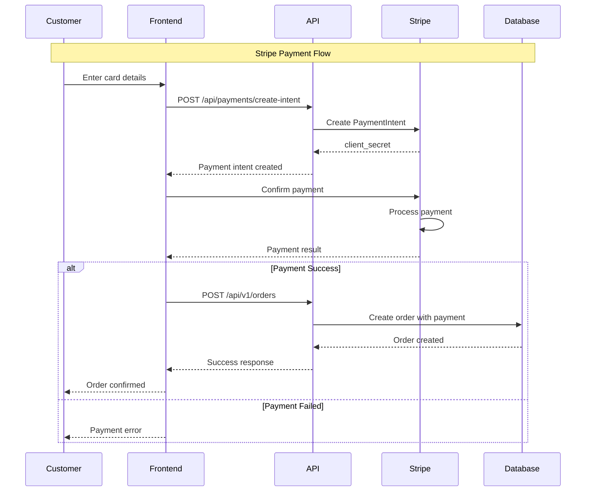
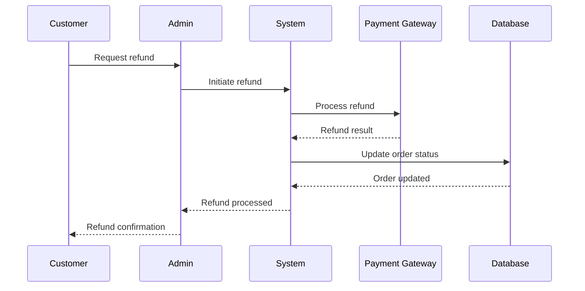
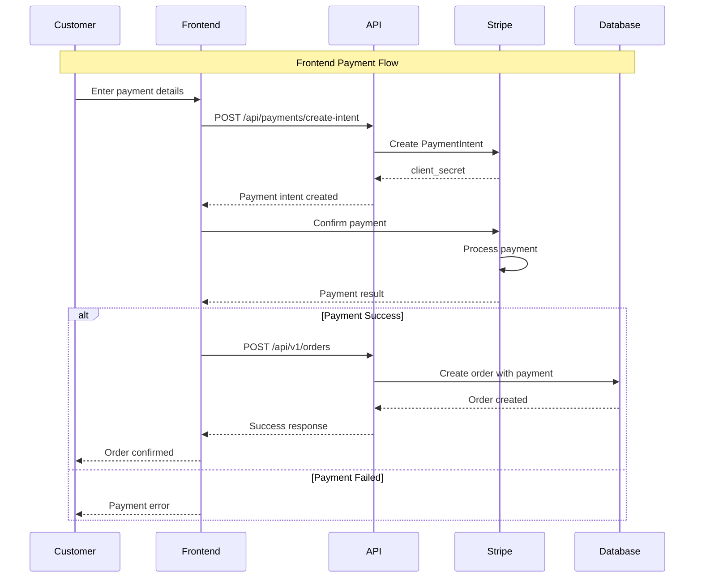

# Admin Panel and Frontend

**Admin panel management, frontend architecture, payment systems, and domain logic** for the PayMyDine system. This document consolidates admin panel functionality, payment processing, frontend components, and core business domain logic.

## 📋 Admin Panel Overview

PayMyDine admin panel is built on **TastyIgniter v3** framework with:
- **Framework**: TastyIgniter v3 (Laravel 8.x) ↩︎ [composer.json:1-68]
- **Modules**: `admin`, `main`, `system` ↩︎ [app/admin/, app/main/, app/system/]
- **Authentication**: Session-based authentication ↩︎ [app/admin/controllers/SuperAdminController.php:1-50]
- **Multi-tenant**: Database-per-tenant isolation ↩︎ [app/Http/Middleware/TenantDatabaseMiddleware.php:1-48]

## 🏗️ Admin Panel Architecture

### Core Components
- **Controllers**: Admin panel controllers ↩︎ [app/admin/controllers/]
- **Models**: Data models and business logic ↩︎ [app/admin/models/]
- **Views**: Admin panel templates ↩︎ [app/admin/views/]
- **Form Widgets**: Reusable UI components ↩︎ [app/admin/formwidgets/]

### Key Features
- **Payment Management**: Payment gateway configuration ↩︎ [app/admin/controllers/Payments.php:1-177]
- **Order Management**: Order processing and status updates
- **Table Management**: Table configuration and QR codes
- **Menu Management**: Menu items and categories
- **Multi-tenant Support**: Tenant-specific data isolation

## 💳 Payment System Management

### Payment Configuration Storage
- **Database Table**: `ti_payments` ↩︎ [app/admin/models/Payments_model.php:26]
- **Model**: `Payments_model` ↩︎ [app/admin/models/Payments_model.php:1-86]
- **Controller**: `Payments` controller ↩︎ [app/admin/controllers/Payments.php:1-177]

### Payment Settings Structure
```php
protected $fillable = [
    'name', 'code', 'class_name', 'description', 
    'data', 'status', 'is_default', 'priority'
];
```
↩︎ [app/admin/models/Payments_model.php:33]

### Payment Configuration Keys

| Key | Type | Description | Default | Storage |
|-----|------|-------------|---------|---------|
| `name` | string | Payment method name | Required | `ti_payments.name` |
| `code` | string | Unique payment code | Auto-generated | `ti_payments.code` |
| `class_name` | string | Gateway class name | Required | `ti_payments.class_name` |
| `description` | string | Payment description | Optional | `ti_payments.description` |
| `data` | array | Gateway-specific config | {} | `ti_payments.data` |
| `status` | boolean | Enabled/disabled | true | `ti_payments.status` |
| `is_default` | boolean | Default payment method | false | `ti_payments.is_default` |
| `priority` | integer | Display priority | 999 | `ti_payments.priority` |

### Admin UI Configuration
```php
$config['form']['fields'] = [
    'payment' => [
        'label' => 'lang:admin::lang.payments.label_payments',
        'type' => 'select',
        'options' => 'listGateways',
        'context' => ['create'],
        'placeholder' => 'lang:admin::lang.text_please_select',
    ],
    'name' => [
        'label' => 'lang:admin::lang.label_name',
        'type' => 'text',
        'span' => 'left',
    ],
    'priority' => [
        'label' => 'lang:admin::lang.payments.label_priority',
        'type' => 'number',
        'span' => 'right',
        'cssClass' => 'flex-width',
        'default' => 999,
    ],
    'code' => [
        'label' => 'lang:admin::lang.payments.label_code',
        'type' => 'text',
        'span' => 'right',
        'cssClass' => 'flex-width',
    ],
    'description' => [
        'label' => 'lang:admin::lang.label_description',
        'type' => 'textarea',
        'disabled' => true,
        'span' => 'left',
    ],
    'is_default' => [
        'label' => 'lang:admin::lang.payments.label_default',
        'type' => 'switch',
        'span' => 'right',
        'cssClass' => 'flex-width',
    ],
    'status' => [
        'label' => 'lang:admin::lang.label_status',
        'type' => 'switch',
        'span' => 'right',
        'cssClass' => 'flex-width',
    ],
];
```
↩︎ [app/admin/models/config/payments_model.php:85-129]

## 🔧 Stripe Payment Integration

### Stripe Configuration
```env
# Stripe Configuration
NEXT_PUBLIC_STRIPE_PUBLISHABLE_KEY=pk_test_your_publishable_key
STRIPE_SECRET_KEY=sk_test_your_secret_key
STRIPE_RESTAURANT_ACCOUNT_ID=acct_your_restaurant_stripe_account_id
STRIPE_WEBHOOK_SECRET=whsec_your_webhook_secret
```
↩︎ [frontend/env local example:1-23]

### Stripe Payment Processing Flow


### Stripe Payment Implementation
```typescript
// Stripe Elements configuration
const stripeOptions = {
  clientSecret: clientSecret,
  appearance: {
    theme: 'stripe',
    variables: {
      colorPrimary: '#0570de',
      colorBackground: '#ffffff',
      colorText: '#30313d',
      colorDanger: '#df1b41',
      fontFamily: 'Ideal Sans, system-ui, sans-serif',
      spacingUnit: '2px',
      borderRadius: '4px',
    }
  }
};
```
↩︎ [frontend/components/payment/secure-payment-form.tsx:1-208]

## 🔄 Webhook Handling

### Current Status
**Status**: **Critical Issue** - Webhook handling not implemented ↩︎ [frontend/app/api/process-payment/route.ts:1-180]

**Risk**: Payment events not processed, order status not updated

### Stripe Webhook Implementation
```php
// Stripe webhook endpoint
Route::post('/webhooks/stripe', function (Request $request) {
    $payload = $request->getContent();
    $sig_header = $request->header('Stripe-Signature');
    $endpoint_secret = env('STRIPE_WEBHOOK_SECRET');
    
    try {
        $event = \Stripe\Webhook::constructEvent(
            $payload, $sig_header, $endpoint_secret
        );
    } catch(\UnexpectedValueException $e) {
        return response()->json(['error' => 'Invalid payload'], 400);
    } catch(\Stripe\Exception\SignatureVerificationException $e) {
        return response()->json(['error' => 'Invalid signature'], 400);
    }
    
    return $this->handleStripeWebhook($event);
});
```

### Webhook Event Processing
```php
// Handle Stripe webhook events
public function handleStripeWebhook($event)
{
    switch ($event->type) {
        case 'payment_intent.succeeded':
            $this->handlePaymentSuccess($event->data->object);
            break;
            
        case 'payment_intent.payment_failed':
            $this->handlePaymentFailure($event->data->object);
            break;
            
        case 'payment_intent.canceled':
            $this->handlePaymentCanceled($event->data->object);
            break;
            
        case 'charge.dispute.created':
            $this->handleDisputeCreated($event->data->object);
            break;
            
        default:
            Log::info('Unhandled Stripe webhook event', [
                'type' => $event->type,
                'id' => $event->id
            ]);
    }
    
    return response()->json(['status' => 'success']);
}
```

## 💰 Refund Processing

### Current Status
**Status**: **Critical Issue** - Refund functionality not implemented ↩︎ [frontend/app/api/process-payment/route.ts:1-180]

**Risk**: No way to process refunds, customer service issues

### Stripe Refund Processing
```php
// Stripe refund processing
public function processStripeRefund($paymentIntentId, $amount = null, $reason = 'requested_by_customer')
{
    try {
        $stripe = new \Stripe\StripeClient(env('STRIPE_SECRET_KEY'));
        
        $refundData = [
            'payment_intent' => $paymentIntentId,
            'reason' => $reason
        ];
        
        if ($amount) {
            $refundData['amount'] = $amount * 100; // Convert to cents
        }
        
        $refund = $stripe->refunds->create($refundData);
        
        // Log refund
        $this->logRefund($refund, 'stripe');
        
        return [
            'success' => true,
            'refund_id' => $refund->id,
            'amount' => $refund->amount / 100,
            'status' => $refund->status
        ];
        
    } catch (\Stripe\Exception\InvalidRequestException $e) {
        return [
            'success' => false,
            'error' => 'Invalid refund request: ' . $e->getMessage()
        ];
    }
}
```

### Refund Workflow


## 🔒 Payment Permissions and Roles

### Admin Panel Permissions
- **Payment Configuration**: Admin-only access ↩︎ [app/admin/controllers/Payments.php:52]
- **Order Management**: Admin and cashier access
- **Refund Processing**: Admin-only access
- **Webhook Management**: Admin-only access

### Access Control Implementation
```php
// Payment configuration access control
protected $requiredPermissions = 'Admin.Payments';
```
↩︎ [app/admin/controllers/Payments.php:52]

### Role-Based Access
- **Super Admin**: Full system access, bypasses tenant middleware ↩︎ [app/admin/routes.php:202]
- **Admin**: Tenant-specific access to all features
- **Cashier**: Limited access to order management
- **Customer**: Frontend-only access

## 🚨 Payment Troubleshooting

### Common Issues
1. **Payment Configuration Errors**
   - **Issue**: Invalid API keys or configuration
   - **Symptoms**: Payment processing failures
   - **Solution**: Verify API keys and configuration

2. **Webhook Failures**
   - **Issue**: Webhook events not processed
   - **Symptoms**: Order status not updated
   - **Solution**: Check webhook endpoint and signature verification

3. **Refund Processing Issues**
   - **Issue**: Refunds not processing
   - **Symptoms**: Refund requests failing
   - **Solution**: Implement refund functionality

4. **Multi-tenant Payment Issues**
   - **Issue**: Payment processing wrong tenant
   - **Symptoms**: Cross-tenant payment data
   - **Solution**: Verify tenant isolation

## 🎨 Frontend Architecture

### Frontend Overview
PayMyDine frontend is built on **Next.js 15.2.4** with:
- **Framework**: Next.js 15.2.4 with TypeScript ↩︎ [frontend/package.json:1-85]
- **UI Library**: Radix UI + Tailwind CSS ↩︎ [frontend/components/ui/]
- **State Management**: Zustand stores ↩︎ [frontend/store/]
- **Payment Integration**: Stripe, PayPal, Apple Pay, Google Pay ↩︎ [frontend/components/payment/]

### Frontend Components
- **App Router**: Next.js 15 app directory structure ↩︎ [frontend/app/]
- **Components**: Reusable UI components ↩︎ [frontend/components/]
- **Stores**: Zustand state management ↩︎ [frontend/store/]
- **API Client**: Centralized API communication ↩︎ [frontend/lib/api-client.ts:1-596]

### Key Features
- **Multi-tenant Support**: Tenant-specific routing and configuration ↩︎ [frontend/lib/multi-tenant-config.ts:1-77]
- **Payment Processing**: Secure payment integration ↩︎ [frontend/components/payment/]
- **QR Code Scanning**: Table-specific menu access
- **Real-time Updates**: Order status updates
- **Responsive Design**: Mobile-first approach

## 💳 Frontend Payment System

### Supported Payment Methods
- **Stripe**: Card payments, Apple Pay, Google Pay ↩︎ [frontend/components/payment/secure-payment-form.tsx:1-208]
- **PayPal**: PayPal payments ↩︎ [frontend/components/payment/secure-payment-flow.tsx:207-216]
- **Apple Pay**: Apple Pay integration ↩︎ [frontend/components/payment/secure-payment-flow.tsx:218-219]
- **Google Pay**: Google Pay integration ↩︎ [frontend/components/payment/secure-payment-flow.tsx:221-222]
- **Cash**: Cash on delivery ↩︎ [frontend/components/payment/secure-payment-flow.tsx:224-225]

### Payment Components
- **SecurePaymentFlow**: Main payment modal ↩︎ [frontend/components/payment/secure-payment-flow.tsx:1-493]
- **StripeCardForm**: Stripe card input form ↩︎ [frontend/components/payment/secure-payment-form.tsx:1-208]
- **PayPalForm**: PayPal payment form ↩︎ [frontend/components/payment/secure-payment-flow.tsx:207-216]
- **ApplePayButton**: Apple Pay button ↩︎ [frontend/components/payment/secure-payment-flow.tsx:218-219]
- **GooglePayButton**: Google Pay button ↩︎ [frontend/components/payment/secure-payment-flow.tsx:221-222]

### Payment Flow


## 🍽️ Core Domain Logic

### Order Management
- **Order Creation**: Multi-step order creation process
- **Order Status**: Status tracking and updates
- **Order Items**: Menu item management
- **Order Totals**: Price calculation and taxes

### Menu Management
- **Menu Items**: Product catalog management
- **Categories**: Menu categorization
- **Availability**: Stock and availability tracking
- **Pricing**: Dynamic pricing management

### Table Management
- **Table Configuration**: Table setup and management
- **QR Codes**: Table-specific QR code generation
- **Seating**: Table capacity and availability
- **Location**: Table location management

## 🚨 Known Issues

### Critical Issues
1. **No Webhook Implementation**: Webhook handling not implemented ↩︎ [frontend/app/api/process-payment/route.ts:1-180]
2. **No Refund Processing**: Refund functionality not available
3. **No Error Recovery**: Payment failures not retried
4. **No Payment Validation**: Limited payment data validation

### Performance Issues
1. **No Payment Caching**: Payment methods not cached
2. **Synchronous Processing**: Payment processing blocks UI
3. **No Loading States**: Limited loading indicators

## 📚 Related Documentation

- **Architecture**: [01-architecture-and-tenancy.md](01-architecture-and-tenancy.md) - System architecture
- **Database**: [02-database-and-backend.md](02-database-and-backend.md) - Database and backend
- **Operations**: [04-ops-quality-roadmap.md](04-ops-quality-roadmap.md) - Operations and quality