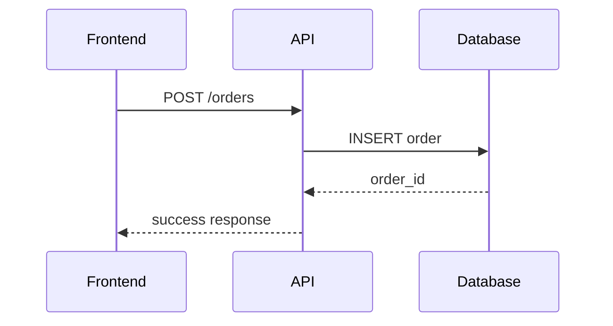

# Unknowns and Meta Documentation

**Unresolved questions, documentation standards, and contributing guidelines** for the PayMyDine system. This document consolidates open questions, table of contents, and documentation meta-information.

## 📋 Table of Contents

### Main Documentation
- [01-architecture-and-tenancy.md](01-architecture-and-tenancy.md) - System architecture and multi-tenant design
- [02-database-and-backend.md](02-database-and-backend.md) - Database schema and backend services
- [03-admin-and-frontend.md](03-admin-and-frontend.md) - Admin panel and frontend architecture
- [04-ops-quality-roadmap.md](04-ops-quality-roadmap.md) - Operations, quality, and refactoring roadmap
- [05-unknowns-and-meta.md](05-unknowns-and-meta.md) - This file

## 🔍 Critical Unknowns

### 1. Authentication Implementation
**Question**: How is user authentication implemented in the system?

**Why it matters**: Security is critical for a payment system

**Evidence missing**: 
- No authentication middleware found on API routes ↩︎ [routes/api.php:1-207]
- No user authentication controllers found
- No session management implementation found

**Where to look**: 
- User management system
- Authentication middleware
- Session configuration
- Login/logout functionality

### 2. CSRF Protection
**Question**: Is CSRF protection implemented and how?

**Why it matters**: Forms are vulnerable to CSRF attacks without protection

**Evidence missing**:
- No CSRF middleware found
- No CSRF tokens in forms
- No CSRF configuration found

**Where to look**:
- Laravel CSRF middleware configuration
- Form token generation
- CSRF validation in controllers

### 3. Rate Limiting
**Question**: Is rate limiting implemented for API endpoints?

**Why it matters**: API endpoints are vulnerable to abuse without rate limiting

**Evidence missing**:
- No rate limiting middleware found
- No rate limiting configuration
- No throttling implementation

**Where to look**:
- Laravel rate limiting middleware
- API gateway configuration
- Throttling settings

### 4. Error Handling Strategy
**Question**: What is the comprehensive error handling strategy?

**Why it matters**: Poor error handling leads to poor user experience and security issues

**Evidence missing**:
- Limited error handling found
- No global error handler
- No error logging strategy

**Where to look**:
- Global exception handler
- Error logging configuration
- Error response formatting

## 🔒 Security Unknowns

### 1. Input Sanitization
**Question**: How is user input sanitized and validated?

**Why it matters**: Unsanitized input leads to XSS and injection attacks

**Evidence missing**:
- No input sanitization found
- Limited validation rules
- No XSS protection

**Where to look**:
- Input validation middleware
- Sanitization functions
- XSS protection configuration

### 2. Output Encoding
**Question**: How is output data encoded to prevent XSS?

**Why it matters**: Unencoded output allows XSS attacks

**Evidence missing**:
- No output encoding found
- No XSS protection headers
- No encoding configuration

**Where to look**:
- Output encoding functions
- XSS protection headers
- Template encoding

### 3. Session Security
**Question**: How are sessions secured and managed?

**Why it matters**: Insecure sessions allow session hijacking

**Evidence missing**:
- No session security configuration
- No session encryption
- No session timeout handling

**Where to look**:
- Session configuration
- Session encryption settings
- Session timeout configuration

### 4. Database Security
**Question**: How is database access secured?

**Why it matters**: Database security is critical for data protection

**Evidence missing**:
- No database access controls
- No query logging
- No database encryption

**Where to look**:
- Database access controls
- Query logging configuration
- Database encryption settings

## ⚡ Performance Unknowns

### 1. Caching Strategy
**Question**: What caching strategy is implemented?

**Why it matters**: Poor caching leads to performance issues

**Evidence missing**:
- No caching implementation found
- No cache configuration
- No cache invalidation strategy

**Where to look**:
- Cache configuration
- Cache implementation
- Cache invalidation logic

### 2. Database Optimization
**Question**: How is database performance optimized?

**Why it matters**: Poor database performance affects user experience

**Evidence missing**:
- No database indexes found
- No query optimization
- No connection pooling

**Where to look**:
- Database index configuration
- Query optimization
- Connection pooling settings

### 3. CDN Configuration
**Question**: Is a CDN used for static assets?

**Why it matters**: CDN improves performance and reduces server load

**Evidence missing**:
- No CDN configuration found
- No static asset optimization
- No CDN headers

**Where to look**:
- CDN configuration
- Static asset optimization
- CDN headers

### 4. Load Balancing
**Question**: How is load balancing configured?

**Why it matters**: Load balancing is essential for scalability

**Evidence missing**:
- No load balancer configuration
- No load balancing strategy
- No health checks

**Where to look**:
- Load balancer configuration
- Health check endpoints
- Load balancing strategy

## 🔧 Operational Unknowns

### 1. Deployment Strategy
**Question**: How is the application deployed?

**Why it matters**: Deployment strategy affects reliability and scalability

**Evidence missing**:
- No deployment configuration found
- No CI/CD pipeline
- No deployment scripts

**Where to look**:
- Deployment configuration
- CI/CD pipeline
- Deployment scripts

### 2. Monitoring and Alerting
**Question**: How is the application monitored?

**Why it matters**: Monitoring is essential for reliability

**Evidence missing**:
- No monitoring configuration
- No alerting setup
- No metrics collection

**Where to look**:
- Monitoring configuration
- Alerting setup
- Metrics collection

### 3. Backup Strategy
**Question**: How is data backed up?

**Why it matters**: Backup strategy is critical for data protection

**Evidence missing**:
- No backup configuration
- No backup scripts
- No recovery procedures

**Where to look**:
- Backup configuration
- Backup scripts
- Recovery procedures

### 4. Disaster Recovery
**Question**: What is the disaster recovery plan?

**Why it matters**: Disaster recovery is essential for business continuity

**Evidence missing**:
- No disaster recovery plan
- No failover configuration
- No recovery procedures

**Where to look**:
- Disaster recovery plan
- Failover configuration
- Recovery procedures

## 📊 Business Unknowns

### 1. User Management
**Question**: How are users managed and what roles exist?

**Why it matters**: User management affects security and functionality

**Evidence missing**:
- No user management system found
- No role definitions
- No permission system

**Where to look**:
- User management system
- Role definitions
- Permission system

### 2. Business Rules
**Question**: What are the business rules for orders and payments?

**Why it matters**: Business rules affect system behavior

**Evidence missing**:
- No business rule documentation
- No business logic validation
- No business process documentation

**Where to look**:
- Business rule documentation
- Business logic validation
- Business process documentation

### 3. Compliance Requirements
**Question**: What compliance requirements must be met?

**Why it matters**: Compliance is essential for legal operation

**Evidence missing**:
- No compliance documentation
- No compliance checks
- No audit trail

**Where to look**:
- Compliance documentation
- Compliance checks
- Audit trail

### 4. Data Retention
**Question**: What is the data retention policy?

**Why it matters**: Data retention affects storage and compliance

**Evidence missing**:
- No data retention policy
- No data cleanup procedures
- No data archiving

**Where to look**:
- Data retention policy
- Data cleanup procedures
- Data archiving

## 📝 Contributing Guidelines

### Writing Standards

#### Citations Required
Every factual statement must include inline citations in this format:
```
↩︎ [path/to/file.php:lineStart-lineEnd]
```

**Examples:**
- `↩︎ [app/admin/models/Orders_model.php:42-87]`
- `↩︎ [frontend/lib/api-client.ts:120-150]`
- `↩︎ [db/paymydine.sql:1814-1900]`

#### Unknown Information
If something cannot be proven from code, mark clearly:
- **Unknown**: Information not found in codebase
- **Assumption**: Logical inference not directly supported
- **Missing Evidence**: What would be needed to verify

#### File Structure
- Keep individual files under ~400 lines
- Use focused, single-purpose documents
- Include summary at top of each file
- Use consistent heading hierarchy

### Style Guidelines

#### Headers
```markdown
# Main Section (H1)
## Subsection (H2)
### Detail Section (H3)
#### Specific Point (H4)
```

#### Code Blocks
```php
// PHP code with syntax highlighting
public function processOrder($orderData) {
    // Implementation
}
```

```typescript
// TypeScript/JavaScript code
interface PaymentData {
  amount: number;
  currency: string;
}
```

#### Tables
| Column 1 | Column 2 | Column 3 |
|----------|----------|----------|
| Data 1   | Data 2   | Data 3   |

#### Mermaid Diagrams


### Content Requirements

#### Architecture Documents
- Include sequence diagrams for complex flows
- Show component interactions
- Document data flow patterns
- Explain design decisions

#### API Documentation
- Complete route tables with all parameters
- Request/response examples
- Error codes and messages
- Authentication requirements

#### Database Documentation
- ERD diagrams (Mermaid or text blocks)
- Table relationships
- Index recommendations
- Migration dependencies

#### Payment Documentation
- Complete payment flow diagrams
- Security considerations
- Error handling patterns
- Integration details

### Quality Checklist

Before submitting documentation:

- [ ] All claims have citations
- [ ] Unknown information is marked
- [ ] Code examples are accurate
- [ ] Diagrams are properly formatted
- [ ] Tables are complete
- [ ] Links work correctly
- [ ] File is under 400 lines
- [ ] Summary is included at top

### File Naming

- Use kebab-case: `payment-settings.md`
- Be descriptive: `checkout-flow.md` not `flow.md`
- Group related files in directories
- Use README.md for directory overviews

### What Not to Do

- Don't guess or assume without marking it
- Don't include actual secrets or credentials
- Don't create files outside the docs/ folder
- Don't modify application code
- Don't use vague language like "probably" or "might"

### What to Do

- Extract facts directly from code
- Use multiple citations when needed
- Include line numbers for specific code
- Document both current state and issues
- Provide actionable recommendations
- Use clear, concise language

## 📚 Style Guide and Glossary

### Glossary

| Term | Definition |
|------|------------|
| **Tenant** | A restaurant instance with isolated data and configuration |
| **Order** | A customer's food order with items, payment, and status |
| **QR Code** | Table-specific QR code for customer menu access |
| **Cashier Mode** | Direct ordering interface for restaurant staff |
| **Payment Gateway** | External payment processor (Stripe, PayPal, etc.) |
| **Multi-tenant** | Architecture supporting multiple isolated tenants |
| **TastyIgniter** | Laravel-based restaurant management framework |

### Naming Conventions

#### Files and Directories
- **kebab-case**: `payment-settings.md`, `checkout-flow.md`
- **Descriptive**: `admin-payments-stripe.md` not `stripe.md`
- **Grouped**: Related files in subdirectories

#### Code References
- **File paths**: `app/admin/models/Orders_model.php`
- **Line ranges**: `42-87` for multi-line references
- **Single lines**: `42` for single line references
- **Methods**: `Orders_model::processOrder()`
- **Classes**: `Admin\Controllers\Payments`

#### Database References
- **Tables**: `ti_orders`, `ti_menus`
- **Columns**: `order_id`, `menu_name`
- **Indexes**: `idx_orders_status`
- **Foreign Keys**: `fk_orders_customer`

### Writing Style

#### Voice and Tone
- **Active voice**: "The system processes orders" not "Orders are processed"
- **Present tense**: "The API returns data" not "The API will return data"
- **Concise**: Avoid unnecessary words
- **Technical**: Use precise terminology

#### Sentence Structure
- **Short sentences**: Easier to scan and understand
- **Bullet points**: For lists and features
- **Numbered lists**: For procedures and steps
- **Tables**: For structured data

#### Code Examples
```php
// Good: Complete, runnable example
public function processOrder($orderData) {
    DB::transaction(function() use ($orderData) {
        $order = Order::create($orderData);
        $this->addOrderItems($order, $orderData['items']);
    });
}
```

```php
// Bad: Incomplete or unclear
public function processOrder($data) {
    // Process order
    return $order;
}
```

### Formatting Standards

#### Headers
```markdown
# Main Section (H1) - Only in README files
## Major Section (H2) - Document sections
### Subsection (H3) - Content areas
#### Detail (H4) - Specific points
```

#### Code Blocks
- **Language specified**: ```php, ```typescript, ```sql
- **Complete examples**: Include imports and context
- **Commented**: Explain complex logic
- **Formatted**: Proper indentation and spacing

#### Tables
- **Headers**: Clear, descriptive column names
- **Alignment**: Left-align text, right-align numbers
- **Consistent**: Same format across similar tables
- **Complete**: All relevant data included

#### Lists
- **Bullet points**: For features, items, options
- **Numbered**: For procedures, steps, priorities
- **Nested**: Use consistent indentation
- **Parallel**: Same grammatical structure

### Citation Format

#### Inline Citations
```
↩︎ [path/to/file.php:lineStart-lineEnd]
```

#### Multiple Citations
```
↩︎ [app/admin/models/Orders_model.php:42-87] [frontend/lib/api-client.ts:120-150]
```

#### File References
- **PHP files**: `app/admin/controllers/Payments.php`
- **TypeScript files**: `frontend/lib/payment-service.ts`
- **SQL files**: `db/paymydine.sql`
- **Config files**: `config/database.php`

#### Line Numbering
- **Single line**: `42`
- **Range**: `42-87`
- **Multiple ranges**: `42-87, 120-150`
- **Entire file**: `1-999` (if file is small)

### Content Structure

#### Document Headers
```markdown
# Document Title

Brief description of what this document covers.

## Overview
High-level summary of the topic.

## Details
Specific information with citations.

## Examples
Code examples and usage patterns.

## Issues
Known problems and limitations.

## References
Links to related documentation.
```

#### Section Headers
- **Descriptive**: "Payment Processing Flow" not "Flow"
- **Consistent**: Same level of detail across similar sections
- **Hierarchical**: Logical progression from general to specific

### Common Mistakes

#### Avoid These
- **Vague language**: "probably", "might", "could be"
- **Missing citations**: Claims without code references
- **Incomplete examples**: Code that won't run
- **Inconsistent formatting**: Different styles in same document
- **Too much detail**: Overwhelming technical depth
- **Too little detail**: Insufficient information

#### Do These Instead
- **Specific language**: "The system validates" not "The system might validate"
- **Complete citations**: Every claim supported by code
- **Working examples**: Tested, complete code samples
- **Consistent style**: Same format throughout
- **Appropriate detail**: Right level for the audience
- **Sufficient information**: Complete but not overwhelming

### Quality Checklist

Before finalizing documentation:

- [ ] All claims have citations
- [ ] Code examples are complete and tested
- [ ] Tables are properly formatted
- [ ] Headers follow hierarchy
- [ ] Links work correctly
- [ ] Language is clear and concise
- [ ] Formatting is consistent
- [ ] File is under 400 lines
- [ ] Summary is included at top

## 📚 Related Documentation

- **Architecture**: [01-architecture-and-tenancy.md](01-architecture-and-tenancy.md) - System architecture
- **Database**: [02-database-and-backend.md](02-database-and-backend.md) - Database and backend
- **Admin Panel**: [03-admin-and-frontend.md](03-admin-and-frontend.md) - Admin panel and frontend
- **Operations**: [04-ops-quality-roadmap.md](04-ops-quality-roadmap.md) - Operations and quality