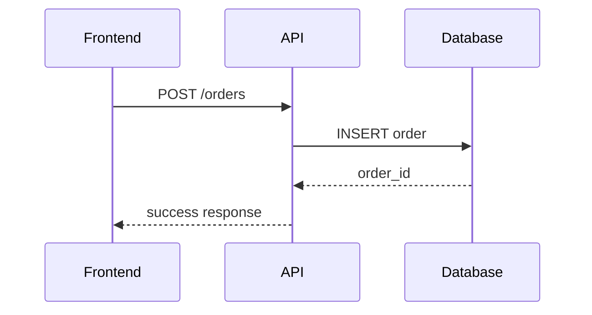

# Contributing to Documentation

## 📝 Writing Standards

### Citations Required
Every factual statement must include inline citations in this format:
```
↩︎ [path/to/file.php:lineStart-lineEnd]
```

**Examples:**
- `↩︎ [app/admin/models/Orders_model.php:42-87]`
- `↩︎ [frontend/lib/api-client.ts:120-150]`
- `↩︎ [db/paymydine.sql:1814-1900]`

### Unknown Information
If something cannot be proven from code, mark clearly:
- **Unknown**: Information not found in codebase
- **Assumption**: Logical inference not directly supported
- **Missing Evidence**: What would be needed to verify

### File Structure
- Keep individual files under ~400 lines
- Use focused, single-purpose documents
- Include summary at top of each file
- Use consistent heading hierarchy

## 🎨 Style Guidelines

### Headers
```markdown
# Main Section (H1)
## Subsection (H2)
### Detail Section (H3)
#### Specific Point (H4)
```

### Code Blocks
```php
// PHP code with syntax highlighting
public function processOrder($orderData) {
    // Implementation
}
```

```typescript
// TypeScript/JavaScript code
interface PaymentData {
  amount: number;
  currency: string;
}
```

### Tables
| Column 1 | Column 2 | Column 3 |
|----------|----------|----------|
| Data 1   | Data 2   | Data 3   |

### Mermaid Diagrams


## 📊 Content Requirements

### Architecture Documents
- Include sequence diagrams for complex flows
- Show component interactions
- Document data flow patterns
- Explain design decisions

### API Documentation
- Complete route tables with all parameters
- Request/response examples
- Error codes and messages
- Authentication requirements

### Database Documentation
- ERD diagrams (Mermaid or text blocks)
- Table relationships
- Index recommendations
- Migration dependencies

### Payment Documentation
- Complete payment flow diagrams
- Security considerations
- Error handling patterns
- Integration details

## 🔍 Quality Checklist

Before submitting documentation:

- [ ] All claims have citations
- [ ] Unknown information is marked
- [ ] Code examples are accurate
- [ ] Diagrams are properly formatted
- [ ] Tables are complete
- [ ] Links work correctly
- [ ] File is under 400 lines
- [ ] Summary is included at top

## 📁 File Naming

- Use kebab-case: `payment-settings.md`
- Be descriptive: `checkout-flow.md` not `flow.md`
- Group related files in directories
- Use README.md for directory overviews

## 🚫 What Not to Do

- Don't guess or assume without marking it
- Don't include actual secrets or credentials
- Don't create files outside the docs/ folder
- Don't modify application code
- Don't use vague language like "probably" or "might"

## ✅ What to Do

- Extract facts directly from code
- Use multiple citations when needed
- Include line numbers for specific code
- Document both current state and issues
- Provide actionable recommendations
- Use clear, concise language