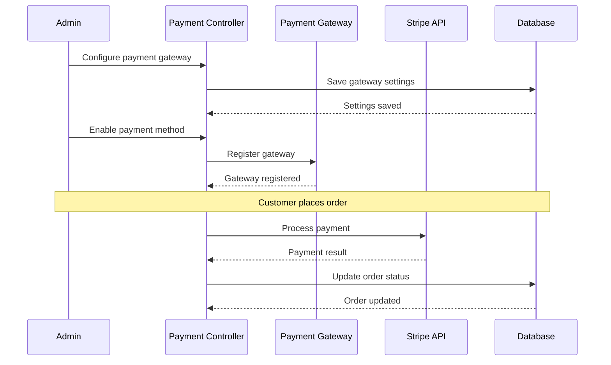

# Admin Payments System

**Payment system management, configuration, and troubleshooting** for the PayMyDine admin panel.

## 📋 Overview

PayMyDine admin panel provides comprehensive payment management through:
- **Payment Gateway Configuration**: Stripe, PayPal, Apple Pay, Google Pay ↩︎ [app/admin/controllers/Payments.php:1-177]
- **Payment Settings**: Gateway-specific configuration and settings ↩︎ [app/admin/models/Payments_model.php:1-86]
- **Order Processing**: Payment integration with order management
- **Multi-tenant Support**: Tenant-specific payment configurations

## 🏗️ Payment Architecture

### Core Components
- **PaymentGateways Service**: Gateway management and discovery ↩︎ [app/admin/classes/PaymentGateways.php:1-50]
- **BasePaymentGateway**: Base class for payment implementations ↩︎ [app/admin/classes/BasePaymentGateway.php:1-50]
- **Payments Controller**: Admin interface for payment management ↩︎ [app/admin/controllers/Payments.php:1-177]
- **Payments Model**: Payment gateway configuration storage ↩︎ [app/admin/models/Payments_model.php:1-86]

### Payment Flow

## 📁 Document Structure

| Document | Description |
|----------|-------------|
| [settings.md](settings.md) | Payment settings UI and configuration |
| [providers-stripe.md](providers-stripe.md) | Stripe integration details |
| [webhooks.md](webhooks.md) | Webhook handling and verification |
| [refunds-and-reconciliation.md](refunds-and-reconciliation.md) | Refund processing and reconciliation |
| [permissions-and-roles.md](permissions-and-roles.md) | Payment permissions and access control |
| [troubleshooting.md](troubleshooting.md) | Common issues and diagnostics |

## 🔧 Payment Configuration

### Gateway Management
- **Gateway Registration**: Dynamic gateway discovery ↩︎ [app/admin/classes/PaymentGateways.php:25-50]
- **Configuration Storage**: Database-backed settings ↩︎ [app/admin/models/Payments_model.php:1-86]
- **Validation**: Gateway-specific validation rules ↩︎ [app/admin/controllers/Payments.php:152-177]

### Supported Gateways
- **Stripe**: Card payments, Apple Pay, Google Pay ↩︎ [frontend/components/payment/secure-payment-form.tsx:1-208]
- **PayPal**: PayPal payments ↩︎ [frontend/components/payment/secure-payment-flow.tsx:207-216]
- **Cash**: Cash on delivery ↩︎ [frontend/components/payment/secure-payment-flow.tsx:224-225]

## 🔒 Security Considerations

### Payment Security
- **PCI Compliance**: Card data never touches servers ↩︎ [frontend/components/payment/secure-payment-form.tsx:1-208]
- **Tokenization**: Stripe handles card tokenization
- **Encryption**: Payment data encrypted in transit
- **Validation**: Comprehensive input validation

### Access Control
- **Admin Permissions**: Payment configuration restricted to admins ↩︎ [app/admin/controllers/Payments.php:52]
- **Tenant Isolation**: Payment settings per tenant
- **Audit Logging**: Payment configuration changes logged

## 📊 Payment Monitoring

### Key Metrics
- **Payment Success Rate**: Track successful payments
- **Gateway Performance**: Monitor gateway response times
- **Error Rates**: Track payment failures and errors
- **Revenue Tracking**: Monitor payment volumes

### Logging
- **Payment Events**: All payment events logged
- **Error Tracking**: Payment errors and failures
- **Audit Trail**: Configuration changes tracked
- **Performance Metrics**: Gateway response times

## 🚨 Known Issues

### Critical Issues
1. **Missing Payment Validation**: Limited payment data validation ↩︎ [app/admin/controllers/Payments.php:152-177]
2. **No Error Handling**: Payment errors not properly handled
3. **Missing Webhooks**: Webhook handling not implemented
4. **No Refund Processing**: Refund functionality not available

### Performance Issues
1. **No Caching**: Payment settings not cached
2. **Synchronous Processing**: Payment processing blocks requests
3. **No Retry Logic**: Failed payments not retried

## 📚 Related Documentation

- **Frontend Payments**: [../../frontend/payments/README.md](../../frontend/payments/README.md) - Frontend payment integration
- **API**: [../../api/README.md](../../api/README.md) - Payment API endpoints
- **Backend**: [../../backend/README.md](../../backend/README.md) - Backend payment services