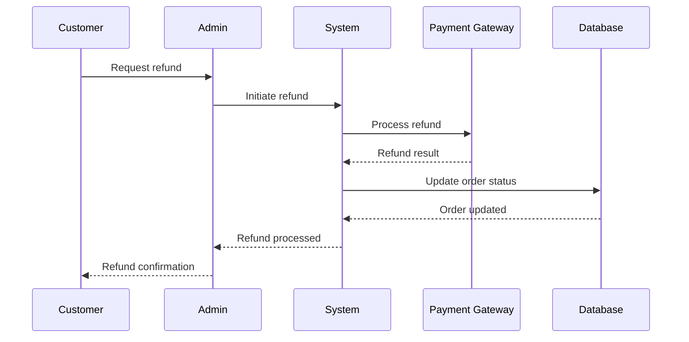

# Refunds and Reconciliation

**Refund processing, partial refunds, and financial reconciliation** for the PayMyDine payment system.

## 📋 Refund Overview

### Current Status
**Status**: **Critical Issue** - Refund functionality not implemented ↩︎ [frontend/app/api/process-payment/route.ts:1-180]

**Risk**: No way to process refunds, customer service issues

**Recommendation**: Implement refund functionality immediately

### Refund Types
- **Full Refunds**: Complete order refund
- **Partial Refunds**: Partial order refund
- **Item Refunds**: Refund specific items
- **Service Refunds**: Refund service charges

## 🔧 Refund Implementation

### Stripe Refund Processing
```php
// Stripe refund processing
public function processStripeRefund($paymentIntentId, $amount = null, $reason = 'requested_by_customer')
{
    try {
        $stripe = new \Stripe\StripeClient(env('STRIPE_SECRET_KEY'));
        
        $refundData = [
            'payment_intent' => $paymentIntentId,
            'reason' => $reason
        ];
        
        if ($amount) {
            $refundData['amount'] = $amount * 100; // Convert to cents
        }
        
        $refund = $stripe->refunds->create($refundData);
        
        // Log refund
        $this->logRefund($refund, 'stripe');
        
        return [
            'success' => true,
            'refund_id' => $refund->id,
            'amount' => $refund->amount / 100,
            'status' => $refund->status
        ];
        
    } catch (\Stripe\Exception\InvalidRequestException $e) {
        return [
            'success' => false,
            'error' => 'Invalid refund request: ' . $e->getMessage()
        ];
    } catch (\Stripe\Exception\ApiErrorException $e) {
        return [
            'success' => false,
            'error' => 'Stripe API error: ' . $e->getMessage()
        ];
    }
}
```

### PayPal Refund Processing
```php
// PayPal refund processing
public function processPayPalRefund($captureId, $amount = null, $reason = 'requested_by_customer')
{
    try {
        $paypal = new \PayPal\Rest\ApiContext(
            new \PayPal\Auth\OAuthTokenCredential(
                env('PAYPAL_CLIENT_ID'),
                env('PAYPAL_CLIENT_SECRET')
            )
        );
        
        $refundRequest = new \PayPal\Api\RefundRequest();
        $refundRequest->setAmount($this->createAmount($amount));
        $refundRequest->setReason($reason);
        
        $refund = \PayPal\Api\Refund::create($refundRequest, $paypal);
        
        // Log refund
        $this->logRefund($refund, 'paypal');
        
        return [
            'success' => true,
            'refund_id' => $refund->getId(),
            'amount' => $amount,
            'status' => $refund->getState()
        ];
        
    } catch (\PayPal\Exception\PayPalConnectionException $e) {
        return [
            'success' => false,
            'error' => 'PayPal connection error: ' . $e->getMessage()
        ];
    }
}
```

## 💰 Refund Types

### Full Refund
```php
// Process full refund
public function processFullRefund($orderId, $reason = 'requested_by_customer')
{
    $order = Order::find($orderId);
    
    if (!$order) {
        return ['success' => false, 'error' => 'Order not found'];
    }
    
    if ($order->payment_status !== 'paid') {
        return ['success' => false, 'error' => 'Order not paid'];
    }
    
    $refundAmount = $order->order_total;
    $paymentIntentId = $order->payment_intent_id;
    
    // Process refund based on payment method
    switch ($order->payment_method) {
        case 'stripe':
            $result = $this->processStripeRefund($paymentIntentId, $refundAmount, $reason);
            break;
        case 'paypal':
            $result = $this->processPayPalRefund($order->paypal_capture_id, $refundAmount, $reason);
            break;
        default:
            return ['success' => false, 'error' => 'Unsupported payment method'];
    }
    
    if ($result['success']) {
        // Update order status
        $order->update([
            'payment_status' => 'refunded',
            'refunded_at' => now(),
            'refund_amount' => $refundAmount,
            'refund_id' => $result['refund_id']
        ]);
        
        // Log refund
        $this->logOrderRefund($order, $result);
    }
    
    return $result;
}
```

### Partial Refund
```php
// Process partial refund
public function processPartialRefund($orderId, $refundAmount, $reason = 'requested_by_customer')
{
    $order = Order::find($orderId);
    
    if (!$order) {
        return ['success' => false, 'error' => 'Order not found'];
    }
    
    if ($order->payment_status !== 'paid') {
        return ['success' => false, 'error' => 'Order not paid'];
    }
    
    if ($refundAmount > $order->order_total) {
        return ['success' => false, 'error' => 'Refund amount exceeds order total'];
    }
    
    $paymentIntentId = $order->payment_intent_id;
    
    // Process refund based on payment method
    switch ($order->payment_method) {
        case 'stripe':
            $result = $this->processStripeRefund($paymentIntentId, $refundAmount, $reason);
            break;
        case 'paypal':
            $result = $this->processPayPalRefund($order->paypal_capture_id, $refundAmount, $reason);
            break;
        default:
            return ['success' => false, 'error' => 'Unsupported payment method'];
    }
    
    if ($result['success']) {
        // Update order status
        $order->update([
            'payment_status' => 'partially_refunded',
            'refunded_at' => now(),
            'refund_amount' => $refundAmount,
            'refund_id' => $result['refund_id']
        ]);
        
        // Log refund
        $this->logOrderRefund($order, $result);
    }
    
    return $result;
}
```

## 📊 Financial Reconciliation

### Daily Reconciliation
```php
// Daily financial reconciliation
public function performDailyReconciliation($date = null)
{
    $date = $date ?: now()->subDay();
    
    $orders = Order::whereDate('created_at', $date)
        ->where('payment_status', 'paid')
        ->get();
    
    $reconciliation = [
        'date' => $date,
        'total_orders' => $orders->count(),
        'total_revenue' => $orders->sum('order_total'),
        'total_refunds' => $orders->where('payment_status', 'refunded')->sum('refund_amount'),
        'net_revenue' => $orders->sum('order_total') - $orders->where('payment_status', 'refunded')->sum('refund_amount'),
        'payment_methods' => $this->getPaymentMethodBreakdown($orders),
        'discrepancies' => $this->findDiscrepancies($orders)
    ];
    
    // Log reconciliation
    $this->logReconciliation($reconciliation);
    
    return $reconciliation;
}
```

### Payment Method Breakdown
```php
// Get payment method breakdown
public function getPaymentMethodBreakdown($orders)
{
    return $orders->groupBy('payment_method')
        ->map(function ($group) {
            return [
                'count' => $group->count(),
                'total_amount' => $group->sum('order_total'),
                'average_amount' => $group->avg('order_total'),
                'refund_count' => $group->where('payment_status', 'refunded')->count(),
                'refund_amount' => $group->where('payment_status', 'refunded')->sum('refund_amount')
            ];
        });
}
```

### Discrepancy Detection
```php
// Find financial discrepancies
public function findDiscrepancies($orders)
{
    $discrepancies = [];
    
    foreach ($orders as $order) {
        // Check for missing payment intent
        if ($order->payment_method === 'stripe' && !$order->payment_intent_id) {
            $discrepancies[] = [
                'type' => 'missing_payment_intent',
                'order_id' => $order->order_id,
                'amount' => $order->order_total
            ];
        }
        
        // Check for refund without payment
        if ($order->payment_status === 'refunded' && !$order->payment_intent_id) {
            $discrepancies[] = [
                'type' => 'refund_without_payment',
                'order_id' => $order->order_id,
                'amount' => $order->refund_amount
            ];
        }
        
        // Check for partial refund exceeding order total
        if ($order->refund_amount > $order->order_total) {
            $discrepancies[] = [
                'type' => 'excessive_refund',
                'order_id' => $order->order_id,
                'order_amount' => $order->order_total,
                'refund_amount' => $order->refund_amount
            ];
        }
    }
    
    return $discrepancies;
}
```

## 🔄 Refund Workflow

### Refund Request Process


### Refund Status Tracking
```php
// Track refund status
public function trackRefundStatus($refundId, $provider)
{
    switch ($provider) {
        case 'stripe':
            $stripe = new \Stripe\StripeClient(env('STRIPE_SECRET_KEY'));
            $refund = $stripe->refunds->retrieve($refundId);
            return [
                'id' => $refund->id,
                'status' => $refund->status,
                'amount' => $refund->amount / 100,
                'reason' => $refund->reason,
                'created' => $refund->created
            ];
            
        case 'paypal':
            $paypal = new \PayPal\Rest\ApiContext(
                new \PayPal\Auth\OAuthTokenCredential(
                    env('PAYPAL_CLIENT_ID'),
                    env('PAYPAL_CLIENT_SECRET')
                )
            );
            $refund = \PayPal\Api\Refund::get($refundId, $paypal);
            return [
                'id' => $refund->getId(),
                'status' => $refund->getState(),
                'amount' => $refund->getAmount()->getTotal(),
                'reason' => $refund->getReason(),
                'created' => $refund->getCreateTime()
            ];
    }
}
```

## 🚨 Refund Issues

### Common Issues
1. **No Refund Processing**: Refund functionality not implemented ↩︎ [frontend/app/api/process-payment/route.ts:1-180]
2. **No Refund Tracking**: Refund status not tracked
3. **No Reconciliation**: Financial reconciliation not performed
4. **No Audit Trail**: Refund actions not logged

### Error Handling
```php
// Refund error handling
public function handleRefundError($exception, $orderId, $refundAmount)
{
    Log::error('Refund processing error', [
        'order_id' => $orderId,
        'refund_amount' => $refundAmount,
        'error' => $exception->getMessage(),
        'trace' => $exception->getTraceAsString()
    ]);
    
    // Send alert to administrators
    $this->sendRefundErrorAlert($exception, $orderId, $refundAmount);
    
    return [
        'success' => false,
        'error' => 'Refund processing failed: ' . $exception->getMessage()
    ];
}
```

## 📊 Refund Reporting

### Refund Analytics
```php
// Generate refund analytics
public function generateRefundAnalytics($startDate, $endDate)
{
    $refunds = Order::whereBetween('refunded_at', [$startDate, $endDate])
        ->whereNotNull('refund_amount')
        ->get();
    
    return [
        'total_refunds' => $refunds->count(),
        'total_refund_amount' => $refunds->sum('refund_amount'),
        'average_refund_amount' => $refunds->avg('refund_amount'),
        'refund_rate' => $this->calculateRefundRate($startDate, $endDate),
        'refund_reasons' => $this->getRefundReasons($refunds),
        'payment_method_breakdown' => $this->getRefundPaymentMethodBreakdown($refunds)
    ];
}
```

### Refund Rate Calculation
```php
// Calculate refund rate
public function calculateRefundRate($startDate, $endDate)
{
    $totalOrders = Order::whereBetween('created_at', [$startDate, $endDate])
        ->where('payment_status', 'paid')
        ->count();
    
    $refundedOrders = Order::whereBetween('created_at', [$startDate, $endDate])
        ->whereIn('payment_status', ['refunded', 'partially_refunded'])
        ->count();
    
    return $totalOrders > 0 ? ($refundedOrders / $totalOrders) * 100 : 0;
}
```

## 📚 Related Documentation

- **Stripe Integration**: [providers-stripe.md](providers-stripe.md) - Stripe refund details
- **Webhooks**: [webhooks.md](webhooks.md) - Refund webhook events
- **Troubleshooting**: [troubleshooting.md](troubleshooting.md) - Refund issues
- **Payment Settings**: [settings.md](settings.md) - Refund configuration