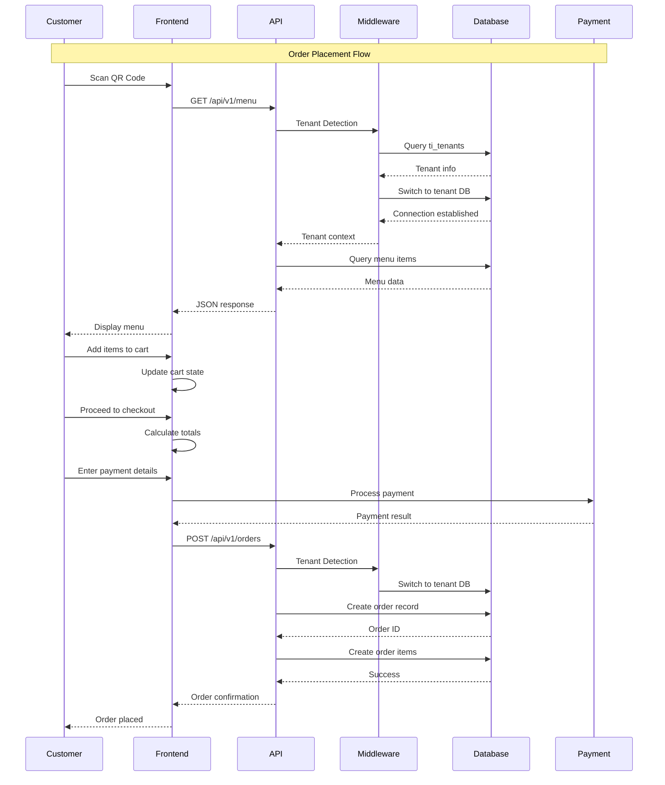
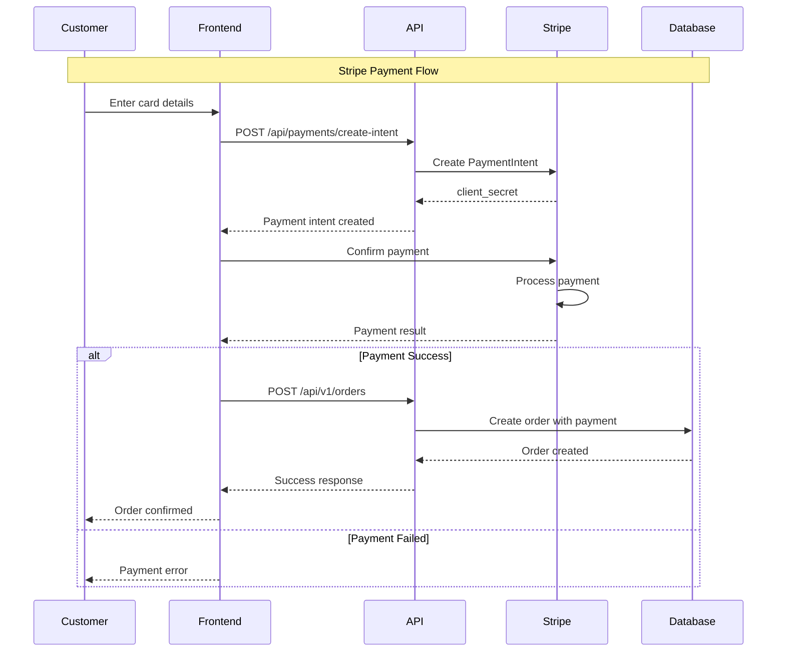
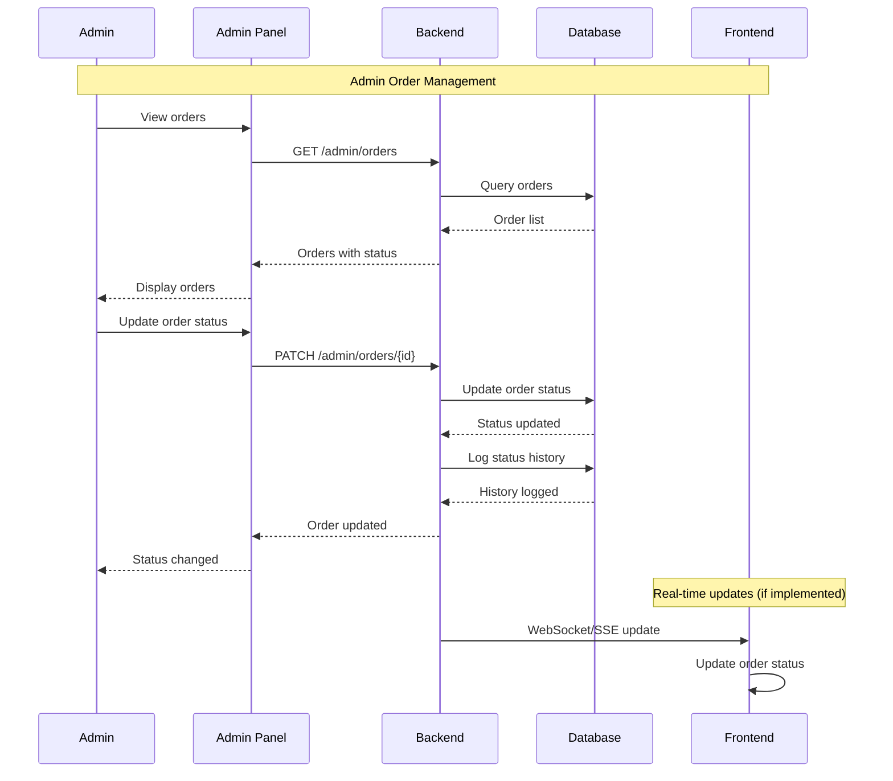
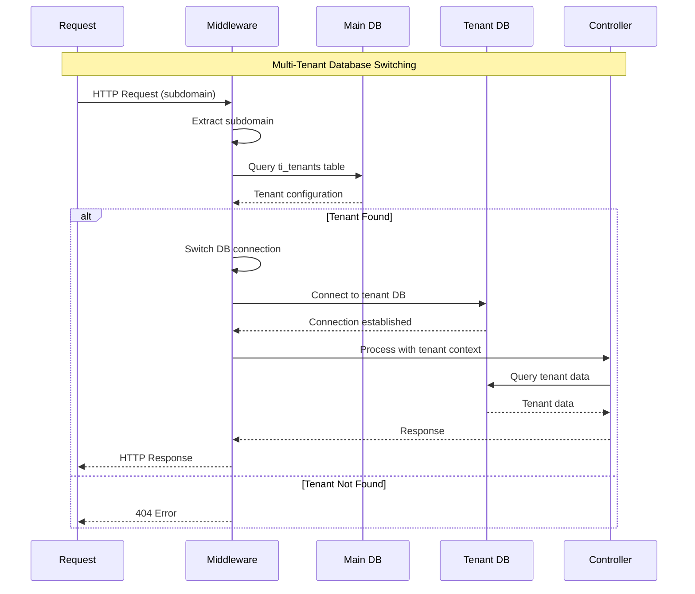
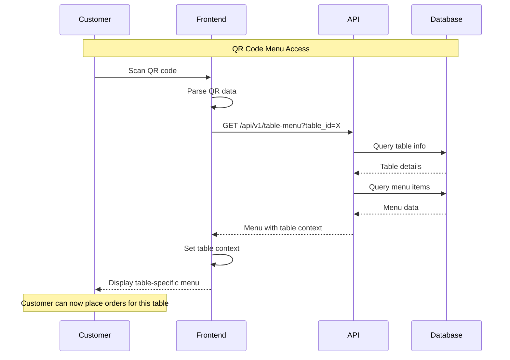
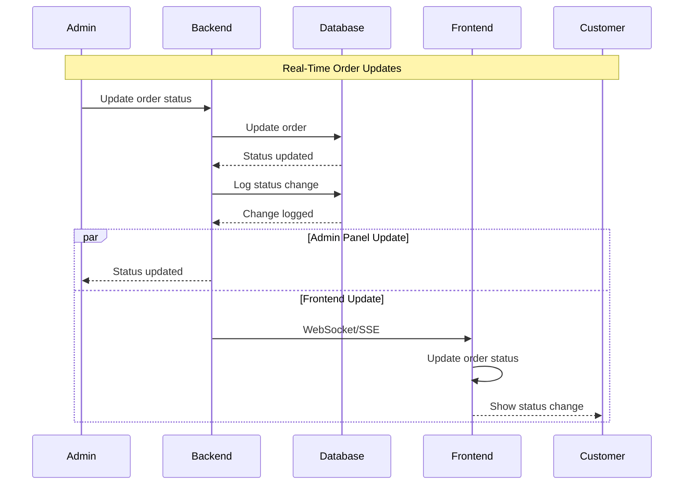
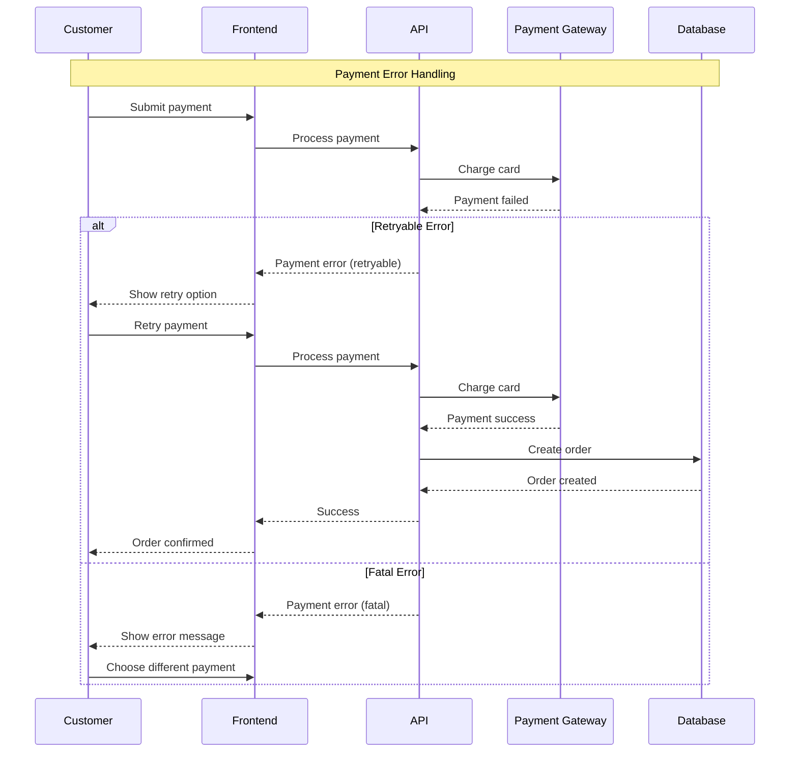
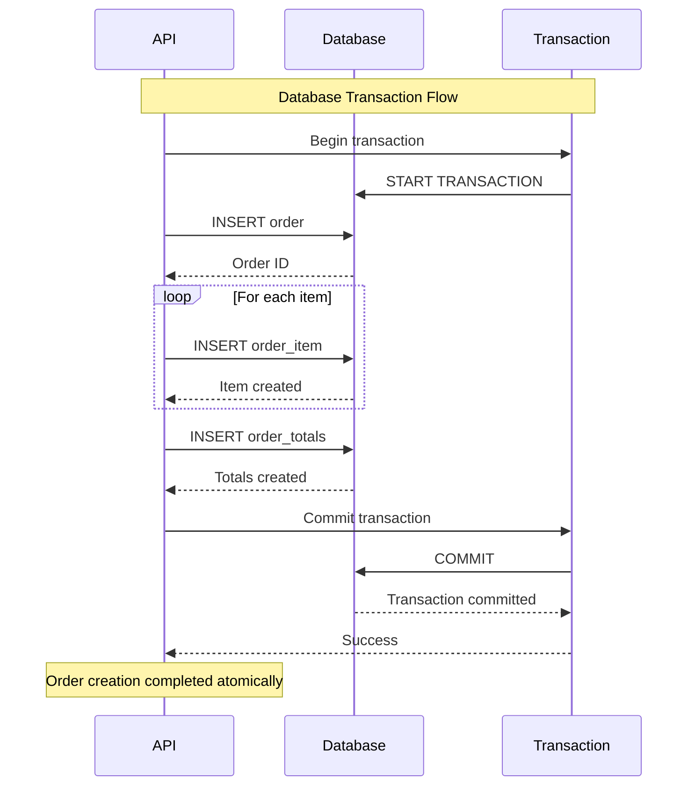
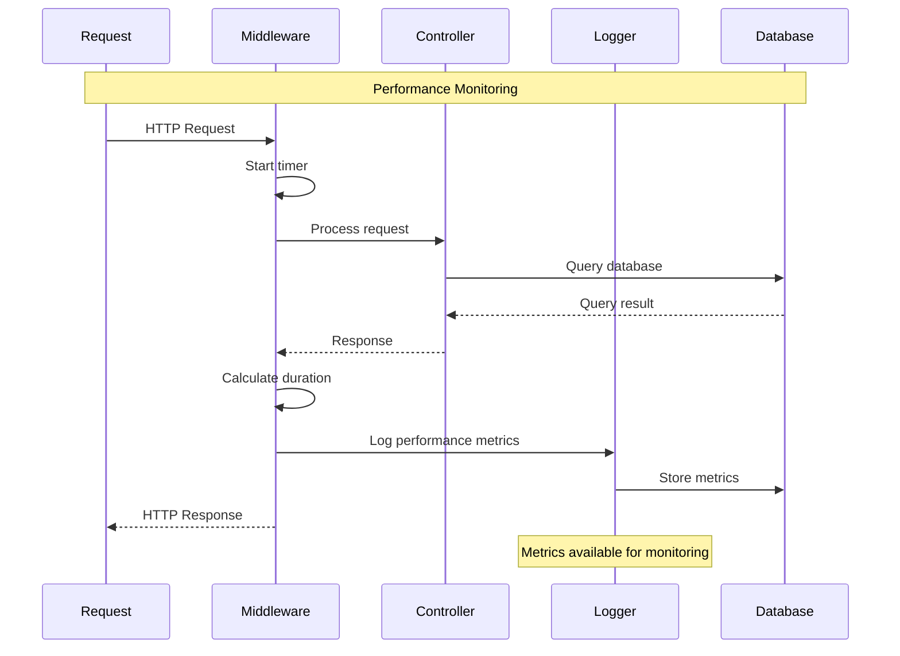

# Cross-Layer Flow Diagrams

**Sequence diagrams showing data flow across Frontend → API → Database layers** for key system operations.

## 🍽️ Order Placement Flow

### Complete Order Lifecycle

## 💳 Payment Processing Flow

### Stripe Payment Integration

## 🔧 Admin Order Management Flow

### Order Status Updates

## 🏢 Multi-Tenant Database Switching

### Tenant Detection and Database Switch

## 📱 QR Code Menu Access Flow

### Table-Specific Menu Loading

## 🔄 Real-Time Updates Flow

### Order Status Notifications

## 🚨 Error Handling Flow

### Payment Failure Recovery

## 🔍 Database Transaction Flow

### Order Creation with Items

## 📊 Performance Monitoring Flow

### Request Performance Tracking

## 🔗 Related Documentation

- **Architecture Overview**: [overview.md](overview.md) - High-level system architecture
- **Tenancy**: [../tenancy/README.md](../tenancy/README.md) - Multi-tenant implementation details
- **API**: [../api/README.md](../api/README.md) - API endpoint specifications
- **Database**: [../database/README.md](../database/README.md) - Database design and relationships