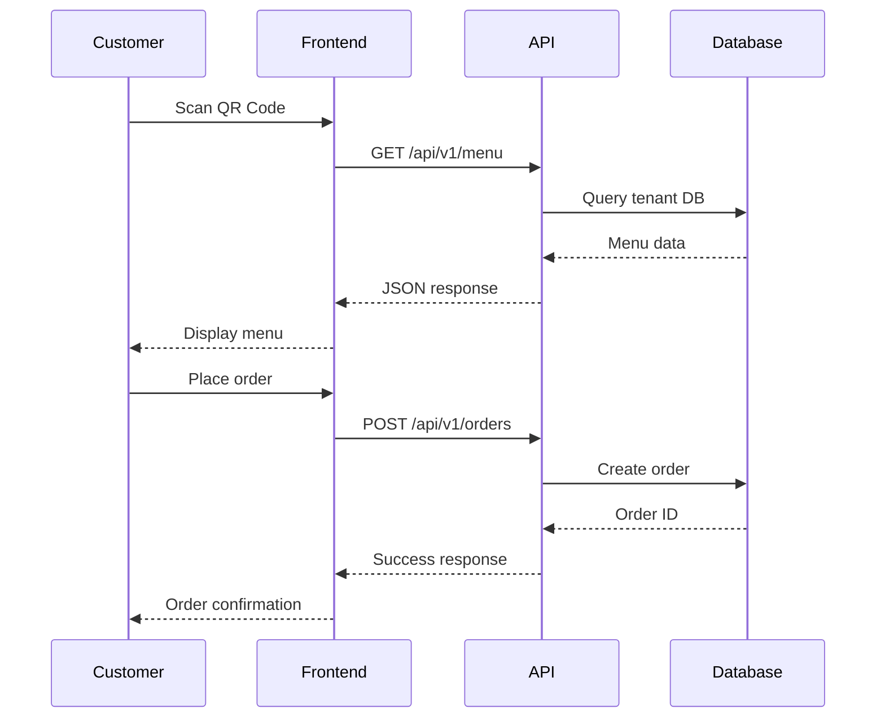
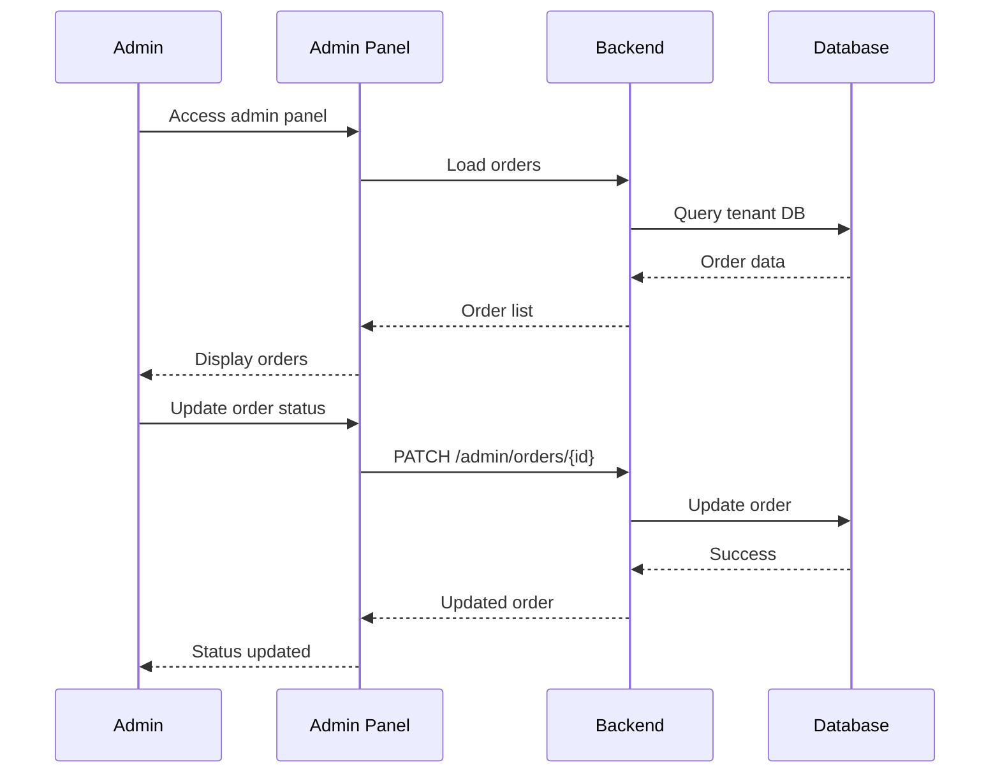

# System Architecture Overview

**High-level architecture and request lifecycle** for the PayMyDine multi-tenant restaurant ordering system.

## 🏗️ System Components

### Backend (Laravel/TastyIgniter)
- **Framework**: TastyIgniter v3 based on Laravel 8.x ↩︎ [composer.json:1-68]
- **Modules**: `admin`, `main`, `system` ↩︎ [app/admin/, app/main/, app/system/]
- **Multi-tenant**: Database-per-tenant isolation ↩︎ [app/Http/Middleware/TenantDatabaseMiddleware.php:1-48]

### Frontend (Next.js)
- **Framework**: Next.js 15.2.4 with TypeScript ↩︎ [frontend/package.json:1-85]
- **State Management**: Zustand stores ↩︎ [frontend/store/]
- **UI Components**: Radix UI + Tailwind CSS ↩︎ [frontend/components/ui/]

### Database (MySQL)
- **Engine**: MySQL 8.0 with InnoDB ↩︎ [db/paymydine.sql:1-50]
- **Multi-tenant**: Separate databases per tenant ↩︎ [db/paymydine.sql:2494-2530]
- **Shared Tables**: `ti_tenants` for tenant management ↩︎ [db/paymydine.sql:2494-2530]

## 🔄 Request Lifecycle

### 1. Customer Order Flow

### 2. Admin Management Flow

## 🏢 Multi-Tenant Architecture

### Tenant Detection
1. **Subdomain-based**: `restaurant.paymydine.com` ↩︎ [app/Http/Middleware/TenantDatabaseMiddleware.php:14-48]
2. **Database Lookup**: Query `ti_tenants` table ↩︎ [app/Http/Middleware/TenantDatabaseMiddleware.php:19-22]
3. **Connection Switch**: Dynamic database switching ↩︎ [app/Http/Middleware/TenantDatabaseMiddleware.php:25-30]

### Database Isolation
- **Per-tenant databases**: Each restaurant has isolated data ↩︎ [db/paymydine.sql:2494-2530]
- **Shared tenant registry**: `ti_tenants` table for tenant management
- **Middleware enforcement**: All requests go through tenant detection ↩︎ [app/admin/routes.php:196-197]

## 🔧 Component Interactions

### Frontend → Backend
- **API Client**: Centralized HTTP client ↩︎ [frontend/lib/api-client.ts:1-596]
- **Environment Config**: Dynamic API URL resolution ↩︎ [frontend/lib/environment-config.ts:1-102]
- **Multi-tenant Config**: Tenant-specific configuration ↩︎ [frontend/lib/multi-tenant-config.ts:1-77]

### Backend → Database
- **Eloquent Models**: Laravel ORM for data access ↩︎ [app/admin/models/Orders_model.php:1-50]
- **Query Builder**: Raw SQL for complex queries ↩︎ [app/admin/routes.php:248-405]
- **Transaction Management**: Database transactions for data integrity

### Admin Panel
- **TastyIgniter Framework**: Built-in admin interface ↩︎ [app/admin/controllers/Payments.php:1-177]
- **Form Widgets**: Reusable UI components ↩︎ [app/admin/formwidgets/]
- **Permission System**: Role-based access control ↩︎ [app/admin/controllers/Payments.php:52]

## 🚀 Deployment Architecture

### Development
- **Frontend**: `localhost:3000` (Next.js dev server)
- **Backend**: `localhost:8000` (Laravel dev server)
- **Database**: `localhost:3306` (MySQL)

### Production
- **Multi-tenant**: Subdomain-based routing
- **Load Balancing**: Multiple tenant instances
- **Database**: Separate databases per tenant
- **CDN**: Static asset delivery

## 🔒 Security Considerations

### Authentication
- **Admin Panel**: Session-based authentication ↩︎ [app/admin/controllers/SuperAdminController.php:1-50]
- **API Endpoints**: **Unknown** - No authentication found in current codebase
- **Multi-tenant**: Tenant isolation enforcement

### Data Protection
- **Database Isolation**: Per-tenant database separation
- **Input Validation**: Laravel validation rules ↩︎ [app/admin/controllers/Payments.php:152-177]
- **CSRF Protection**: **Unknown** - CSRF implementation not found

## 📊 Performance Characteristics

### Caching
- **Menu Data**: **Unknown** - No caching implementation found
- **Database Queries**: **Unknown** - Query optimization not implemented
- **Static Assets**: Next.js built-in optimization ↩︎ [frontend/next.config.mjs:1-110]

### Scalability
- **Horizontal**: Multi-tenant architecture supports multiple restaurants
- **Vertical**: Laravel and Next.js can scale with server resources
- **Database**: MySQL can handle multiple tenant databases

## 🔍 Known Issues

### Critical Issues
1. **Missing Authentication**: API endpoints lack authentication ↩︎ [routes/api.php:1-207]
2. **No Rate Limiting**: Endpoints vulnerable to abuse
3. **Missing Transactions**: Order creation not wrapped in transactions ↩︎ [app/admin/routes.php:248-405]
4. **Race Conditions**: Order ID generation using `max() + 1` ↩︎ [app/admin/routes.php:248-405]

### Performance Issues
1. **No Caching**: Menu data fetched on every request
2. **Complex Queries**: Multiple joins without optimization ↩︎ [app/admin/routes.php:23-62]
3. **No Pagination**: Large datasets not paginated

## 📚 Related Documentation

- **Cross-layer Flow**: [cross-layer-flow.md](cross-layer-flow.md) - Detailed sequence diagrams
- **Tenancy**: [../tenancy/README.md](../tenancy/README.md) - Multi-tenant implementation
- **Database**: [../database/README.md](../database/README.md) - Database design
- **API**: [../api/README.md](../api/README.md) - API specifications