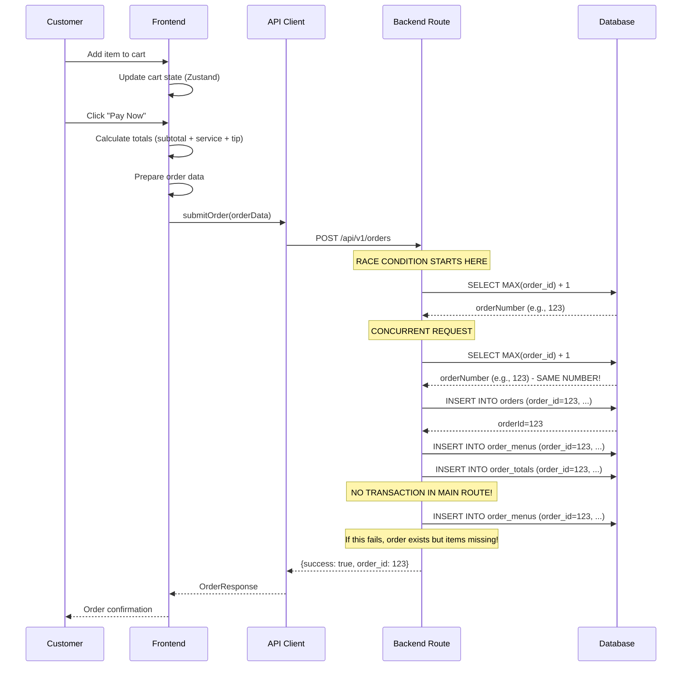

# End-to-End Order Creation Flow Analysis

**Analysis Date**: January 2025  
**Purpose**: Trace order creation from "Add to Cart" to "Order Created" and verify atomicity + correctness

## 1. Order Creation Flow Sequence

### Frontend Flow (Next.js)

#### Step 1: Add to Cart
**File**: `frontend/store/cart-store.ts:37-60`
```typescript
addToCart: (item, quantity = 1) =>
  set((state) => {
    const existingItem = state.items.find((cartItem) => cartItem.item.id === item.id)
    if (existingItem) {
      const newQuantity = existingItem.quantity + quantity
      if (newQuantity <= 0) {
        return {
          items: state.items.filter((cartItem) => cartItem.item.id !== item.id)
        }
      }
      return {
        items: state.items.map((cartItem) =>
          cartItem.item.id === item.id ? { ...cartItem, quantity: newQuantity } : cartItem
        )
      }
    }
    if (quantity <= 0) return state
    return { 
      items: [...state.items, { item, quantity: quantity }] 
    }
  })
```

#### Step 2: Payment Modal Calculation
**File**: `frontend/app/menu/page.tsx:307-310`
```typescript
const serviceCharge = subtotal * 0.1
const tipAmount = customTip ? Number.parseFloat(customTip) || 0 : subtotal * (tipPercentage / 100)
const finalTotal = subtotal + serviceCharge + tipAmount
```

#### Step 3: Order Data Preparation
**File**: `frontend/app/menu/page.tsx:316-339`
```typescript
const orderData = {
  table_id: isCashier ? null : (tableInfo?.table_id || "7"),
  table_name: isCashier ? null : (tableInfo?.table_name || "Table 7"),
  location_id: tableInfo?.location_id || 1,
  is_codier: isCashier,
  items: itemsToPay.map(item => ({
    menu_id: item.item.id,
    name: item.item.name,
    quantity: item.quantity || 1,
    price: item.price,
    special_instructions: '',
    options: selectedOptions[item.item.id] || {}
  })),
  customer_name: paymentFormData.cardholderName || (isCashier ? "Cashier Customer" : `${tableInfo?.table_name || `Table ${tableInfo?.table_id || 'Unknown'}`} Customer`),
  customer_phone: paymentFormData.phone || '',
  customer_email: paymentFormData.email || '',
  payment_method: (selectedPaymentMethod === 'cod' ? 'cod' : 
                selectedPaymentMethod === 'paypal' ? 'paypal' : 'card') as 'cod' | 'card' | 'paypal',
  total_amount: finalTotal,
  tip_amount: tipAmount,
  special_instructions: ''
}
```

#### Step 4: API Client Order Submission
**File**: `frontend/lib/api-client.ts:250-270`
```typescript
async submitOrder(order: OrderRequest): Promise<OrderResponse> {
  try {
    const endpoint = this.envConfig.getApiEndpoint('/orders');
    const response = await fetch(endpoint, {
      method: 'POST',
      headers: {
        'Accept': 'application/json',
        'Content-Type': 'application/json',
      },
      body: JSON.stringify(order),
    });
    
    if (!response.ok) {
      throw new Error(`HTTP error! status: ${response.status}`);
    }
    
    const data = await response.json();
    return data;
  } catch (error) {
    console.error('Order submission failed:', error);
    throw error;
  }
}
```

### Backend Flow (Laravel/TastyIgniter)

#### Step 5: Route Handler Selection
**Two different routes handle order creation:**

1. **Admin Route** (Primary): `app/admin/routes.php:569`
2. **Main Route** (Secondary): `app/main/routes.php:248`

#### Step 6: Admin Route Order Creation
**File**: `app/admin/routes.php:569-750`

**Input Validation**:
```php
$validationRules = [
    'customer_name' => 'required|string|max:255',
    'items' => 'required|array|min:1',
    'items.*.menu_id' => 'required|integer|exists:menus,menu_id',
    'items.*.name' => 'required|string|max:255',
    'items.*.quantity' => 'required|integer|min:1',
    'items.*.price' => 'required|numeric|min:0',
    'total_amount' => 'required|numeric|min:0',
    'payment_method' => 'required|in:cash,card,paypal'
];
```

**Transaction Boundary**:
```php
DB::beginTransaction();

// Get next order number - RACE CONDITION!
$orderNumber = DB::table('orders')->max('order_id') + 1;

// Create main order record
$orderId = DB::table('orders')->insertGetId([...]);

// Insert order items
foreach ($request->items as $item) {
    DB::table('order_menus')->insert([...]);
}

// Store tip amount if provided
if ($request->tip_amount && $request->tip_amount > 0) {
    DB::table('order_totals')->insert([...]);
}

// Store payment method
DB::table('order_totals')->insert([...]);

DB::commit();
```

#### Step 7: Main Route Order Creation
**File**: `app/main/routes.php:248-350`

**Input Validation** (Basic):
```php
if (empty($input['table_id']) || empty($input['items']) || empty($input['customer_name'])) {
    return response()->json([
        'success' => false,
        'error' => 'Missing required fields: table_id, items, customer_name'
    ], 400);
}
```

**No Transaction Boundary**:
```php
// Insert order - NO TRANSACTION!
$orderId = DB::table('orders')->insertGetId([...]);

// Insert order menu items - NO TRANSACTION!
foreach ($input['items'] as $item) {
    $orderMenuId = DB::table('order_menus')->insertGetId([...]);
    
    // Process options - NO TRANSACTION!
    if (!empty($item['options'])) {
        foreach ($item['options'] as $optionType => $optionValueId) {
            DB::table('order_menu_options')->insert([...]);
        }
    }
}
```

## 2. Input Validation Analysis

### Frontend Validation
- **Cart Store**: Basic quantity validation (must be > 0)
- **Payment Modal**: Numeric validation for tips and totals
- **TypeScript Types**: Interface validation for order structure

### Backend Validation

#### Admin Route Validation (Comprehensive)
```php
$validationRules = [
    'customer_name' => 'required|string|max:255',
    'items' => 'required|array|min:1',
    'items.*.menu_id' => 'required|integer|exists:menus,menu_id',
    'items.*.name' => 'required|string|max:255',
    'items.*.quantity' => 'required|integer|min:1',
    'items.*.price' => 'required|numeric|min:0',
    'total_amount' => 'required|numeric|min:0',
    'payment_method' => 'required|in:cash,card,paypal'
];
```

#### Main Route Validation (Insufficient)
```php
// Only basic field presence check
if (empty($input['table_id']) || empty($input['items']) || empty($input['customer_name'])) {
    return response()->json(['success' => false, 'error' => 'Missing required fields'], 400);
}
```

## 3. Transaction Boundaries Analysis

### ❌ CRITICAL ISSUE: Inconsistent Transaction Handling

#### Admin Route: Partial Transaction
- ✅ `DB::beginTransaction()` and `DB::commit()`
- ❌ **Race Condition**: `max(order_id) + 1` outside transaction
- ❌ **Non-atomic**: Order ID generation not protected

#### Main Route: No Transaction
- ❌ **No transaction wrapping** at all
- ❌ **Data inconsistency risk** if any step fails
- ❌ **Partial order creation** possible

## 4. Totals Math Verification

### Frontend Calculation
```typescript
// frontend/app/menu/page.tsx:307-310
const subtotal = itemsToPay.reduce((acc, inst) => acc + inst.price, 0)
const serviceCharge = subtotal * 0.1  // 10% service charge
const tipAmount = customTip ? Number.parseFloat(customTip) || 0 : subtotal * (tipPercentage / 100)
const finalTotal = subtotal + serviceCharge + tipAmount
```

### Backend Calculation
```php
// Admin route - NO CALCULATION, trusts frontend
$orderId = DB::table('orders')->insertGetId([
    'order_total' => $request->total_amount,  // Trusts frontend calculation
    // ...
]);

// Main route - NO CALCULATION, trusts frontend
$orderId = DB::table('orders')->insertGetId([
    'order_total' => $input['total_amount'],  // Trusts frontend calculation
    // ...
]);
```

### ❌ CRITICAL ISSUE: No Backend Validation of Totals
- Backend **trusts frontend calculation** completely
- No verification of `subtotal + service + tip = total`
- No validation against menu prices
- **Security risk**: Frontend can manipulate totals

## 5. Idempotency Analysis

### ❌ CRITICAL ISSUE: No Idempotency Protection

#### Race Condition in Order ID Generation
```php
// app/admin/routes.php:598
$orderNumber = DB::table('orders')->max('order_id') + 1;  // RACE CONDITION!
```

**Problem**: Two concurrent requests can get the same order number.

#### No Duplicate Prevention
- No unique constraints on order creation
- No idempotency keys
- No retry protection
- **Client retries can create duplicate orders**

## 6. Sequence Diagram



## 7. Critical Issues Summary

### 🔴 CRITICAL: Race Conditions
1. **Order ID Generation**: `max(order_id) + 1` without transaction protection
2. **Concurrent Requests**: Can create duplicate order IDs
3. **Data Corruption**: Partial order creation possible

### 🔴 CRITICAL: No Transaction Atomicity
1. **Main Route**: No transaction wrapping at all
2. **Admin Route**: Race condition outside transaction
3. **Partial Failures**: Orders can be created without items

### 🔴 CRITICAL: No Totals Validation
1. **Frontend Trust**: Backend trusts frontend calculations
2. **Security Risk**: Totals can be manipulated
3. **No Verification**: No validation against menu prices

### 🔴 CRITICAL: No Idempotency
1. **Duplicate Orders**: Client retries create duplicates
2. **No Unique Keys**: No protection against retries
3. **No Deduplication**: No mechanism to prevent duplicates

## 8. Recommended Fixes

### Immediate Fixes (Critical)

#### 1. Fix Race Condition in Order ID Generation
```php
// BEFORE (app/admin/routes.php:598)
$orderNumber = DB::table('orders')->max('order_id') + 1;

// AFTER
DB::beginTransaction();
$orderNumber = DB::table('orders')->lockForUpdate()->max('order_id') + 1;
// ... rest of order creation
DB::commit();
```

#### 2. Add Transaction Wrapping to Main Route
```php
// BEFORE (app/main/routes.php:248)
Route::post('/orders', function () {
    // No transaction
    $orderId = DB::table('orders')->insertGetId([...]);
    // ... rest of code
});

// AFTER
Route::post('/orders', function () {
    DB::beginTransaction();
    try {
        $orderId = DB::table('orders')->insertGetId([...]);
        // ... rest of code
        DB::commit();
    } catch (\Exception $e) {
        DB::rollBack();
        throw $e;
    }
});
```

#### 3. Add Backend Totals Validation
```php
// Add after validation rules
$calculatedTotal = 0;
foreach ($request->items as $item) {
    $menuItem = DB::table('menus')->where('menu_id', $item['menu_id'])->first();
    if (!$menuItem) {
        throw new \Exception("Menu item not found");
    }
    $calculatedTotal += $menuItem->menu_price * $item['quantity'];
}

// Add service charge and tip
$serviceCharge = $calculatedTotal * 0.1;
$tipAmount = $request->tip_amount ?? 0;
$expectedTotal = $calculatedTotal + $serviceCharge + $tipAmount;

if (abs($request->total_amount - $expectedTotal) > 0.01) {
    throw new \Exception("Total amount mismatch");
}
```

#### 4. Add Idempotency Protection
```php
// Add idempotency key to request
$idempotencyKey = $request->header('Idempotency-Key') ?: Str::uuid();
$existingOrder = DB::table('orders')->where('idempotency_key', $idempotencyKey)->first();
if ($existingOrder) {
    return response()->json([
        'success' => true,
        'order_id' => $existingOrder->order_id,
        'message' => 'Order already exists'
    ]);
}

// Add idempotency_key to order creation
$orderId = DB::table('orders')->insertGetId([
    'idempotency_key' => $idempotencyKey,
    // ... rest of fields
]);
```

### Complete Fix Implementation

```php
<?php
// Complete fixed order creation route
Route::post('/orders', function (Request $request) {
    try {
        // Input validation
        $validationRules = [
            'customer_name' => 'required|string|max:255',
            'items' => 'required|array|min:1',
            'items.*.menu_id' => 'required|integer|exists:menus,menu_id',
            'items.*.name' => 'required|string|max:255',
            'items.*.quantity' => 'required|integer|min:1',
            'items.*.price' => 'required|numeric|min:0',
            'total_amount' => 'required|numeric|min:0',
            'payment_method' => 'required|in:cash,card,paypal'
        ];
        
        $request->validate($validationRules);
        
        // Idempotency check
        $idempotencyKey = $request->header('Idempotency-Key') ?: Str::uuid();
        $existingOrder = DB::table('orders')->where('idempotency_key', $idempotencyKey)->first();
        if ($existingOrder) {
            return response()->json([
                'success' => true,
                'order_id' => $existingOrder->order_id,
                'message' => 'Order already exists'
            ]);
        }
        
        // Start transaction
        DB::beginTransaction();
        
        try {
            // Validate and calculate totals
            $calculatedTotal = 0;
            $validatedItems = [];
            
            foreach ($request->items as $item) {
                $menuItem = DB::table('menus')
                    ->where('menu_id', $item['menu_id'])
                    ->where('menu_status', 1)
                    ->lockForUpdate()
                    ->first();
                
                if (!$menuItem) {
                    throw new \Exception("Menu item {$item['menu_id']} not found or inactive");
                }
                
                $itemTotal = $menuItem->menu_price * $item['quantity'];
                $calculatedTotal += $itemTotal;
                
                $validatedItems[] = [
                    'menu_id' => $item['menu_id'],
                    'name' => $menuItem->menu_name,
                    'quantity' => $item['quantity'],
                    'price' => $menuItem->menu_price,
                    'subtotal' => $itemTotal
                ];
            }
            
            // Add service charge and tip
            $serviceCharge = $calculatedTotal * 0.1;
            $tipAmount = $request->tip_amount ?? 0;
            $expectedTotal = $calculatedTotal + $serviceCharge + $tipAmount;
            
            // Validate total amount
            if (abs($request->total_amount - $expectedTotal) > 0.01) {
                throw new \Exception("Total amount mismatch. Expected: {$expectedTotal}, Got: {$request->total_amount}");
            }
            
            // Create order with proper ID generation
            $orderId = DB::table('orders')->insertGetId([
                'idempotency_key' => $idempotencyKey,
                'first_name' => $request->customer_name,
                'last_name' => 'Customer',
                'email' => $request->customer_email ?? 'customer@example.com',
                'telephone' => $request->customer_phone ?? '0000000000',
                'location_id' => 1,
                'order_type' => $request->table_id ?? 'cashier',
                'order_total' => $expectedTotal,
                'order_date' => now()->format('Y-m-d'),
                'order_time' => now()->format('H:i:s'),
                'status_id' => 1,
                'assignee_id' => null,
                'comment' => $request->special_instructions ?? '',
                'processed' => 0,
                'payment' => $request->payment_method,
                'total_items' => count($validatedItems),
                'ip_address' => $request->ip(),
                'user_agent' => $request->userAgent() ?? 'API Client',
                'created_at' => now(),
                'updated_at' => now()
            ]);
            
            // Insert order items
            foreach ($validatedItems as $item) {
                DB::table('order_menus')->insert([
                    'order_id' => $orderId,
                    'menu_id' => $item['menu_id'],
                    'name' => $item['name'],
                    'quantity' => $item['quantity'],
                    'price' => $item['price'],
                    'subtotal' => $item['subtotal'],
                    'comment' => $item['special_instructions'] ?? ''
                ]);
            }
            
            // Insert order totals
            DB::table('order_totals')->insert([
                'order_id' => $orderId,
                'code' => 'subtotal',
                'title' => 'Subtotal',
                'value' => $calculatedTotal,
                'priority' => 1,
                'is_summable' => 1
            ]);
            
            if ($serviceCharge > 0) {
                DB::table('order_totals')->insert([
                    'order_id' => $orderId,
                    'code' => 'service',
                    'title' => 'Service Charge (10%)',
                    'value' => $serviceCharge,
                    'priority' => 2,
                    'is_summable' => 1
                ]);
            }
            
            if ($tipAmount > 0) {
                DB::table('order_totals')->insert([
                    'order_id' => $orderId,
                    'code' => 'tip',
                    'title' => 'Tip',
                    'value' => $tipAmount,
                    'priority' => 3,
                    'is_summable' => 1
                ]);
            }
            
            DB::table('order_totals')->insert([
                'order_id' => $orderId,
                'code' => 'total',
                'title' => 'Total',
                'value' => $expectedTotal,
                'priority' => 4,
                'is_summable' => 0
            ]);
            
            DB::commit();
            
            return response()->json([
                'success' => true,
                'order_id' => $orderId,
                'message' => 'Order created successfully',
                'total_breakdown' => [
                    'subtotal' => $calculatedTotal,
                    'service_charge' => $serviceCharge,
                    'tip' => $tipAmount,
                    'total' => $expectedTotal
                ]
            ]);
            
        } catch (\Exception $e) {
            DB::rollBack();
            throw $e;
        }
        
    } catch (\Exception $e) {
        return response()->json([
            'success' => false,
            'error' => 'Failed to create order',
            'message' => $e->getMessage()
        ], 500);
    }
});
```

## 9. Database Schema Updates Required

```sql
-- Add idempotency key to orders table
ALTER TABLE `ti_orders` 
ADD COLUMN `idempotency_key` varchar(255) UNIQUE AFTER `order_id`;

-- Add index for idempotency lookups
CREATE INDEX `idx_orders_idempotency_key` ON `ti_orders` (`idempotency_key`);

-- Add foreign key constraints
ALTER TABLE `ti_orders` 
ADD CONSTRAINT `fk_orders_status` 
FOREIGN KEY (`status_id`) REFERENCES `ti_statuses`(`status_id`) 
ON DELETE RESTRICT ON UPDATE CASCADE;

ALTER TABLE `ti_order_menus` 
ADD CONSTRAINT `fk_order_menus_order` 
FOREIGN KEY (`order_id`) REFERENCES `ti_orders`(`order_id`) 
ON DELETE CASCADE ON UPDATE CASCADE;

ALTER TABLE `ti_order_menus` 
ADD CONSTRAINT `fk_order_menus_menu` 
FOREIGN KEY (`menu_id`) REFERENCES `ti_menus`(`menu_id`) 
ON DELETE RESTRICT ON UPDATE CASCADE;
```

## 10. Frontend Updates Required

```typescript
// Add idempotency key to API client
async submitOrder(order: OrderRequest): Promise<OrderResponse> {
  const idempotencyKey = crypto.randomUUID();
  
  const response = await fetch(endpoint, {
    method: 'POST',
    headers: {
      'Accept': 'application/json',
      'Content-Type': 'application/json',
      'Idempotency-Key': idempotencyKey,
    },
    body: JSON.stringify(order),
  });
  
  // ... rest of implementation
}
```

## Conclusion

The current order creation flow has **critical atomicity and correctness issues**:

1. **Race conditions** in order ID generation
2. **No transaction atomicity** in main route
3. **No backend validation** of totals
4. **No idempotency protection** against retries

**Recommendation**: Implement the complete fix before any production deployment.

---

*This analysis provides a comprehensive trace of the order creation flow with specific code references and critical issues identified.*