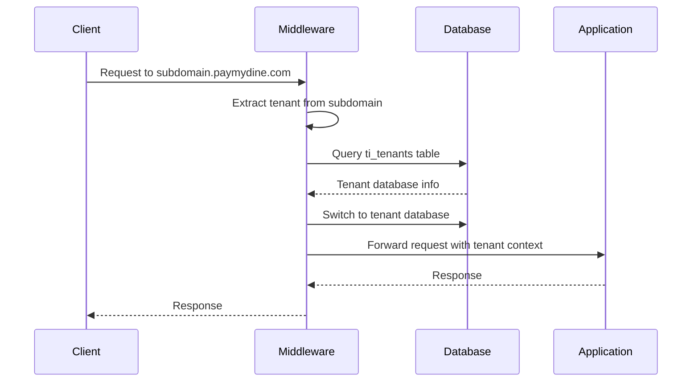
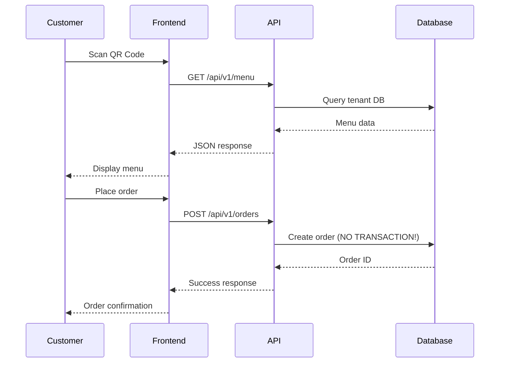

# Technical Audit Overview: PayMyDine Multi-Tenant Restaurant System

**Audit Date**: January 2025  
**Auditor**: AI Technical Auditor  
**Scope**: Full-stack application audit (Backend, Frontend, Database, Infrastructure)  
**Repository**: PayMyDine Multi-Tenant Restaurant Ordering System

## Executive Summary

This audit reveals a **functionally complete but critically vulnerable** multi-tenant restaurant ordering system. The application demonstrates solid architectural foundations but suffers from **severe security vulnerabilities**, **performance bottlenecks**, and **data integrity issues** that require immediate attention before production deployment.

**Risk Level**: 🔴 **CRITICAL** - Immediate security fixes required

## Codebase Architecture Map

### Backend (Laravel/TastyIgniter)
```
app/
├── admin/                    # Admin panel module
│   ├── controllers/         # 25+ controllers
│   ├── models/             # 44+ Eloquent models  
│   ├── routes.php          # 1000+ lines of routes
│   └── views/              # Blade templates
├── main/                   # Customer-facing module
│   ├── routes.php          # API endpoints
│   └── models/             # Customer models
├── system/                 # Core system module
│   ├── classes/            # Base classes
│   └── traits/             # Reusable traits
└── Http/
    └── Middleware/
        └── TenantDatabaseMiddleware.php  # Multi-tenant switching
```

### Frontend (Next.js 15.2.4)
```
frontend/
├── app/                    # Next.js 13+ app directory
│   ├── admin/             # Admin interface
│   ├── table/             # Table-specific pages
│   ├── checkout/          # Order checkout
│   └── order-placed/      # Order confirmation
├── components/            # UI components
│   ├── ui/               # Radix UI components
│   └── payment/          # Payment components
├── lib/                  # Utilities and API client
│   ├── api-client.ts     # Centralized HTTP client
│   └── environment-config.ts  # Multi-tenant config
├── store/                # Zustand state management
│   ├── cart-store.ts     # Shopping cart
│   ├── language-store.ts # i18n
│   └── theme-store.ts    # Theme management
└── hooks/                # Custom React hooks
```

### Database (MySQL 8.0)
```
db/
├── paymydine.sql         # Main schema (2691 lines)
├── newtenantdb.sql       # Tenant template
└── sample_rows.sql       # Sample data

Key Tables:
├── ti_orders            # Order management
├── ti_menus             # Menu items
├── ti_tables            # Table management
├── ti_categories        # Menu categories
├── ti_tenants           # Multi-tenant registry
└── ti_notifications     # Real-time notifications
```

## Critical Findings Summary

### 🔴 Security Vulnerabilities (CRITICAL)
1. **No API Authentication** - All endpoints publicly accessible
2. **SQL Injection Risk** - Raw SQL queries without parameterization
3. **Missing CSRF Protection** - No CSRF tokens on API routes
4. **XSS Vulnerabilities** - Unescaped user input in responses
5. **Data Exposure** - Sensitive information in error messages

### 🟡 Data Integrity Issues (HIGH)
1. **Race Conditions** - Order ID generation using `max() + 1`
2. **Missing Transactions** - Order creation not atomic
3. **Missing Foreign Keys** - Referential integrity not enforced
4. **Inconsistent Validation** - Mixed validation approaches

### 🟡 Performance Issues (MEDIUM)
1. **No Caching** - Database queries on every request
2. **N+1 Query Risk** - Potential performance bottlenecks
3. **Missing Indexes** - Slow query performance
4. **No Pagination** - Large datasets cause memory issues

### 🟢 Architecture Strengths
1. **Multi-tenant Design** - Database-per-tenant isolation
2. **Modular Structure** - Clean separation of concerns
3. **TypeScript Frontend** - Type safety and developer experience
4. **Comprehensive Documentation** - Well-documented codebase

## Entry Points Analysis

### Backend Entry Points
- **Admin Panel**: `/admin` (TastyIgniter framework)
- **API Endpoints**: `/api/v1/*` (Laravel routes)
- **QR Redirect**: `/redirect/qr` (Table-based ordering)
- **Super Admin**: `/superadmin/*` (Tenant management)

### Frontend Entry Points
- **Customer Interface**: `/` (Next.js app)
- **Table Ordering**: `/table/[id]` (QR code landing)
- **Admin Dashboard**: `/admin` (Admin interface)
- **Order Status**: `/order-placed` (Order confirmation)

## Multi-Tenancy Implementation

### Tenant Detection Flow


### Database Isolation
- **Per-tenant databases**: Each restaurant has isolated data
- **Shared tenant registry**: `ti_tenants` table for tenant management
- **Middleware enforcement**: All requests go through tenant detection
- **Connection switching**: Dynamic database connection changes

## Business Logic Analysis

### Order Creation Flow


### Critical Issues in Order Flow
1. **No Transaction Wrapping** - Order creation not atomic
2. **Race Condition** - Order ID generation using `max() + 1`
3. **No Validation** - Input validation missing
4. **No Error Handling** - Inconsistent error responses

## Security Assessment

### Authentication & Authorization
- **Admin Panel**: ✅ Session-based authentication
- **API Endpoints**: ❌ No authentication
- **Super Admin**: ✅ Custom authentication
- **Multi-tenant**: ✅ Tenant isolation enforced

### Input Validation
- **Laravel Validation**: ⚠️ Inconsistent usage
- **Frontend Validation**: ✅ React Hook Form + Zod
- **SQL Injection**: ❌ Raw SQL without parameterization
- **XSS Protection**: ❌ Unescaped user input

### Data Protection
- **Database Isolation**: ✅ Per-tenant database separation
- **CSRF Protection**: ❌ Missing on API routes
- **Rate Limiting**: ❌ No request throttling
- **HTTPS Enforcement**: ❌ No security headers

## Performance Analysis

### Database Performance
- **Query Optimization**: ❌ Complex joins without indexes
- **Caching Strategy**: ❌ No caching implementation
- **Pagination**: ❌ Large datasets not paginated
- **Connection Pooling**: ⚠️ Basic Laravel connection handling

### Frontend Performance
- **Code Splitting**: ✅ Next.js automatic splitting
- **Image Optimization**: ✅ Next.js image optimization
- **Bundle Size**: ⚠️ Large dependency footprint
- **State Management**: ✅ Efficient Zustand stores

## Test Coverage

### Backend Tests
- **Unit Tests**: ❌ Minimal coverage
- **Feature Tests**: ⚠️ Basic functionality tests
- **Integration Tests**: ❌ No multi-tenant tests
- **Browser Tests**: ⚠️ Laravel Dusk setup only

### Frontend Tests
- **Unit Tests**: ❌ No test files found
- **Integration Tests**: ❌ No test setup
- **E2E Tests**: ❌ No end-to-end testing
- **Visual Tests**: ❌ No visual regression testing

## Documentation Quality

### Well Documented
- **Architecture**: ✅ Comprehensive system overview
- **API Specs**: ✅ OpenAPI documentation
- **Database**: ✅ ERD and migration docs
- **Multi-tenancy**: ✅ Detailed tenant implementation

### Missing Documentation
- **Setup Guide**: ❌ No installation instructions
- **API Authentication**: ❌ No auth documentation
- **Troubleshooting**: ❌ No debugging guides
- **Deployment**: ❌ No production deployment guide

## Risk Assessment Matrix

| Risk Category | Impact | Likelihood | Risk Level | Priority |
|---------------|--------|------------|------------|----------|
| SQL Injection | High | High | 🔴 Critical | P0 |
| No API Auth | High | High | 🔴 Critical | P0 |
| Race Conditions | High | Medium | 🟡 High | P1 |
| XSS Vulnerabilities | Medium | High | 🟡 High | P1 |
| Performance Issues | Medium | Medium | 🟡 Medium | P2 |
| Missing Tests | Low | High | 🟡 Medium | P2 |

## Immediate Action Required

### Critical (0-2 weeks)
1. **Implement API Authentication** - JWT or API key authentication
2. **Fix SQL Injection** - Parameterize all raw SQL queries
3. **Add CSRF Protection** - Implement CSRF tokens
4. **Fix Race Conditions** - Use database transactions
5. **Add Input Validation** - Comprehensive validation layer

### Near-term (1-2 months)
1. **Implement Caching** - Redis for menu and order data
2. **Add Rate Limiting** - Protect against abuse
3. **Security Audit** - Comprehensive security review
4. **Add Tests** - Comprehensive test coverage
5. **Performance Optimization** - Query optimization and indexing

### Later (3-6 months)
1. **Monitoring & Logging** - Application monitoring
2. **Backup Strategy** - Data backup and recovery
3. **Documentation** - Complete setup and deployment guides
4. **CI/CD Pipeline** - Automated testing and deployment
5. **Load Testing** - Performance under load

## Conclusion

The PayMyDine system demonstrates **solid architectural foundations** but requires **immediate security fixes** before any production deployment. The multi-tenant design is well-implemented, but the lack of authentication, input validation, and proper error handling creates **critical security vulnerabilities**.

**Recommendation**: **DO NOT DEPLOY** until critical security issues are resolved.

---

*This audit provides a comprehensive analysis of the PayMyDine system. For detailed findings and specific code references, see the accompanying audit documents.*