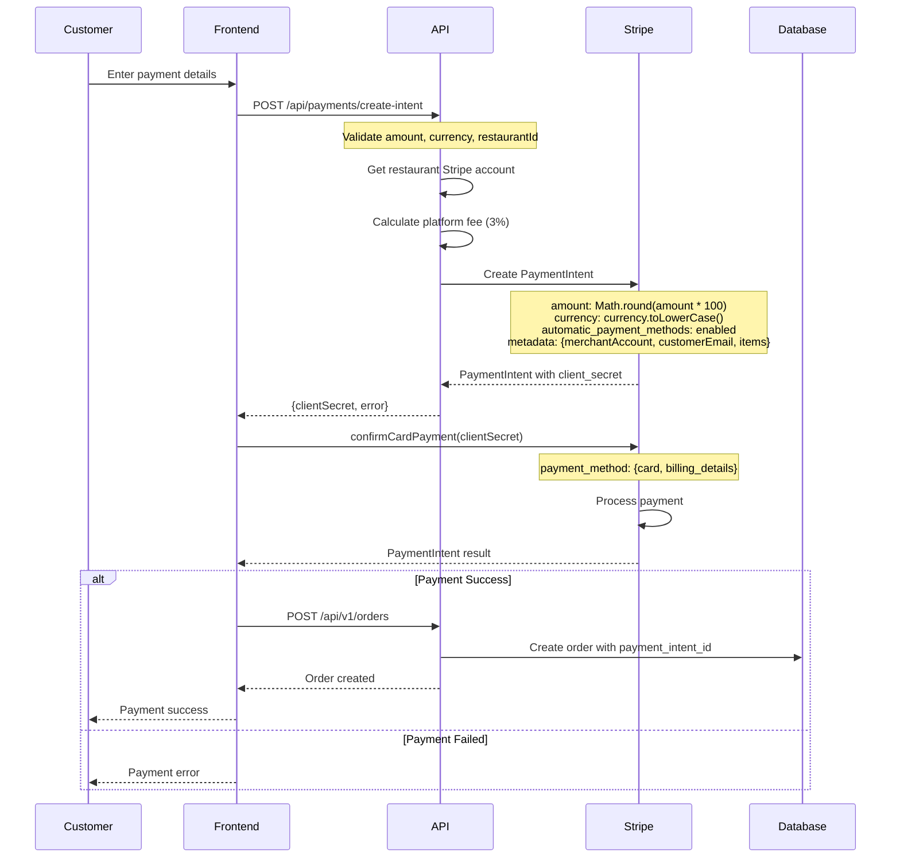
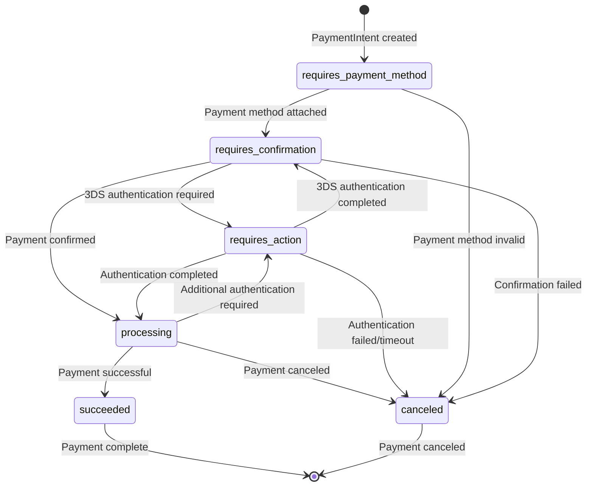

# Payment System Analysis & Hardening

**Analysis Date**: January 2025  
**Purpose**: Document and harden the Stripe payment integration

## 1. Stripe Usage Analysis

### Stripe SDK Integration

**Frontend Integration**:
- **Package**: `@stripe/stripe-js` and `@stripe/react-stripe-js`
- **Configuration**: `frontend/lib/payment-service.ts:1-2`
- **Elements**: CardElement, useStripe, useElements

**Backend Integration**:
- **Package**: `stripe` (Node.js SDK)
- **API Version**: `2023-10-16`
- **Configuration**: `frontend/app/api/payments/create-intent/route.ts:6-10`

### Stripe Keys Configuration

**Environment Variables**:
```env
# Frontend (Public)
NEXT_PUBLIC_STRIPE_PUBLISHABLE_KEY=pk_test_your_publishable_key
NEXT_PUBLIC_STRIPE_ACCOUNT_ID=acct_your_restaurant_stripe_account_id

# Backend (Secret)
STRIPE_SECRET_KEY=sk_test_your_secret_key
STRIPE_RESTAURANT_ACCOUNT_ID=acct_your_restaurant_stripe_account_id
STRIPE_WEBHOOK_SECRET=whsec_your_webhook_secret
```

**Key Locations**:
- **Frontend**: `frontend/app/checkout/page.tsx:50`
- **Backend**: `frontend/app/api/process-payment/route.ts:127`
- **Payment Intent**: `frontend/app/api/payments/create-intent/route.ts:6-7`

### Stripe Account Structure

**Multi-Tenant Configuration**:
```typescript
// frontend/app/api/payments/create-intent/route.ts:40-46
const restaurantAccount = await getRestaurantStripeAccount(restaurantId)
if (!restaurantAccount) {
  return NextResponse.json({
    error: 'Restaurant payment account not configured'
  }, { status: 400 })
}
```

**Platform Fee Calculation**:
```typescript
// frontend/app/api/payments/create-intent/route.ts:48-49
const platformFee = Math.round(amount * 0.03) // 3% platform fee
```

## 2. Server→Client Payment Flow

### Payment Intent Creation Flow



### Secret Management Analysis

**✅ SECURE: Secret Keys**
- **Backend**: `STRIPE_SECRET_KEY` stored in server environment
- **Frontend**: Only publishable keys exposed to client
- **No client-side secret exposure**

**⚠️ RISK: Webhook Secret**
- **Missing**: No webhook endpoint implementation found
- **Risk**: Webhook signature verification not implemented
- **Impact**: Payment events not processed

## 3. Webhook Signature Check & Idempotency

### Current Webhook Status

**❌ CRITICAL ISSUE: No Webhook Implementation**

**Missing Components**:
1. **Webhook Endpoint**: No `/webhooks/stripe` route found
2. **Signature Verification**: No `Stripe-Signature` validation
3. **Event Processing**: No webhook event handlers
4. **Idempotency**: No idempotency key handling

### Required Webhook Implementation

```typescript
// Required: /api/webhooks/stripe/route.ts
import { NextRequest, NextResponse } from 'next/server'
import Stripe from 'stripe'
import { headers } from 'next/headers'

const stripe = new Stripe(process.env.STRIPE_SECRET_KEY!, {
  apiVersion: '2023-10-16',
})

const webhookSecret = process.env.STRIPE_WEBHOOK_SECRET!

export async function POST(request: NextRequest) {
  const body = await request.text()
  const signature = headers().get('stripe-signature')!
  
  let event: Stripe.Event
  
  try {
    event = stripe.webhooks.constructEvent(body, signature, webhookSecret)
  } catch (err: any) {
    console.error('Webhook signature verification failed:', err.message)
    return NextResponse.json({ error: 'Invalid signature' }, { status: 400 })
  }
  
  // Handle the event
  switch (event.type) {
    case 'payment_intent.succeeded':
      await handlePaymentSuccess(event.data.object as Stripe.PaymentIntent)
      break
    case 'payment_intent.payment_failed':
      await handlePaymentFailure(event.data.object as Stripe.PaymentIntent)
      break
    case 'payment_intent.canceled':
      await handlePaymentCanceled(event.data.object as Stripe.PaymentIntent)
      break
    default:
      console.log(`Unhandled event type: ${event.type}`)
  }
  
  return NextResponse.json({ received: true })
}
```

### Idempotency Key Implementation

**Current Status**: ❌ **Not Implemented**

**Required Implementation**:
```typescript
// Add idempotency key to PaymentIntent creation
const paymentIntent = await stripe.paymentIntents.create({
  amount: Math.round(amount * 100),
  currency: currency.toLowerCase(),
  idempotency_key: `order_${orderId}_${Date.now()}`,
  automatic_payment_methods: { enabled: true },
  metadata: {
    order_id: orderId,
    restaurant_id: restaurantId,
    customer_email: customerInfo.email,
  }
})
```

## 4. Refund/Cancel Flows

### Current Refund Status

**❌ CRITICAL ISSUE: No Refund Implementation**

**Missing Components**:
1. **Refund API Endpoints**: No refund processing routes
2. **Refund Database Schema**: No refund tracking columns
3. **Refund UI**: No admin refund interface
4. **Refund Webhooks**: No refund event handling

### Required Refund Implementation

```typescript
// Required: /api/payments/refund/route.ts
import { NextRequest, NextResponse } from 'next/server'
import Stripe from 'stripe'

const stripe = new Stripe(process.env.STRIPE_SECRET_KEY!, {
  apiVersion: '2023-10-16',
})

export async function POST(request: NextRequest) {
  const { paymentIntentId, amount, reason } = await request.json()
  
  try {
    const refund = await stripe.refunds.create({
      payment_intent: paymentIntentId,
      amount: amount ? Math.round(amount * 100) : undefined,
      reason: reason || 'requested_by_customer',
      metadata: {
        refunded_at: new Date().toISOString(),
        refunded_by: 'admin', // Should be actual admin ID
      }
    })
    
    // Update order status in database
    await updateOrderRefundStatus(paymentIntentId, refund.id, refund.amount / 100)
    
    return NextResponse.json({
      success: true,
      refund_id: refund.id,
      amount: refund.amount / 100,
      status: refund.status
    })
    
  } catch (error: any) {
    console.error('Refund failed:', error)
    return NextResponse.json({
      success: false,
      error: error.message
    }, { status: 400 })
  }
}
```

### Payment Cancellation

**Current Status**: ❌ **Not Implemented**

**Required Implementation**:
```typescript
// Required: Cancel PaymentIntent
export async function cancelPayment(paymentIntentId: string) {
  try {
    const paymentIntent = await stripe.paymentIntents.cancel(paymentIntentId)
    
    // Update order status
    await updateOrderStatus(paymentIntentId, 'canceled')
    
    return {
      success: true,
      status: paymentIntent.status
    }
  } catch (error: any) {
    return {
      success: false,
      error: error.message
    }
  }
}
```

## 5. PaymentIntent Lifecycle State Machine



## 6. Security Checklist

### ✅ **Implemented Security Measures**

1. **Secret Key Protection**: Backend secrets not exposed to client
2. **HTTPS Required**: Stripe requires HTTPS in production
3. **Amount Validation**: Amount converted to cents (integer)
4. **Currency Validation**: Currency converted to lowercase
5. **Metadata Tracking**: Order and customer info stored in metadata

### ❌ **Missing Security Measures**

1. **Webhook Signature Verification**: Not implemented
2. **Idempotency Keys**: Not implemented
3. **3DS Authentication**: Not properly handled
4. **Rate Limiting**: No rate limiting on payment endpoints
5. **Input Validation**: Limited validation on payment data
6. **Error Handling**: Insufficient error handling and logging
7. **Refund Security**: No refund authorization checks

### 🔒 **Required Security Hardening**

```typescript
// 1. Webhook Signature Verification
const event = stripe.webhooks.constructEvent(body, signature, webhookSecret)

// 2. Idempotency Key Implementation
const paymentIntent = await stripe.paymentIntents.create({
  idempotency_key: `order_${orderId}_${timestamp}`,
  // ... other parameters
})

// 3. 3DS Authentication Handling
if (paymentIntent.status === 'requires_action') {
  return NextResponse.json({
    requires_action: true,
    client_secret: paymentIntent.client_secret
  })
}

// 4. Rate Limiting
import rateLimit from 'express-rate-limit'

const paymentRateLimit = rateLimit({
  windowMs: 15 * 60 * 1000, // 15 minutes
  max: 5, // 5 payment attempts per window
  message: 'Too many payment attempts, please try again later'
})

// 5. Input Validation
const paymentSchema = z.object({
  amount: z.number().positive().max(10000), // Max $100
  currency: z.string().length(3),
  restaurantId: z.string().uuid(),
  customerInfo: z.object({
    email: z.string().email(),
    name: z.string().min(1).max(100)
  })
})
```

## 7. Currency & Rounding Analysis

### Current Implementation

**Amount Conversion**: `frontend/app/api/process-payment/route.ts:135`
```typescript
amount: Math.round(amount * 100), // Convert to cents
```

**Currency Handling**: `frontend/app/api/process-payment/route.ts:136`
```typescript
currency: currency.toLowerCase(),
```

### Currency Support

**Supported Currencies**: Not explicitly defined
**Default Currency**: Not set
**Currency Validation**: Basic lowercase conversion only

### Rounding Issues

**✅ CORRECT**: Amount conversion to cents
**⚠️ RISK**: No currency-specific rounding rules
**⚠️ RISK**: No minimum amount validation
**⚠️ RISK**: No maximum amount validation

### Required Currency Hardening

```typescript
// Currency validation and rounding
const SUPPORTED_CURRENCIES = ['usd', 'eur', 'gbp', 'cad', 'aud']
const CURRENCY_DECIMALS = {
  usd: 2, eur: 2, gbp: 2, cad: 2, aud: 2,
  jpy: 0, krw: 0, // Zero decimal currencies
}

function validateAndRoundAmount(amount: number, currency: string): number {
  if (!SUPPORTED_CURRENCIES.includes(currency.toLowerCase())) {
    throw new Error(`Unsupported currency: ${currency}`)
  }
  
  const decimals = CURRENCY_DECIMALS[currency.toLowerCase()] || 2
  const multiplier = Math.pow(10, decimals)
  
  return Math.round(amount * multiplier)
}
```

## 8. Test Matrix with Mocked Stripe

### Unit Tests

```typescript
// Test payment intent creation
describe('Payment Intent Creation', () => {
  it('should create payment intent with correct amount', async () => {
    const mockStripe = {
      paymentIntents: {
        create: jest.fn().mockResolvedValue({
          id: 'pi_test_123',
          client_secret: 'pi_test_123_secret',
          status: 'requires_payment_method'
        })
      }
    }
    
    const result = await createPaymentIntent({
      amount: 25.99,
      currency: 'usd',
      restaurantId: 'rest_123'
    })
    
    expect(mockStripe.paymentIntents.create).toHaveBeenCalledWith({
      amount: 2599, // $25.99 in cents
      currency: 'usd',
      automatic_payment_methods: { enabled: true }
    })
    
    expect(result.client_secret).toBe('pi_test_123_secret')
  })
  
  it('should handle 3DS authentication', async () => {
    const mockStripe = {
      paymentIntents: {
        create: jest.fn().mockResolvedValue({
          id: 'pi_test_123',
          status: 'requires_action',
          client_secret: 'pi_test_123_secret'
        })
      }
    }
    
    const result = await createPaymentIntent({
      amount: 25.99,
      currency: 'usd',
      restaurantId: 'rest_123'
    })
    
    expect(result.requires_action).toBe(true)
    expect(result.client_secret).toBe('pi_test_123_secret')
  })
})
```

### Integration Tests

```typescript
// Test webhook handling
describe('Stripe Webhooks', () => {
  it('should verify webhook signature', async () => {
    const payload = JSON.stringify({
      id: 'evt_test_webhook',
      type: 'payment_intent.succeeded',
      data: { object: { id: 'pi_test_123' } }
    })
    
    const signature = generateStripeSignature(payload, webhookSecret)
    
    const response = await request(app)
      .post('/api/webhooks/stripe')
      .set('stripe-signature', signature)
      .send(payload)
    
    expect(response.status).toBe(200)
    expect(response.body.received).toBe(true)
  })
  
  it('should reject invalid webhook signature', async () => {
    const payload = JSON.stringify({ invalid: 'payload' })
    const invalidSignature = 'invalid_signature'
    
    const response = await request(app)
      .post('/api/webhooks/stripe')
      .set('stripe-signature', invalidSignature)
      .send(payload)
    
    expect(response.status).toBe(400)
    expect(response.body.error).toBe('Invalid signature')
  })
})
```

### End-to-End Tests

```typescript
// Test complete payment flow
describe('Payment Flow E2E', () => {
  it('should process successful payment', async () => {
    // 1. Create payment intent
    const intentResponse = await request(app)
      .post('/api/payments/create-intent')
      .send({
        amount: 25.99,
        currency: 'usd',
        restaurantId: 'rest_123',
        customerInfo: { email: 'test@example.com' }
      })
    
    expect(intentResponse.status).toBe(200)
    expect(intentResponse.body.client_secret).toBeDefined()
    
    // 2. Confirm payment (mocked)
    const confirmResponse = await request(app)
      .post('/api/payments/confirm')
      .send({
        payment_intent_id: 'pi_test_123',
        payment_method_id: 'pm_test_123'
      })
    
    expect(confirmResponse.status).toBe(200)
    expect(confirmResponse.body.success).toBe(true)
    
    // 3. Verify order creation
    const order = await Order.findOne({ payment_intent_id: 'pi_test_123' })
    expect(order).toBeDefined()
    expect(order.payment_status).toBe('paid')
  })
})
```

## 9. Critical Issues Summary

### 🔴 **CRITICAL: Missing Webhook Implementation**
- **Impact**: Payment events not processed
- **Risk**: Orders not updated after payment
- **Fix**: Implement webhook endpoint with signature verification

### 🔴 **CRITICAL: No Refund Functionality**
- **Impact**: Cannot process refunds
- **Risk**: Customer service issues
- **Fix**: Implement refund API and admin interface

### 🔴 **CRITICAL: No Idempotency Protection**
- **Impact**: Duplicate payments possible
- **Risk**: Financial discrepancies
- **Fix**: Add idempotency keys to all Stripe operations

### 🔴 **CRITICAL: No 3DS Authentication Handling**
- **Impact**: 3DS payments fail
- **Risk**: Payment failures for European cards
- **Fix**: Implement 3DS authentication flow

### 🔴 **CRITICAL: Insufficient Error Handling**
- **Impact**: Payment errors not properly handled
- **Risk**: Poor user experience
- **Fix**: Implement comprehensive error handling

## 10. Implementation Priority

### **Phase 1: Critical Security (Immediate)**
1. Implement webhook signature verification
2. Add idempotency key protection
3. Implement 3DS authentication handling
4. Add comprehensive error handling

### **Phase 2: Core Functionality (Week 1)**
1. Implement refund processing
2. Add payment cancellation
3. Implement currency validation
4. Add rate limiting

### **Phase 3: Monitoring & Testing (Week 2)**
1. Add payment monitoring
2. Implement comprehensive testing
3. Add payment analytics
4. Implement fraud detection

## 11. Recommended Environment Variables

```env
# Stripe Configuration
STRIPE_SECRET_KEY=sk_test_your_secret_key
STRIPE_PUBLISHABLE_KEY=pk_test_your_publishable_key
STRIPE_WEBHOOK_SECRET=whsec_your_webhook_secret
STRIPE_RESTAURANT_ACCOUNT_ID=acct_your_restaurant_account_id

# Payment Security
PAYMENT_RATE_LIMIT_MAX=5
PAYMENT_RATE_LIMIT_WINDOW=900000
PAYMENT_MIN_AMOUNT=0.50
PAYMENT_MAX_AMOUNT=10000.00

# Supported Currencies
SUPPORTED_CURRENCIES=usd,eur,gbp,cad,aud
DEFAULT_CURRENCY=usd

# Webhook Configuration
WEBHOOK_TIMEOUT=30000
WEBHOOK_RETRY_ATTEMPTS=3
```

---

*This analysis provides comprehensive documentation of the payment system with specific security hardening recommendations and implementation priorities.*