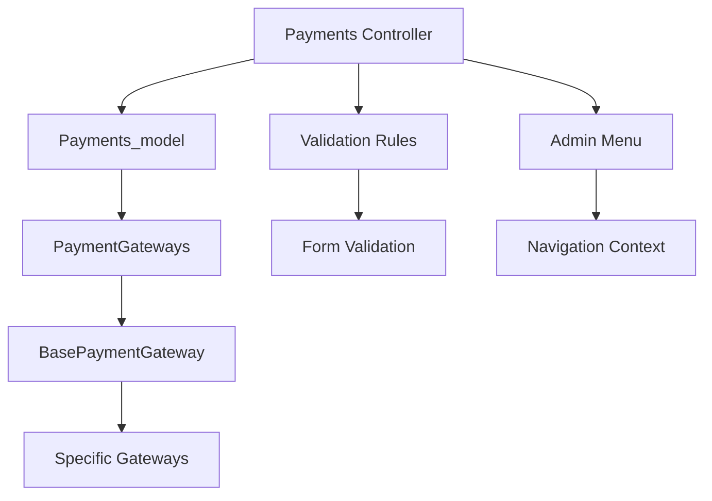
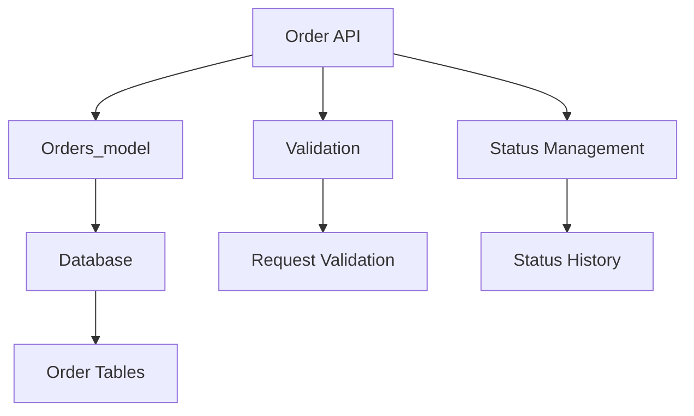

# Services and Helpers

**Important services, helpers, and utility classes** used throughout the PayMyDine backend.

## 📋 Core Services

### PaymentGateways Service
**Location**: `app/admin/classes/PaymentGateways.php` ↩︎ [app/admin/classes/PaymentGateways.php:1-50]

**Purpose**: Manages payment gateway registration and discovery

**Key Methods**:
```php
public function findGateway($name)
public function listGatewayObjects()
public function listGateways()
```
↩︎ [app/admin/classes/PaymentGateways.php:25-50]

**Usage**: Used by admin panel to manage payment gateways ↩︎ [app/admin/controllers/Payments.php:1-177]

### BasePaymentGateway Class
**Location**: `app/admin/classes/BasePaymentGateway.php` ↩︎ [app/admin/classes/BasePaymentGateway.php:1-50]

**Purpose**: Base class for all payment gateway implementations

**Key Properties**:
```php
protected $model;
protected $orderModel = 'Admin\Models\Orders_model';
protected $orderStatusModel = 'Admin\Models\Statuses_model';
protected $configFields = [];
protected $configRules = [];
```
↩︎ [app/admin/classes/BasePaymentGateway.php:15-25]

**Usage**: Extended by specific payment gateway implementations

### TenantDatabaseMiddleware
**Location**: `app/Http/Middleware/TenantDatabaseMiddleware.php` ↩︎ [app/Http/Middleware/TenantDatabaseMiddleware.php:1-48]

**Purpose**: Handles multi-tenant database switching

**Key Methods**:
```php
public function handle(Request $request, Closure $next)
private function extractTenantFromDomain(Request $request)
```
↩︎ [app/Http/Middleware/TenantDatabaseMiddleware.php:12-48]

**Usage**: Applied to routes requiring tenant context ↩︎ [app/admin/routes.php:196-197]

## 🏗️ Model Services

### Orders_model
**Location**: `app/admin/models/Orders_model.php` ↩︎ [app/admin/models/Orders_model.php:1-50]

**Purpose**: Order management and business logic

**Key Traits**:
```php
use HasInvoice;
use ManagesOrderItems;
use LogsStatusHistory;
use SendsMailTemplate;
use Locationable;
use Assignable;
```
↩︎ [app/admin/models/Orders_model.php:20-25]

**Key Methods**:
- **addOrderItem()**: **Missing** - Method called but doesn't exist ↩︎ [docs/orders/performance-and-integrity.md:467-471]
- **addOrderMenus()**: **Unknown** - Method exists but usage not found

### Payments_model
**Location**: `app/admin/models/Payments_model.php` ↩︎ [app/admin/models/Payments_model.php:1-86]

**Purpose**: Payment gateway configuration and management

**Key Methods**:
```php
public function getDropdownOptions()
public static function listDropdownOptions()
public static function onboardingIsComplete()
public function listGateways()
```
↩︎ [app/admin/models/Payments_model.php:48-77]

**Usage**: Used by admin panel for payment configuration ↩︎ [app/admin/controllers/Payments.php:1-177]

## 🔧 Helper Functions

### Cashier Table Management
**Location**: `app/admin/routes.php:23-62` ↩︎ [app/admin/routes.php:23-62]

**Purpose**: Utility functions for cashier table management

**Functions**:
```php
function resolveCashierTableId($locationId = 1)
function buildCashierTableUrl($locationId = 1)
```

**Usage**: Used in admin routes for cashier functionality ↩︎ [app/admin/routes.php:23-62]

### Database Query Helpers
**Location**: `app/admin/routes.php:248-405` ↩︎ [app/admin/routes.php:248-405]

**Purpose**: Raw SQL queries for order management

**Key Queries**:
```php
// Order creation
$orderId = DB::table('orders')->insertGetId([...]);

// Order items
DB::table('order_menus')->insert([...]);

// Order totals
DB::table('order_totals')->insert([...]);
```
↩︎ [app/admin/routes.php:248-405]

## 🛠️ Utility Classes

### Environment Configuration
**Location**: `frontend/lib/environment-config.ts` ↩︎ [frontend/lib/environment-config.ts:1-102]

**Purpose**: Environment-specific configuration management

**Key Methods**:
```typescript
getApiBaseUrl(): string
getFrontendUrl(): string
getApiEndpoint(endpoint: string): string
isProduction(): boolean
isDevelopment(): boolean
```
↩︎ [frontend/lib/environment-config.ts:50-80]

**Usage**: Used by frontend for API communication ↩︎ [frontend/lib/api-client.ts:1-596]

### Multi-Tenant Configuration
**Location**: `frontend/lib/multi-tenant-config.ts` ↩︎ [frontend/lib/multi-tenant-config.ts:1-77]

**Purpose**: Multi-tenant configuration management

**Key Methods**:
```typescript
async detectTenant(): Promise<TenantConfig | null>
getTenantInfo(): TenantConfig | null
getApiBaseUrl(): string
getTableUrl(tableId: string): string
```
↩︎ [frontend/lib/multi-tenant-config.ts:20-50]

**Usage**: Used by frontend for tenant-specific operations

## 🔍 Service Dependencies

### Payment Service Dependencies


### Order Service Dependencies


## 🚨 Service Issues

### Critical Issues
1. **Missing addOrderItem() Method**: Called but doesn't exist ↩︎ [docs/orders/performance-and-integrity.md:467-471]
2. **No Transaction Management**: Order creation not atomic ↩︎ [app/admin/routes.php:248-405]
3. **Raw SQL Queries**: Business logic in routes instead of services ↩︎ [app/admin/routes.php:248-405]

### Performance Issues
1. **No Caching**: Services don't implement caching
2. **No Connection Pooling**: Database connections not optimized
3. **No Query Optimization**: Complex queries without optimization

## 📊 Service Usage Patterns

### Admin Panel Services
- **Payments**: Used for payment gateway management
- **Orders**: Used for order management and status updates
- **Tables**: Used for table management and QR codes
- **Tenants**: Used for multi-tenant operations

### API Services
- **Menu**: Used for menu data retrieval
- **Orders**: Used for order creation and management
- **Tables**: Used for table information
- **Restaurant**: Used for restaurant information

## 🔧 Service Improvements

### Recommended Refactoring
1. **Extract Business Logic**: Move raw SQL to service classes
2. **Add Transaction Management**: Wrap order creation in transactions
3. **Implement Caching**: Add caching to frequently accessed data
4. **Add Error Handling**: Comprehensive error handling in services
5. **Add Logging**: Log service operations for debugging

### Service Architecture
```php
// Recommended service structure
class OrderService
{
    public function createOrder(array $orderData): Order
    {
        return DB::transaction(function() use ($orderData) {
            $order = $this->createOrderRecord($orderData);
            $this->addOrderItems($order, $orderData['items']);
            $this->addOrderTotals($order, $orderData['totals']);
            $this->logStatusHistory($order, 'created');
            return $order;
        });
    }
    
    private function createOrderRecord(array $data): Order
    {
        return Order::create($data);
    }
    
    private function addOrderItems(Order $order, array $items): void
    {
        foreach ($items as $item) {
            $order->orderMenus()->create($item);
        }
    }
}
```

## 📚 Related Documentation

- **Routes**: [routes.md](routes.md) - Route definitions and middleware
- **Validation**: [validation-and-errors.md](validation-and-errors.md) - Request validation patterns
- **Security**: [security.md](security.md) - Security considerations
- **API**: [../api/README.md](../api/README.md) - API service usage