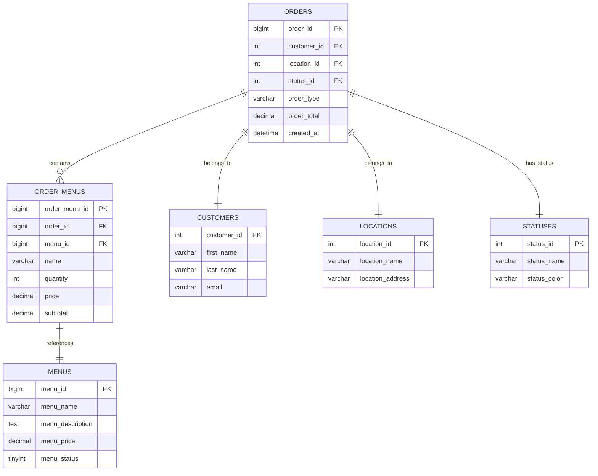
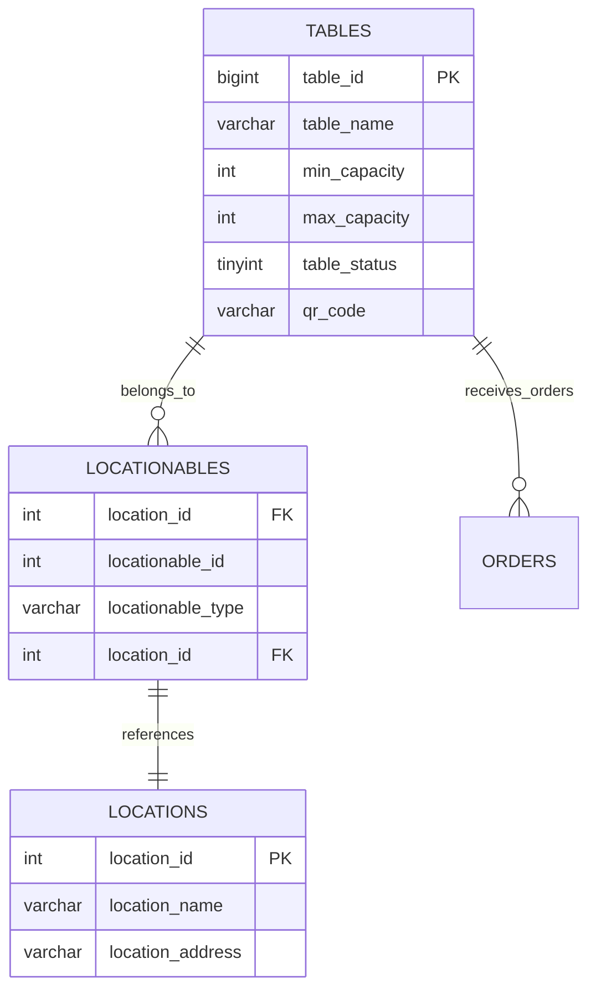
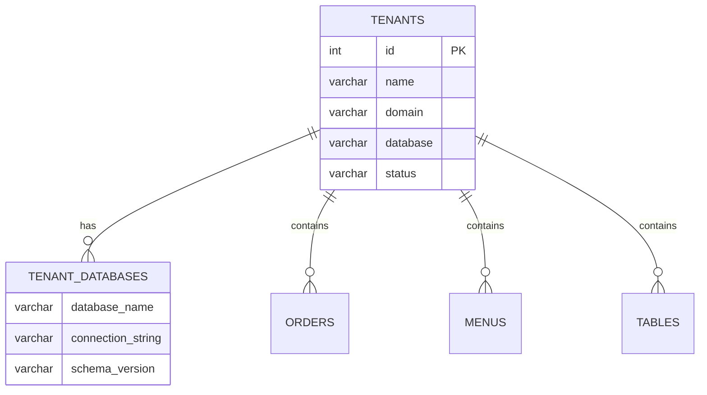

# Entity Relationship Diagram

**Database schema and relationships** for the PayMyDine multi-tenant restaurant ordering system.

## 🗄️ Core Entities

### Orders
```sql
CREATE TABLE `ti_orders` (
  `order_id` bigint unsigned NOT NULL AUTO_INCREMENT,
  `customer_id` int DEFAULT NULL,
  `first_name` varchar(128) NOT NULL,
  `last_name` varchar(128) NOT NULL,
  `email` varchar(96) NOT NULL,
  `telephone` varchar(128) NOT NULL,
  `location_id` int NOT NULL,
  `address_id` int DEFAULT NULL,
  `cart` text NOT NULL,
  `total_items` int NOT NULL,
  `comment` text,
  `payment` varchar(128) NOT NULL,
  `order_type` varchar(128) NOT NULL,
  `created_at` datetime NOT NULL,
  `updated_at` datetime NOT NULL,
  `order_time` time NOT NULL,
  `order_date` date NOT NULL,
  `order_total` decimal(15,4) DEFAULT NULL,
  `status_id` int NOT NULL,
  `ip_address` varchar(40) NOT NULL,
  `user_agent` varchar(128) NOT NULL,
  `assignee_id` int DEFAULT NULL,
  `assignee_group_id` int unsigned DEFAULT NULL,
  `invoice_prefix` varchar(128) DEFAULT NULL,
  `invoice_date` datetime DEFAULT NULL,
  `hash` varchar(40) DEFAULT NULL,
  `processed` tinyint(1) DEFAULT NULL,
  `status_updated_at` datetime DEFAULT NULL,
  `assignee_updated_at` datetime DEFAULT NULL,
  `order_time_is_asap` tinyint(1) NOT NULL DEFAULT '0',
  `delivery_comment` text,
  `ms_order_type` varchar(255) NOT NULL DEFAULT '',
  PRIMARY KEY (`order_id`),
  KEY `ti_orders_hash_index` (`hash`)
) ENGINE=InnoDB AUTO_INCREMENT=190 DEFAULT CHARSET=utf8mb4;
```
↩︎ [db/paymydine.sql:1814-1900]

### Order Items
```sql
CREATE TABLE `ti_order_menus` (
  `order_menu_id` bigint unsigned NOT NULL AUTO_INCREMENT,
  `order_id` bigint unsigned NOT NULL,
  `menu_id` bigint unsigned NOT NULL,
  `name` varchar(128) NOT NULL,
  `quantity` int NOT NULL,
  `price` decimal(15,4) NOT NULL,
  `subtotal` decimal(15,4) NOT NULL,
  `comment` text,
  `created_at` timestamp NULL DEFAULT NULL,
  `updated_at` timestamp NULL DEFAULT NULL,
  PRIMARY KEY (`order_menu_id`)
) ENGINE=InnoDB DEFAULT CHARSET=utf8mb4;
```
↩︎ [db/paymydine.sql:1754-1785]

### Menus
```sql
CREATE TABLE `ti_menus` (
  `menu_id` bigint unsigned NOT NULL AUTO_INCREMENT,
  `menu_name` varchar(128) NOT NULL,
  `menu_description` text NOT NULL,
  `menu_price` decimal(15,4) NOT NULL,
  `minimum_qty` int NOT NULL DEFAULT '0',
  `menu_status` tinyint(1) NOT NULL,
  `menu_priority` int NOT NULL DEFAULT '0',
  `order_restriction` text,
  `created_at` timestamp NULL DEFAULT NULL,
  `updated_at` timestamp NULL DEFAULT NULL,
  PRIMARY KEY (`menu_id`)
) ENGINE=InnoDB AUTO_INCREMENT=13 DEFAULT CHARSET=utf8mb4;
```
↩︎ [db/paymydine.sql:1629-1700]

### Tables
```sql
CREATE TABLE `ti_tables` (
  `table_id` bigint unsigned NOT NULL AUTO_INCREMENT,
  `table_name` varchar(128) NOT NULL,
  `min_capacity` int NOT NULL,
  `max_capacity` int NOT NULL,
  `table_status` tinyint(1) NOT NULL,
  `extra_capacity` int NOT NULL DEFAULT '0',
  `is_joinable` tinyint(1) NOT NULL DEFAULT '1',
  `priority` int NOT NULL DEFAULT '0',
  `created_at` timestamp NULL DEFAULT NULL,
  `updated_at` timestamp NULL DEFAULT NULL,
  `qr_code` varchar(30) DEFAULT NULL,
  PRIMARY KEY (`table_id`)
) ENGINE=InnoDB AUTO_INCREMENT=32 DEFAULT CHARSET=utf8mb4;
```
↩︎ [db/paymydine.sql:2461-2530]

### Tenants
```sql
CREATE TABLE `ti_tenants` (
  `id` int NOT NULL AUTO_INCREMENT,
  `name` varchar(255) NOT NULL,
  `domain` varchar(255) NOT NULL,
  `database` varchar(255) NOT NULL,
  `email` varchar(255) NOT NULL,
  `phone` varchar(20) NOT NULL,
  `start` date NOT NULL,
  `end` date NOT NULL,
  `type` varchar(255) DEFAULT NULL,
  `country` varchar(255) NOT NULL,
  `description` varchar(1000) NOT NULL,
  `status` varchar(255) NOT NULL,
  `created_at` timestamp NULL DEFAULT CURRENT_TIMESTAMP,
  `updated_at` timestamp NULL DEFAULT CURRENT_TIMESTAMP ON UPDATE CURRENT_TIMESTAMP,
  PRIMARY KEY (`id`),
  UNIQUE KEY `unique_domain` (`domain`(191)),
  UNIQUE KEY `unique_database` (`database`(191))
) ENGINE=MyISAM AUTO_INCREMENT=24 DEFAULT CHARSET=utf8mb4;
```
↩︎ [db/paymydine.sql:2494-2530]

## 🔗 Entity Relationships

### Order Relationships


### Table and QR Code Relationships


### Multi-Tenant Relationships


## 📊 Data Flow Patterns

### Order Creation Flow
1. **Customer** places order → **ti_orders** record created
2. **Order items** added → **ti_order_menus** records created
3. **Order totals** calculated → **ti_order_totals** records created
4. **Status history** logged → **ti_status_history** records created

### Menu Management Flow
1. **Admin** creates menu item → **ti_menus** record created
2. **Menu categories** assigned → **ti_menu_categories** records created
3. **Menu options** configured → **ti_menu_options** records created
4. **Menu availability** set → **ti_menu_mealtimes** records created

### Table Management Flow
1. **Admin** creates table → **ti_tables** record created
2. **Table location** assigned → **ti_locationables** record created
3. **QR code** generated → **ti_tables.qr_code** updated
4. **Table status** tracked → **ti_tables.table_status** updated

## 🔍 Key Relationships

### Order → Menu Items
- **One-to-Many**: One order can have multiple menu items
- **Foreign Key**: `ti_order_menus.order_id` → `ti_orders.order_id`
- **Cascade**: Order deletion should cascade to order items

### Order → Customer
- **Many-to-One**: Multiple orders can belong to one customer
- **Foreign Key**: `ti_orders.customer_id` → `ti_customers.customer_id`
- **Nullable**: Orders can exist without customer (guest orders)

### Order → Status
- **Many-to-One**: Multiple orders can have same status
- **Foreign Key**: `ti_orders.status_id` → `ti_statuses.status_id`
- **Required**: Every order must have a status

### Table → Location
- **Many-to-Many**: Tables can belong to multiple locations
- **Junction Table**: `ti_locationables` for table-location relationships
- **Polymorphic**: Supports different locationable types

## 🚨 Missing Relationships

### Critical Missing Foreign Keys
1. **ti_orders.customer_id** → **ti_customers.customer_id**
2. **ti_orders.location_id** → **ti_locations.location_id**
3. **ti_orders.status_id** → **ti_statuses.status_id**
4. **ti_order_menus.menu_id** → **ti_menus.menu_id**

### Missing Indexes
1. **ti_orders.status_id** - For status-based queries
2. **ti_orders.created_at** - For date-based queries
3. **ti_orders.customer_id** - For customer order history
4. **ti_order_menus.order_id** - For order item queries

## 📚 Related Documentation

- **Schema Review**: [schema-review.md](schema-review.md) - Detailed schema analysis
- **Migrations**: [migrations.md](migrations.md) - Migration sources and data flow
- **Tenancy**: [../tenancy/README.md](../tenancy/README.md) - Multi-tenant database switching