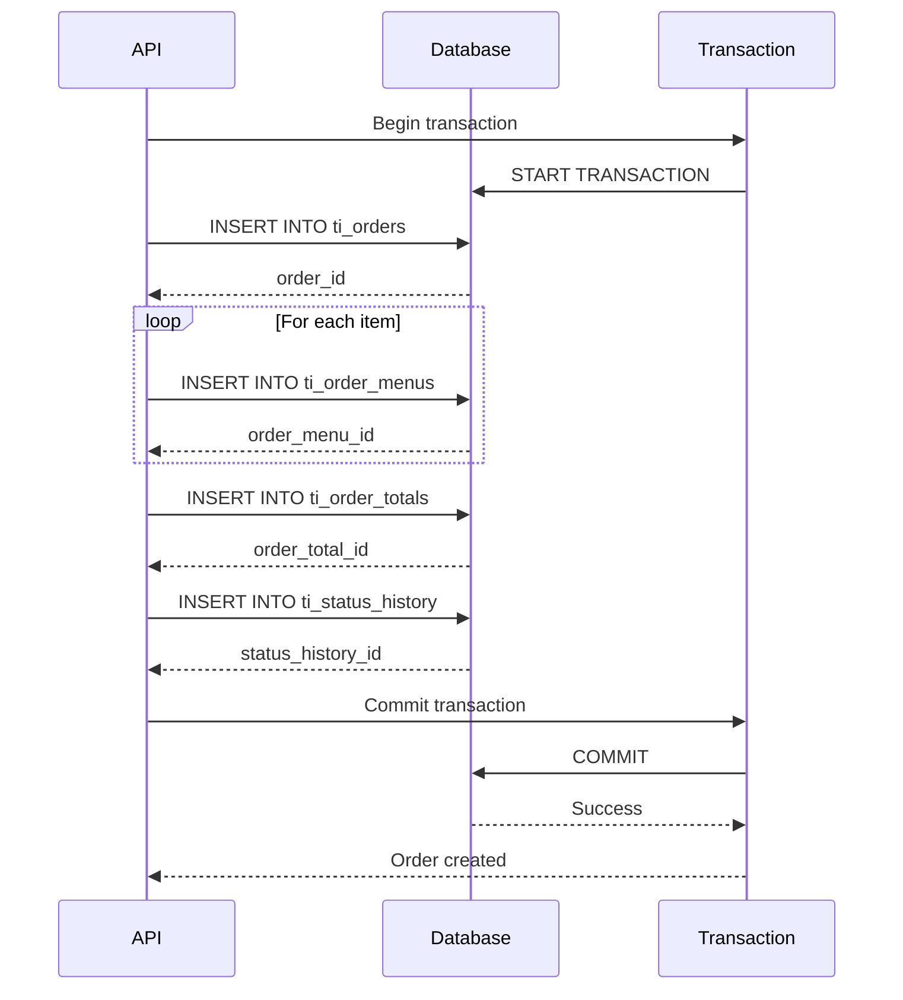
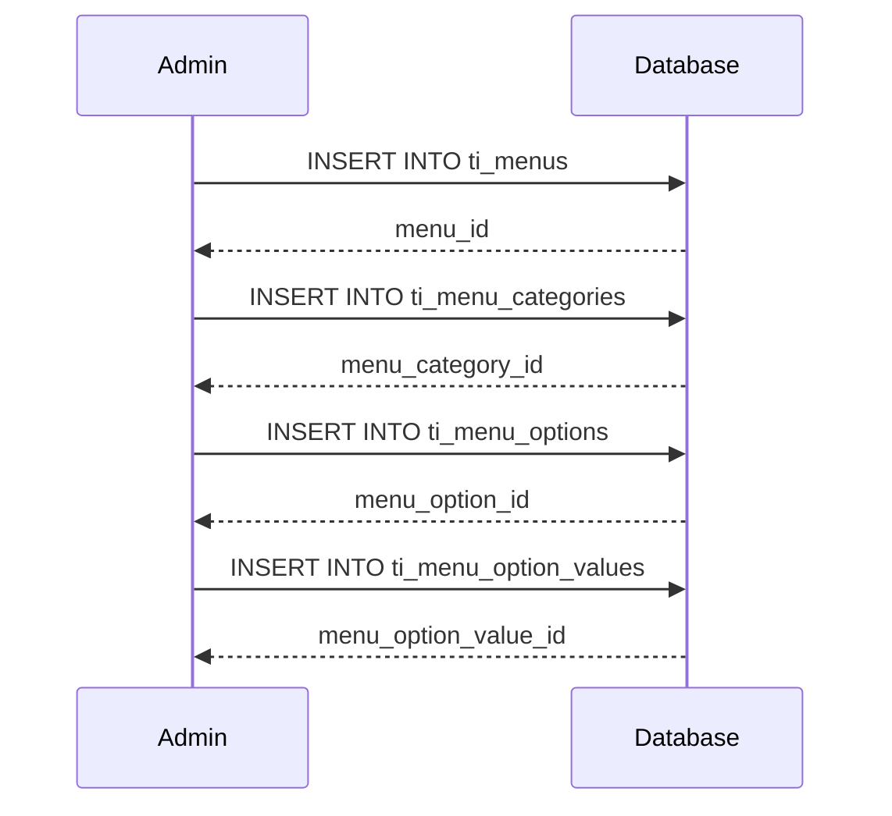
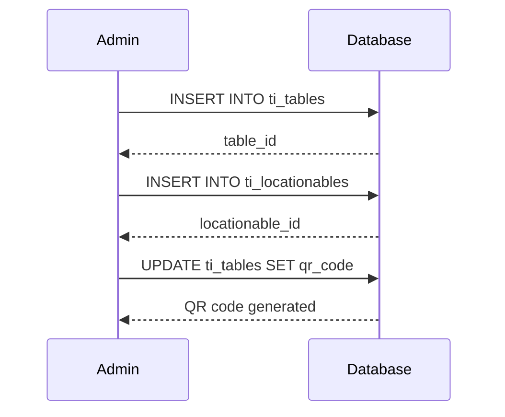

# Database Migrations

**Migration sources, data flow, and schema evolution** for the PayMyDine database.

## 📋 Migration Sources

### Primary Schema Source
- **File**: `db/paymydine.sql` ↩︎ [db/paymydine.sql:1-2691]
- **Type**: MySQL dump with complete schema and data
- **Size**: 2,691 lines
- **Engine**: MySQL 8.0.42 ↩︎ [db/paymydine.sql:1-50]

### Migration Files
- **Location**: `app/admin/database/migrations/` ↩︎ [app/admin/database/migrations/]
- **Format**: Laravel migration files
- **Naming**: `YYYY_MM_DD_HHMMSS_description.php`

## 🗄️ Schema Evolution

### Initial Schema
The database schema is based on **TastyIgniter v3** framework with custom modifications for multi-tenancy:

```sql
-- Core order tables
CREATE TABLE `ti_orders` (...);
CREATE TABLE `ti_order_menus` (...);
CREATE TABLE `ti_order_totals` (...);
CREATE TABLE `ti_status_history` (...);

-- Menu management
CREATE TABLE `ti_menus` (...);
CREATE TABLE `ti_categories` (...);
CREATE TABLE `ti_menu_categories` (...);

-- Table management
CREATE TABLE `ti_tables` (...);
CREATE TABLE `ti_locationables` (...);

-- Multi-tenant support
CREATE TABLE `ti_tenants` (...);
```
↩︎ [db/paymydine.sql:1814-1900]

### Custom Modifications
1. **Multi-tenant tables**: Added `ti_tenants` for tenant management
2. **QR code support**: Added `qr_code` column to `ti_tables`
3. **Order type**: Modified `order_type` to support table-based ordering
4. **Status tracking**: Enhanced status history for order lifecycle

## 🔄 Data Flow Patterns

### Order Creation Flow


### Menu Management Flow


### Table Management Flow


## 📊 Migration Dependencies

### Core Dependencies
1. **ti_tenants** → **All tenant tables** (tenant isolation)
2. **ti_orders** → **ti_order_menus** (order items)
3. **ti_orders** → **ti_order_totals** (order totals)
4. **ti_orders** → **ti_status_history** (status tracking)
5. **ti_menus** → **ti_menu_categories** (menu categorization)
6. **ti_tables** → **ti_locationables** (table location)

### Migration Order
```sql
-- 1. Create tenant registry
CREATE TABLE ti_tenants (...);

-- 2. Create core business tables
CREATE TABLE ti_menus (...);
CREATE TABLE ti_categories (...);
CREATE TABLE ti_tables (...);
CREATE TABLE ti_customers (...);
CREATE TABLE ti_locations (...);
CREATE TABLE ti_statuses (...);

-- 3. Create relationship tables
CREATE TABLE ti_menu_categories (...);
CREATE TABLE ti_locationables (...);

-- 4. Create order tables
CREATE TABLE ti_orders (...);
CREATE TABLE ti_order_menus (...);
CREATE TABLE ti_order_totals (...);
CREATE TABLE ti_status_history (...);
```

## 🔧 Migration Scripts

### Tenant Database Creation
```sql
-- Create tenant database
CREATE DATABASE tenant_restaurant_name;

-- Apply schema to tenant database
USE tenant_restaurant_name;
SOURCE db/paymydine.sql;

-- Remove tenant-specific tables from tenant database
DROP TABLE ti_tenants;
DROP TABLE ti_users;
DROP TABLE ti_settings;
```

### Schema Updates
```sql
-- Add missing foreign keys
ALTER TABLE ti_orders 
ADD CONSTRAINT fk_orders_customer 
FOREIGN KEY (customer_id) REFERENCES ti_customers(customer_id);

-- Add performance indexes
CREATE INDEX idx_orders_status_id ON ti_orders(status_id);
CREATE INDEX idx_orders_created_at ON ti_orders(created_at);

-- Add data validation constraints
ALTER TABLE ti_orders 
ADD CONSTRAINT chk_orders_total_positive 
CHECK (order_total >= 0);
```

## 🚨 Migration Risks

### 1. Data Loss Risk
**Issue**: Foreign key constraints may fail if orphaned data exists ↩︎ [db/paymydine.sql:1814-1900]

**Mitigation**:
- Audit data before adding constraints
- Clean up orphaned records first
- Test migrations on copy of production data

### 2. Performance Impact
**Issue**: Adding indexes on large tables can be slow ↩︎ [db/paymydine.sql:1814-1900]

**Mitigation**:
- Add indexes during maintenance windows
- Use online index creation where possible
- Monitor performance during migration

### 3. Downtime Risk
**Issue**: Some schema changes require table locks ↩︎ [db/paymydine.sql:1814-1900]

**Mitigation**:
- Plan migrations during low-traffic periods
- Use rolling updates for multi-tenant deployments
- Test migration scripts thoroughly

## 📈 Data Volume Estimates

### Current Data Sizes
- **Orders**: ~190 records ↩︎ [db/paymydine.sql:1814-1900]
- **Menus**: ~12 items ↩︎ [db/paymydine.sql:1629-1700]
- **Tables**: ~8 tables ↩︎ [db/paymydine.sql:2461-2530]
- **Tenants**: ~1 active tenant ↩︎ [db/paymydine.sql:2494-2530]

### Growth Projections
- **Orders**: 100-1000 per day per tenant
- **Menu Items**: 50-500 per tenant
- **Tables**: 10-100 per tenant
- **Customers**: 100-10000 per tenant

## 🔍 Migration Monitoring

### Pre-Migration Checklist
- [ ] **Backup database** before migration
- [ ] **Test migration** on copy of production data
- [ ] **Verify data integrity** after migration
- [ ] **Check performance** impact of changes
- [ ] **Plan rollback** strategy if needed

### Post-Migration Validation
- [ ] **Verify foreign keys** are working
- [ ] **Check indexes** are being used
- [ ] **Test application** functionality
- [ ] **Monitor performance** metrics
- [ ] **Validate data** integrity

## 📚 Related Documentation

- **Schema Review**: [schema-review.md](schema-review.md) - Detailed schema analysis
- **ERD**: [erd.md](erd.md) - Entity relationship diagram
- **Tenancy**: [../tenancy/README.md](../tenancy/README.md) - Multi-tenant database switching