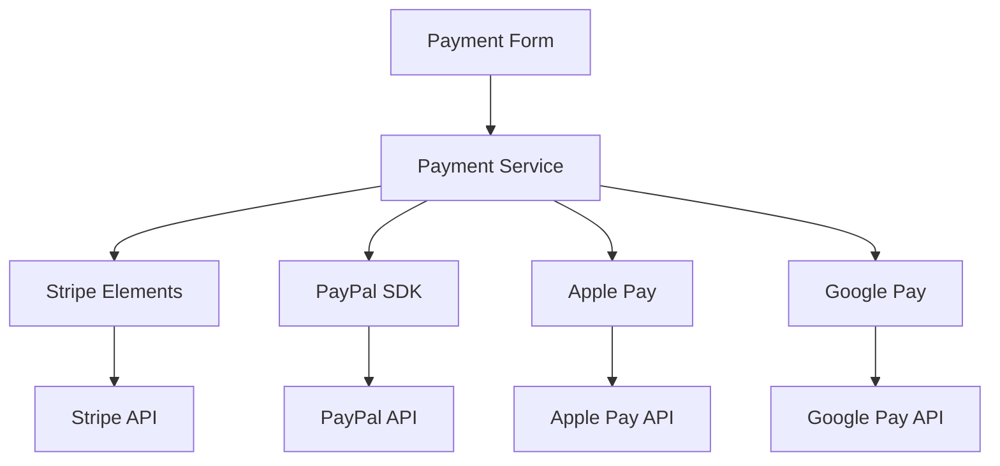

# Frontend Payment System

**Frontend payment integration, components, and user experience** for the PayMyDine payment system.

## 📋 Payment System Overview

### Supported Payment Methods
- **Stripe**: Card payments, Apple Pay, Google Pay ↩︎ [frontend/components/payment/secure-payment-form.tsx:1-208]
- **PayPal**: PayPal payments ↩︎ [frontend/components/payment/secure-payment-flow.tsx:207-216]
- **Apple Pay**: Apple Pay integration ↩︎ [frontend/components/payment/secure-payment-flow.tsx:218-219]
- **Google Pay**: Google Pay integration ↩︎ [frontend/components/payment/secure-payment-flow.tsx:221-222]
- **Cash**: Cash on delivery ↩︎ [frontend/components/payment/secure-payment-flow.tsx:224-225]

### Payment Architecture


## 🏗️ Payment Components

### Core Components
- **SecurePaymentFlow**: Main payment modal ↩︎ [frontend/components/payment/secure-payment-flow.tsx:1-493]
- **StripeCardForm**: Stripe card input form ↩︎ [frontend/components/payment/secure-payment-form.tsx:1-208]
- **PayPalForm**: PayPal payment form ↩︎ [frontend/components/payment/secure-payment-flow.tsx:207-216]
- **ApplePayButton**: Apple Pay button ↩︎ [frontend/components/payment/secure-payment-flow.tsx:218-219]
- **GooglePayButton**: Google Pay button ↩︎ [frontend/components/payment/secure-payment-flow.tsx:221-222]

### Payment Service
- **PaymentService**: Centralized payment processing ↩︎ [frontend/lib/payment-service.ts:1-204]
- **StripePaymentProcessor**: Stripe-specific processing ↩︎ [frontend/lib/payment-service.ts:96-204]
- **PayPalPaymentProcessor**: PayPal-specific processing ↩︎ [frontend/lib/payment-service.ts:171-204]

## 📁 Document Structure

| Document | Description |
|----------|-------------|
| [checkout-flow.md](checkout-flow.md) | End-to-end checkout process |
| [components.md](components.md) | Payment UI components |
| [error-handling.md](error-handling.md) | Payment error handling and UX |
| [e2e-tests.md](e2e-tests.md) | E2E test specifications |

## 🔧 Payment Configuration

### Environment Variables
```env
# Stripe Configuration
NEXT_PUBLIC_STRIPE_PUBLISHABLE_KEY=pk_test_your_publishable_key
STRIPE_SECRET_KEY=sk_test_your_secret_key
STRIPE_RESTAURANT_ACCOUNT_ID=acct_your_restaurant_stripe_account_id

# PayPal Configuration
NEXT_PUBLIC_PAYPAL_CLIENT_ID=your_paypal_client_id
PAYPAL_CLIENT_SECRET=your_paypal_client_secret
PAYPAL_MERCHANT_ID=your_paypal_merchant_id

# Apple Pay Configuration
APPLE_PAY_MERCHANT_ID=merchant.com.yourcompany.paymydine
APPLE_PAY_DOMAIN_NAME=yourdomain.com

# Google Pay Configuration
NEXT_PUBLIC_STRIPE_ACCOUNT_ID=acct_your_stripe_account_id
```
↩︎ [frontend/env local example:1-23]

### Payment Flow Configuration
```typescript
// Payment flow configuration
const paymentConfig = {
  stripe: {
    publishableKey: process.env.NEXT_PUBLIC_STRIPE_PUBLISHABLE_KEY,
    accountId: process.env.NEXT_PUBLIC_STRIPE_ACCOUNT_ID
  },
  paypal: {
    clientId: process.env.NEXT_PUBLIC_PAYPAL_CLIENT_ID,
    merchantId: process.env.PAYPAL_MERCHANT_ID
  },
  applePay: {
    merchantId: process.env.APPLE_PAY_MERCHANT_ID,
    domainName: process.env.APPLE_PAY_DOMAIN_NAME
  },
  googlePay: {
    accountId: process.env.NEXT_PUBLIC_STRIPE_ACCOUNT_ID
  }
};
```
↩︎ [frontend/lib/payment-service.ts:1-204]

## 🔒 Security Implementation

### PCI Compliance
- **No Card Data Storage**: Card data never touches servers ↩︎ [frontend/components/payment/secure-payment-form.tsx:1-208]
- **Stripe Elements**: Secure card input handling
- **Tokenization**: Stripe handles card tokenization
- **Encryption**: All data encrypted in transit

### Secure Payment Flow
```typescript
// Secure payment processing
const handleSubmit = async (event: React.FormEvent) => {
  event.preventDefault();
  
  if (!stripe || !elements) {
    onPaymentError("Payment system not ready");
    return;
  }

  setIsProcessing(true);
  setCardError(null);

  try {
    const cardElement = elements.getElement(CardElement);
    if (!cardElement) {
      throw new Error("Card element not found");
    }

    // Create payment intent
    const response = await fetch('/api/payments/create-intent', {
      method: 'POST',
      headers: { 'Content-Type': 'application/json' },
      body: JSON.stringify({
        ...paymentData,
        customerInfo: {
          ...paymentData.customerInfo,
          name: formData.cardholderName,
          email: formData.email,
          phone: formData.phone,
        },
      }),
    });

    const { clientSecret, error: intentError } = await response.json();
    
    if (intentError) {
      throw new Error(intentError);
    }

    // Confirm payment
    const { error, paymentIntent } = await stripe.confirmCardPayment(clientSecret, {
      payment_method: {
        card: cardElement,
        billing_details: {
          name: formData.cardholderName,
          email: formData.email,
          phone: formData.phone,
        },
      },
    });

    if (error) {
      onPaymentError(error.message);
    } else {
      onPaymentComplete(paymentIntent);
    }
  } catch (error: any) {
    onPaymentError(error.message);
  } finally {
    setIsProcessing(false);
  }
};
```
↩︎ [frontend/components/payment/secure-payment-form.tsx:37-104]

## 🚨 Known Issues

### Critical Issues
1. **No Error Recovery**: Payment failures not retried ↩︎ [frontend/components/payment/secure-payment-form.tsx:87-104]
2. **No Payment Validation**: Limited payment data validation
3. **No Offline Support**: Payments fail when offline
4. **No Payment History**: Payment history not displayed

### Performance Issues
1. **No Payment Caching**: Payment methods not cached
2. **Synchronous Processing**: Payment processing blocks UI
3. **No Loading States**: Limited loading indicators

## 📊 Payment Analytics

### Key Metrics
- **Payment Success Rate**: Track successful payments
- **Payment Method Usage**: Monitor payment method preferences
- **Payment Failure Rate**: Track failed payments
- **Average Payment Time**: Monitor payment processing time

### Error Tracking
```typescript
// Payment error tracking
const handlePaymentError = (error: string) => {
  console.error('Payment error:', error);
  
  // Log error for analytics
  analytics.track('Payment Error', {
    error: error,
    paymentMethod: selectedPaymentMethod,
    amount: paymentData.amount,
    timestamp: new Date().toISOString()
  });
  
  onPaymentError(error);
};
```

## 📚 Related Documentation

- **Admin Payments**: [../../admin/payments/README.md](../../admin/payments/README.md) - Admin payment management
- **API**: [../../api/README.md](../../api/README.md) - Payment API endpoints
- **Backend**: [../../backend/README.md](../../backend/README.md) - Backend payment services