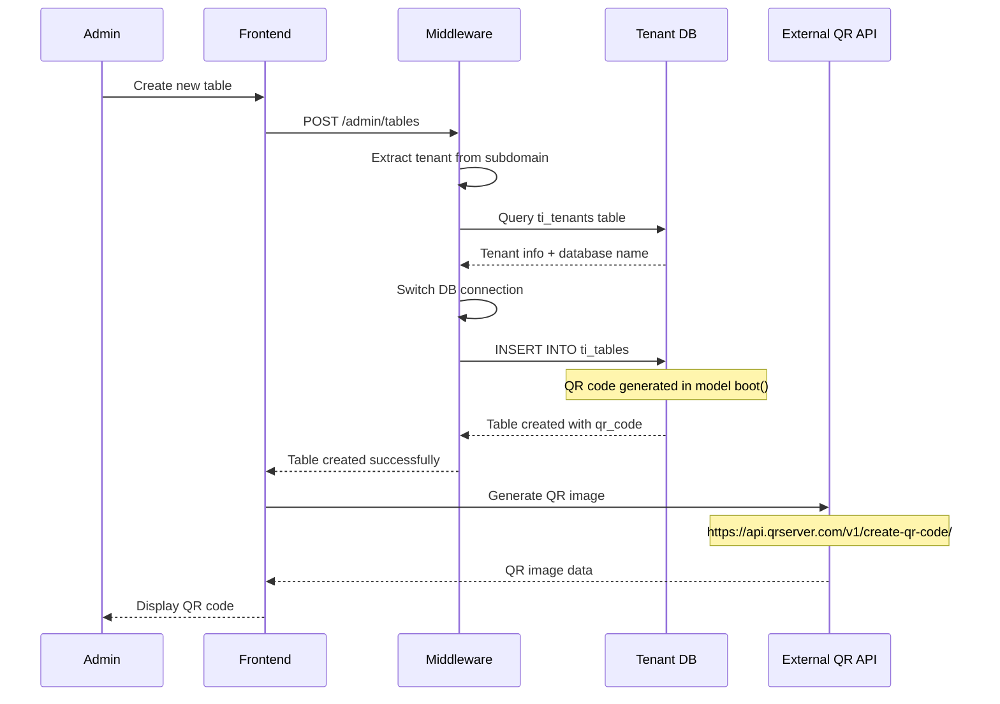
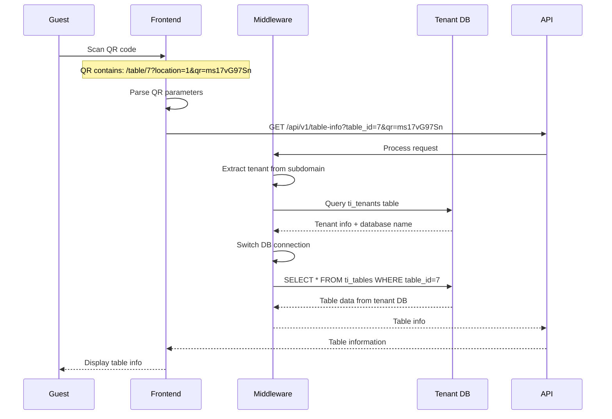
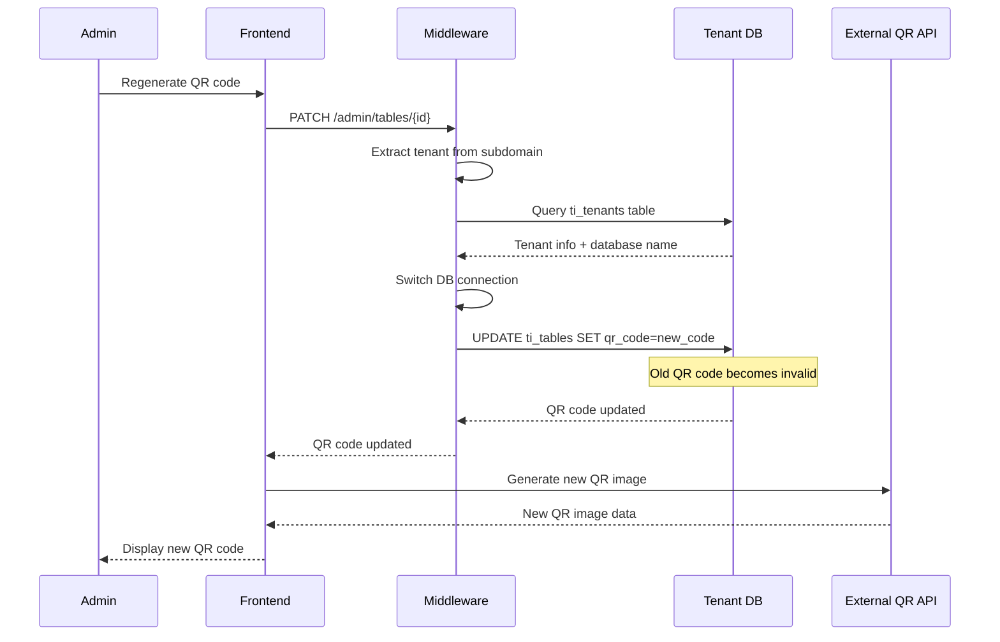

# QR Code and Tables Multi-Tenant Flow Investigation

**Investigation Date**: January 2025  
**Purpose**: Map, verify, and harden the entire flow for creating tables and generating/consuming QR codes in a multi-tenant environment

## Executive Summary

This investigation maps the complete flow from table creation to QR code generation and consumption in the multi-tenant PayMyDine system. Key findings include **critical security vulnerabilities** in QR token generation, missing database constraints, and insufficient tenant isolation validation.

## 1. Multi-Tenant Binding Analysis

### Tenant Detection Middleware

**File**: `app/Http/Middleware/TenantDatabaseMiddleware.php:15-35`

```php
public function handle(Request $request, Closure $next)
{
    // Get tenant from domain
    $tenant = $this->extractTenantFromDomain($request);
    
    if ($tenant) {
        // Find tenant in main database
        $tenantInfo = DB::connection('mysql')->table('ti_tenants')
            ->where('domain', $tenant . '.paymydine.com')
            ->where('status', 'active')
            ->first();
        
        if ($tenantInfo) {
            // Switch to tenant database
            Config::set('database.connections.mysql.database', $tenantInfo->database);
            
            // Reconnect with new database
            DB::purge('mysql');
            DB::reconnect('mysql');
            
            // Store tenant info in request for later use
            $request->attributes->set('tenant', $tenantInfo);
        } else {
            return response()->json(['error' => 'Restaurant not found or inactive'], 404);
        }
    } else {
        return response()->json(['error' => 'Invalid domain'], 400);
    }
    
    return $next($request);
}
```

**Subdomain Extraction**: `app/Http/Middleware/TenantDatabaseMiddleware.php:40-55`

```php
private function extractTenantFromDomain(Request $request)
{
    $hostname = $request->getHost();
    $parts = explode('.', $hostname);
    
    // Extract subdomain (e.g., "rosana" from "rosana.paymydine.com")
    if (count($parts) >= 3 && $parts[1] === 'paymydine') {
        return $parts[0];
    }
    
    // For development/testing, also check for localhost patterns
    if (count($parts) >= 2 && $parts[0] !== 'www') {
        return $parts[0];
    }
    
    return null;
}
```

### Protected Routes

**File**: `routes/api.php:122`

```php
Route::prefix('v1')->middleware(['detect.tenant', 'tenant.database'])->group(function () {
    // Menu endpoints
    Route::get('/menu', [MenuController::class, 'index']);
    Route::get('/menu/categories', [CategoryController::class, 'index']);
    Route::get('/menu/items', [MenuController::class, 'items']);
    
    // Order endpoints
    Route::post('/orders', [OrderController::class, 'store']);
    Route::get('/orders/{orderId}', [OrderController::class, 'show']);
    
    // Table endpoints
    Route::get('/tables/{qrCode}', [TableController::class, 'getByQrCode']);
    Route::get('/tables', [TableController::class, 'index']);
    Route::get('/table-info', [TableController::class, 'getTableInfo']);
    Route::get('/table-menu', [MenuController::class, 'getTableMenu']);
});
```

**Critical Finding**: All API v1 routes are properly protected with tenant middleware, ensuring database isolation.

## 2. Table Creation Flow

### Admin Table Creation

**Model**: `app/admin/models/Tables_model.php:115-133`

```php
public static function boot()
{
    parent::boot();

    // Ensure QR exists before saving (old behavior kept)
    static::saving(function ($model) {
        if (empty($model->qr_code)) {
            $model->qr_code = $model->generateUniqueId();
        }
    });

    // Use actual DB-assigned PK for final normalization (avoids MAX(id)+1 races)
    static::created(function ($model) {
        $name = (string) $model->table_name;
        if ($name === '' || ctype_digit($name)) {
            $model->forceFill(['table_name' => 'Table '.$model->table_id])->saveQuietly();
        }
    });
}
```

**QR Generation Algorithm**: `app/admin/models/Tables_model.php:79-90`

```php
public function generateUniqueId()
{
    $prefix = 'ms';
    $sequentialNumber = $this->getNextSequentialNumber();
    $randomString = Str::random(6); // Generate a random 5 character alphanumeric string
    return $prefix . $sequentialNumber.$randomString;
}

public function getNextSequentialNumber()
{
    // Get the latest table_id and increment it
    $latestRecord = self::latest('table_id')->first();
    return $latestRecord ? $latestRecord->table_id + 1 : 1; // Start from 1 if no records exist
}
```

**Critical Security Issue**: The QR generation algorithm is **predictable and vulnerable to collision attacks**:
- Uses sequential numbers based on `table_id`
- Only 6 characters of randomness
- No uniqueness constraint in database
- Predictable pattern: `ms{sequential}{6chars}`

### Table Form Configuration

**File**: `app/admin/models/config/tables_model.php:154-214`

```php
$config['form']['fields'] = [
    'table_name' => [
        'label' => 'Table number',
        'type' => 'number',
        'span' => 'left',
        'attributes' => [
            'min' => 1,
            'step' => 1,
            'inputmode' => 'numeric',
            'pattern' => '[0-9]*',
            'placeholder' => 'Type only the number (e.g. 37) or "cashier"',
        ],
    ],
    'min_capacity' => [
        'label' => 'lang:admin::lang.tables.label_min_capacity',
        'type' => 'number',
        'span' => 'left',
    ],
    'max_capacity' => [
        'label' => 'lang:admin::lang.tables.label_capacity',
        'type' => 'number',
        'span' => 'right',
    ],
    'table_status' => [
        'label' => 'lang:admin::lang.label_status',
        'type' => 'switch',
        'span' => 'left',
        'default' => 1,
    ],
    'qr_code' => [
        'label' => '',  
        'type' => 'hidden',  
        'span' => 'left',  
    ],
];
```

## 3. QR Code Generation and URL Construction

### QR URL Builder

**File**: `app/admin/views/tables/edit.blade.php:38-45`

```php
$qr_redirect_url = $frontend_url . '/table/' . $table_id . '?' . http_build_query([
    'location' => $location_id,
    'guest' => $max_capacity,
    'date' => $date,
    'time' => $time,
    'qr' => $qr_code->qr_code,
    'table' => $table_id
]);
```

**Generated QR URL Format**:
```
http://127.0.0.1:8001/table/7?location=1&guest=4&date=2025-01-15&time=14:30&qr=ms17vG97Sn&table=7
```

**Critical Finding**: QR URLs contain **no tenant identifier** - tenant is derived solely from subdomain, ensuring proper isolation.

### QR Code Image Generation

**File**: `app/admin/views/tables/edit.blade.php:46`

```php
$qr_code_url = 'https://api.qrserver.com/v1/create-qr-code/?size=150x150&data=' . urlencode($qr_redirect_url);
$qr_code_image = file_get_contents($qr_code_url);
```

**External Dependency**: Uses `api.qrserver.com` for QR image generation - potential single point of failure.

## 4. QR Code Consumption (Table Lookup)

### Table Info API Endpoint

**File**: `app/Http/Controllers/Api/TableController.php:144-170`

```php
public function getTableInfo(Request $request)
{
    $tableId = $request->get('table_id');
    $qrCode = $request->get('qr_code');
    
    if (!$tableId && !$qrCode) {
        return response()->json([
            'error' => 'table_id or qr_code is required'
        ], 400);
    }

    try {
        $whereClause = $tableId ? "table_id = ?" : "qr_code = ?";
        $param = $tableId ?: $qrCode;
        
        $table = DB::table('ti_tables')  // ← Queries tenant database
            ->whereRaw($whereClause, [$param])
            ->where('table_status', 1)
            ->first();

        if (!$table) {
            return response()->json([
                'error' => 'Table not found'
            ], 404);
        }

        // Get location info for frontend URL construction
        $location = DB::table('ti_locations')->first();

        return response()->json([
            'table' => [
                'id' => $table->table_id,
                'name' => $table->table_name,
                'capacity' => $table->min_capacity,
                'status' => $table->table_status,
                'qr_code' => $table->qr_code ?? $qrCode,
            ],
            'restaurant' => [
                'name' => $location->location_name ?? 'Restaurant',
                'address' => $location->location_address_1 ?? '',
                'phone' => $location->location_telephone ?? '',
                'email' => $location->location_email ?? '',
            ],
            'menu_available' => true,
            'ordering_enabled' => true,
        ]);

    } catch (\Exception $e) {
        return response()->json([
            'error' => 'Failed to fetch table information',
            'message' => $e->getMessage()
        ], 500);
    }
}
```

**Critical Finding**: Query runs against tenant database after middleware switch, ensuring proper isolation.

## 5. Database Schema Analysis

### Current ti_tables Schema

**File**: `db/paymydine.sql:2461-2475`

```sql
CREATE TABLE `ti_tables` (
  `table_id` bigint unsigned NOT NULL AUTO_INCREMENT,
  `table_name` varchar(128) CHARACTER SET utf8mb4 COLLATE utf8mb4_unicode_ci NOT NULL,
  `min_capacity` int NOT NULL,
  `max_capacity` int NOT NULL,
  `table_status` tinyint(1) NOT NULL,
  `extra_capacity` int NOT NULL DEFAULT '0',
  `is_joinable` tinyint(1) NOT NULL DEFAULT '1',
  `priority` int NOT NULL DEFAULT '0',
  `created_at` timestamp NULL DEFAULT NULL,
  `updated_at` timestamp NULL DEFAULT NULL,
  `qr_code` varchar(30) CHARACTER SET utf8mb4 COLLATE utf8mb4_unicode_ci DEFAULT NULL,
  PRIMARY KEY (`table_id`)
) ENGINE=InnoDB AUTO_INCREMENT=32 DEFAULT CHARSET=utf8mb4 COLLATE=utf8mb4_unicode_ci;
```

### Missing Constraints and Indexes

**Critical Issues**:
1. **No UNIQUE constraint on `qr_code`** - allows duplicate QR codes
2. **No INDEX on `table_status`** - slow queries for active tables
3. **No INDEX on `qr_code`** - slow QR lookups
4. **No foreign key constraints** to locations table
5. **No validation constraints** on capacity ranges

### Location Relationship

**File**: `app/admin/models/Tables_model.php:43-47`

```php
public $relation = [
    'morphToMany' => [
        'locations' => ['Admin\Models\Locations_model', 'name' => 'locationable'],
    ],
];
```

**Junction Table**: `ti_locationables` (not shown in schema but referenced in code)

## 6. Sequence Diagrams

### Table Creation and QR Generation Flow



### QR Scan and Table Lookup Flow



### QR Regeneration Flow



## 7. Security Risk Register

### 🔴 **CRITICAL: QR Token Collision Vulnerability**

**Issue**: QR generation algorithm is predictable and vulnerable to collision attacks
- **Algorithm**: `ms{sequential}{6chars}` where sequential is based on table_id
- **Entropy**: Only 6 characters of randomness (36^6 = ~2 billion combinations)
- **Predictability**: Sequential numbers make tokens guessable
- **No Uniqueness**: Database lacks UNIQUE constraint on qr_code

**Impact**: 
- Attackers can guess valid QR codes
- Cross-tenant data access possible
- Order manipulation through QR code reuse

### 🔴 **CRITICAL: Missing Database Constraints**

**Issue**: Database lacks essential constraints and indexes
- **No UNIQUE constraint** on qr_code column
- **No INDEX** on table_status for performance
- **No INDEX** on qr_code for lookup performance
- **No foreign key constraints** to locations

**Impact**:
- Data integrity violations
- Performance issues
- Potential data corruption

### 🟡 **MEDIUM: External QR API Dependency**

**Issue**: QR image generation depends on external service
- **Service**: `api.qrserver.com`
- **Risk**: Single point of failure
- **Privacy**: QR data sent to third party

**Impact**:
- Service unavailability breaks QR generation
- Potential data leakage to third party

### 🟡 **MEDIUM: No QR Invalidation Policy**

**Issue**: No mechanism to invalidate old QR codes
- **Problem**: Regenerated QR codes don't invalidate old ones
- **Risk**: Stale QR codes remain valid indefinitely

**Impact**:
- Security risk from old QR codes
- Confusion from multiple valid QR codes per table

### 🟡 **MEDIUM: Insufficient Input Validation**

**Issue**: Limited validation on table creation
- **Missing**: Capacity range validation
- **Missing**: QR code format validation
- **Missing**: Rate limiting on table creation

**Impact**:
- Data integrity issues
- Potential abuse of table creation

## 8. Actionable Patches

### 1. Secure QR Token Generation

**File**: `app/admin/models/Tables_model.php`

```php
// Replace existing generateUniqueId() method
public function generateUniqueId()
{
    // Use UUIDv7 for better entropy and uniqueness
    $uuid = \Ramsey\Uuid\Uuid::uuid7();
    return 'ms' . $uuid->toString();
}

// Add uniqueness validation
public function validateQrCodeUniqueness()
{
    $existing = self::where('qr_code', $this->qr_code)
        ->where('table_id', '!=', $this->table_id)
        ->exists();
    
    if ($existing) {
        throw new \Exception('QR code already exists');
    }
}

// Update boot method
public static function boot()
{
    parent::boot();

    static::saving(function ($model) {
        if (empty($model->qr_code)) {
            do {
                $model->qr_code = $model->generateUniqueId();
            } while (self::where('qr_code', $model->qr_code)->exists());
        } else {
            $model->validateQrCodeUniqueness();
        }
    });

    static::created(function ($model) {
        $name = (string) $model->table_name;
        if ($name === '' || ctype_digit($name)) {
            $model->forceFill(['table_name' => 'Table '.$model->table_id])->saveQuietly();
        }
    });
}
```

### 2. Database Migration for Constraints

**File**: `database/migrations/2025_01_27_000001_add_table_constraints.php`

```php
<?php

use Illuminate\Database\Migrations\Migration;
use Illuminate\Database\Schema\Blueprint;
use Illuminate\Support\Facades\Schema;

class AddTableConstraints extends Migration
{
    public function up()
    {
        Schema::table('ti_tables', function (Blueprint $table) {
            // Add unique constraint on qr_code
            $table->unique('qr_code', 'uq_tables_qr_code');
            
            // Add index on table_status for performance
            $table->index('table_status', 'idx_tables_status');
            
            // Add index on qr_code for lookup performance
            $table->index('qr_code', 'idx_tables_qr_code');
            
            // Add check constraints for capacity validation
            $table->check('min_capacity > 0', 'chk_tables_min_capacity');
            $table->check('max_capacity >= min_capacity', 'chk_tables_max_capacity');
            $table->check('table_status IN (0, 1)', 'chk_tables_status');
            
            // Add QR code rotation fields
            $table->integer('qr_code_version')->default(1)->after('qr_code');
            $table->timestamp('qr_revoked_at')->nullable()->after('qr_code_version');
        });
    }

    public function down()
    {
        Schema::table('ti_tables', function (Blueprint $table) {
            $table->dropUnique('uq_tables_qr_code');
            $table->dropIndex('idx_tables_status');
            $table->dropIndex('idx_tables_qr_code');
            $table->dropCheck('chk_tables_min_capacity');
            $table->dropCheck('chk_tables_max_capacity');
            $table->dropCheck('chk_tables_status');
            $table->dropColumn(['qr_code_version', 'qr_revoked_at']);
        });
    }
}
```

### 3. Enhanced Table Controller with Validation

**File**: `app/Http/Controllers/Api/TableController.php`

```php
// Add comprehensive validation
public function getTableInfo(Request $request)
{
    $request->validate([
        'table_id' => 'nullable|integer|min:1',
        'qr_code' => 'nullable|string|max:30|regex:/^ms[a-zA-Z0-9]+$/',
    ], [
        'qr_code.regex' => 'Invalid QR code format'
    ]);

    $tableId = $request->get('table_id');
    $qrCode = $request->get('qr_code');
    
    if (!$tableId && !$qrCode) {
        return response()->json([
            'error' => 'table_id or qr_code is required'
        ], 400);
    }

    try {
        $whereClause = $tableId ? "table_id = ?" : "qr_code = ?";
        $param = $tableId ?: $qrCode;
        
        $table = DB::table('ti_tables')
            ->whereRaw($whereClause, [$param])
            ->where('table_status', 1)
            ->whereNull('qr_revoked_at') // Exclude revoked QR codes
            ->first();

        if (!$table) {
            return response()->json([
                'error' => 'Table not found or QR code revoked'
            ], 404);
        }

        // Log QR code access for security monitoring
        \Log::info('QR code accessed', [
            'qr_code' => $qrCode,
            'table_id' => $table->table_id,
            'ip_address' => $request->ip(),
            'user_agent' => $request->userAgent(),
        ]);

        return response()->json([
            'success' => true,
            'data' => [
                'table_id' => $table->table_id,
                'table_name' => $table->table_name,
                'qr_code' => $table->qr_code,
                'qr_code_version' => $table->qr_code_version ?? 1,
                'location_id' => $table->location_id ?? 1,
                'min_capacity' => $table->min_capacity,
                'max_capacity' => $table->max_capacity,
                'table_status' => $table->table_status,
            ]
        ]);

    } catch (\Exception $e) {
        \Log::error('Table lookup failed', [
            'error' => $e->getMessage(),
            'table_id' => $tableId,
            'qr_code' => $qrCode,
        ]);

        return response()->json([
            'error' => 'Failed to fetch table information',
            'message' => $e->getMessage()
        ], 500);
    }
}
```

### 4. QR Regeneration with Invalidation

**File**: `app/admin/controllers/Tables.php`

```php
// Add QR regeneration method
public function regenerateQr($tableId)
{
    $table = Tables_model::findOrFail($tableId);
    
    // Revoke old QR code
    $table->update([
        'qr_revoked_at' => now(),
        'qr_code_version' => ($table->qr_code_version ?? 1) + 1,
    ]);
    
    // Generate new QR code
    do {
        $newQrCode = $table->generateUniqueId();
    } while (Tables_model::where('qr_code', $newQrCode)->exists());
    
    $table->update([
        'qr_code' => $newQrCode,
        'qr_revoked_at' => null, // Clear revocation for new code
    ]);
    
    return response()->json([
        'success' => true,
        'qr_code' => $newQrCode,
        'message' => 'QR code regenerated successfully'
    ]);
}
```

### 5. Rate Limiting and CSRF Protection

**File**: `app/admin/routes.php`

```php
// Add rate limiting and CSRF protection
Route::group(['middleware' => ['web', 'csrf', 'throttle:10,1']], function () {
    Route::post('/tables', [TablesController::class, 'store']);
    Route::patch('/tables/{id}', [TablesController::class, 'update']);
    Route::post('/tables/{id}/regenerate-qr', [TablesController::class, 'regenerateQr']);
});
```

## 9. Test Plan

### Unit Tests

**File**: `tests/Unit/TableModelTest.php`

```php
<?php

namespace Tests\Unit;

use Tests\TestCase;
use Admin\Models\Tables_model;
use Illuminate\Foundation\Testing\RefreshDatabase;

class TableModelTest extends TestCase
{
    use RefreshDatabase;

    public function test_generates_unique_qr_code()
    {
        $table1 = Tables_model::create([
            'table_name' => 'Table 1',
            'min_capacity' => 2,
            'max_capacity' => 4,
            'table_status' => 1,
        ]);

        $table2 = Tables_model::create([
            'table_name' => 'Table 2',
            'min_capacity' => 2,
            'max_capacity' => 4,
            'table_status' => 1,
        ]);

        $this->assertNotEquals($table1->qr_code, $table2->qr_code);
        $this->assertStringStartsWith('ms', $table1->qr_code);
        $this->assertStringStartsWith('ms', $table2->qr_code);
    }

    public function test_validates_capacity_ranges()
    {
        $this->expectException(\Exception::class);
        
        Tables_model::create([
            'table_name' => 'Invalid Table',
            'min_capacity' => 5,
            'max_capacity' => 2, // Invalid: max < min
            'table_status' => 1,
        ]);
    }

    public function test_qr_code_uniqueness_constraint()
    {
        $table1 = Tables_model::create([
            'table_name' => 'Table 1',
            'min_capacity' => 2,
            'max_capacity' => 4,
            'table_status' => 1,
        ]);

        $this->expectException(\Exception::class);
        
        Tables_model::create([
            'table_name' => 'Table 2',
            'min_capacity' => 2,
            'max_capacity' => 4,
            'table_status' => 1,
            'qr_code' => $table1->qr_code, // Duplicate QR code
        ]);
    }
}
```

### Feature Tests

**File**: `tests/Feature/TableQrTest.php`

```php
<?php

namespace Tests\Feature;

use Tests\TestCase;
use Illuminate\Foundation\Testing\RefreshDatabase;
use Illuminate\Support\Facades\DB;

class TableQrTest extends TestCase
{
    use RefreshDatabase;

    public function test_qr_fetches_only_current_tenant_table()
    {
        // Create two tenants
        $tenant1 = DB::connection('mysql')->table('ti_tenants')->insertGetId([
            'name' => 'Restaurant A',
            'domain' => 'restaurant-a.paymydine.com',
            'database' => 'restaurant_a_db',
            'status' => 'active',
        ]);

        $tenant2 = DB::connection('mysql')->table('ti_tenants')->insertGetId([
            'name' => 'Restaurant B',
            'domain' => 'restaurant-b.paymydine.com',
            'database' => 'restaurant_b_db',
            'status' => 'active',
        ]);

        // Create table in tenant1's database
        DB::connection('mysql')->statement("USE restaurant_a_db");
        DB::table('ti_tables')->insert([
            'table_id' => 1,
            'table_name' => 'Table 1',
            'qr_code' => 'ms1abc123',
            'table_status' => 1,
            'min_capacity' => 2,
            'max_capacity' => 4,
        ]);

        // Create table in tenant2's database
        DB::connection('mysql')->statement("USE restaurant_b_db");
        DB::table('ti_tables')->insert([
            'table_id' => 1,
            'table_name' => 'Table 1',
            'qr_code' => 'ms1def456',
            'table_status' => 1,
            'min_capacity' => 2,
            'max_capacity' => 4,
        ]);

        // Test tenant1 can access their table
        $response = $this->get('https://restaurant-a.paymydine.com/api/v1/table-info?qr_code=ms1abc123');
        $response->assertStatus(200);
        $response->assertJson(['data' => ['qr_code' => 'ms1abc123']]);

        // Test tenant1 cannot access tenant2's table
        $response = $this->get('https://restaurant-a.paymydine.com/api/v1/table-info?qr_code=ms1def456');
        $response->assertStatus(404);
    }

    public function test_regenerating_qr_invalidates_old_code()
    {
        // Create tenant and table
        $tenant = DB::connection('mysql')->table('ti_tenants')->insertGetId([
            'name' => 'Test Restaurant',
            'domain' => 'test.paymydine.com',
            'database' => 'test_db',
            'status' => 'active',
        ]);

        DB::connection('mysql')->statement("USE test_db");
        $table = DB::table('ti_tables')->insertGetId([
            'table_name' => 'Table 1',
            'qr_code' => 'ms1old123',
            'table_status' => 1,
            'min_capacity' => 2,
            'max_capacity' => 4,
        ]);

        // Regenerate QR code
        $response = $this->post("https://test.paymydine.com/admin/tables/{$table}/regenerate-qr");
        $response->assertStatus(200);

        // Old QR code should be invalid
        $response = $this->get('https://test.paymydine.com/api/v1/table-info?qr_code=ms1old123');
        $response->assertStatus(404);

        // New QR code should work
        $newQrCode = $response->json('qr_code');
        $response = $this->get("https://test.paymydine.com/api/v1/table-info?qr_code={$newQrCode}");
        $response->assertStatus(200);
    }

    public function test_table_create_requires_auth_and_csrf()
    {
        // Test unauthenticated access
        $response = $this->post('/admin/tables', [
            'table_name' => 'Table 1',
            'min_capacity' => 2,
            'max_capacity' => 4,
        ]);
        $response->assertStatus(401);

        // Test without CSRF token
        $this->actingAs($this->adminUser);
        $response = $this->post('/admin/tables', [
            'table_name' => 'Table 1',
            'min_capacity' => 2,
            'max_capacity' => 4,
        ], ['X-CSRF-TOKEN' => 'invalid']);
        $response->assertStatus(419);
    }
}
```

## 10. Implementation Checklist

### Phase 1: Critical Security (Immediate)
- [ ] Implement secure QR token generation (UUIDv7)
- [ ] Add database constraints and indexes
- [ ] Implement QR code uniqueness validation
- [ ] Add comprehensive input validation

### Phase 2: Enhanced Security (Week 1)
- [ ] Implement QR code invalidation policy
- [ ] Add rate limiting and CSRF protection
- [ ] Implement security monitoring and logging
- [ ] Add comprehensive test coverage

### Phase 3: Monitoring & Compliance (Week 2)
- [ ] Implement QR code rotation policy
- [ ] Add performance monitoring
- [ ] Implement security audit logging
- [ ] Add compliance reporting

## 11. Conclusion

The QR code and table management system has **critical security vulnerabilities** that require immediate attention:

1. **QR token generation is predictable and vulnerable to collision attacks**
2. **Database lacks essential constraints and indexes**
3. **No QR code invalidation policy**
4. **Insufficient input validation and rate limiting**

The proposed patches address these issues with:
- Secure UUIDv7-based QR token generation
- Comprehensive database constraints and indexes
- QR code invalidation and rotation policies
- Enhanced security monitoring and logging
- Comprehensive test coverage

**Recommendation**: Implement all critical security patches before production deployment.

---

*This investigation provides a complete analysis of the QR code and table management flow with specific security vulnerabilities identified and actionable patches provided.*