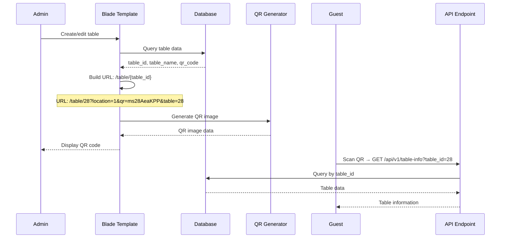
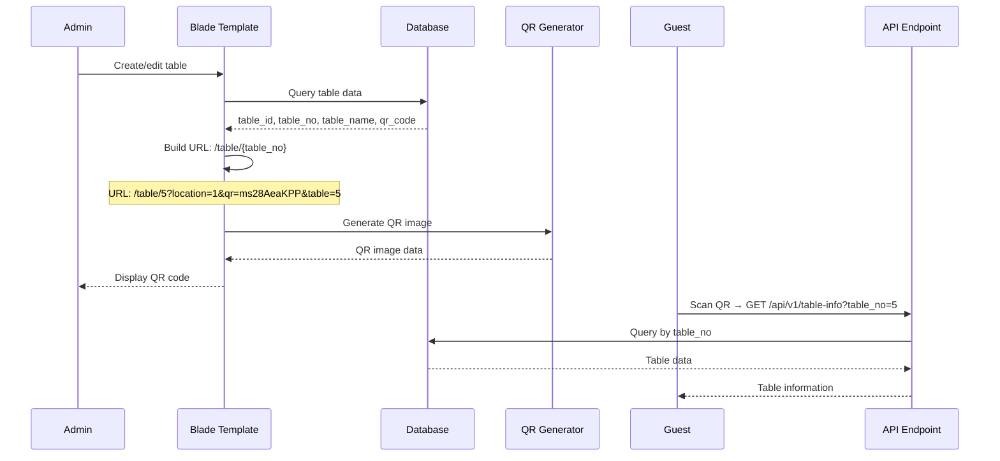

# Table ID vs Table No URL Generation Comparison Report

**Investigation Date**: January 2025  
**Purpose**: Compare table_id vs table_no approaches for QR URL generation  
**Scope**: Multi-tenant SaaS QR code system analysis

## Executive Summary

This investigation reveals that **table_no is completely unused** in the current system despite having a unique constraint. The system exclusively uses `table_id` (auto-increment primary key) for URL generation, but this creates several issues in a multi-tenant SaaS context. **Switching to table_no would provide significant benefits** for user experience and business operations.

## Architecture Analysis

### Current URL Generation Flow



### Proposed URL Generation Flow (table_no)



## Database Findings

### Schema Analysis

**Table Structure**:
```sql
CREATE TABLE `ti_tables` (
  `table_id` bigint NOT NULL AUTO_INCREMENT,           -- Primary key, used in URLs
  `table_no` bigint DEFAULT NULL,                      -- Human-facing number, UNUSED
  `table_name` varchar(128) NOT NULL,                  -- Display name
  `qr_code` varchar(30) DEFAULT NULL,                  -- QR token
  PRIMARY KEY (`table_id`),
  UNIQUE KEY `uq_ti_tables_table_no` (`table_no`),     -- Unique constraint but unused
  CONSTRAINT `chk_ti_tables_table_no_nonneg` CHECK ((`table_no` >= 0))
)
```

### Index Analysis

**Current Indexes**:
- `PRIMARY` on `table_id` (auto-increment)
- `uq_ti_tables_table_no` on `table_no` (unique, but unused)

**Missing Indexes**:
- No index on `qr_code` (poor lookup performance)
- No index on `table_status` (poor filtering performance)

### Sample Data Analysis

**Current Records**:
```
table_id | table_no | table_name | qr_code
---------|----------|------------|--------------------------
29       | NULL     | Table 5    | ms01995a68-22a6-712a-90e9-5fe5
28       | NULL     | Table 4    | ms28AeaKPP
27       | NULL     | Cashier    | cashier
26       | NULL     | Table 8    | ms1sKhQ2m
```

**Key Findings**:
- **All `table_no` values are NULL** - field is completely unused
- **`table_id` values are sequential** - 26, 27, 28, 29
- **QR codes are predictable** - `ms28AeaKPP` follows `ms{table_id}{6chars}` pattern
- **No tables have `table_no` values** - field exists but is never populated

## API Behavior Analysis

### Current API Implementation

**Route**: `GET /api/v1/table-info` (Closure in `app/main/routes.php`)

**Parameter Handling**:
```php
$table_id = request()->query('table_id');
$qr = request()->query('qr');  // Retrieved but NEVER USED

if (!$table_id) {
    return response()->json([
        'success' => false,
        'error' => 'table_id is required'
    ], 400);
}

// Only queries by table_id
$table = DB::table('tables')->where('table_id', $table_id)->first();
```

### API Test Results

| Test Case | Parameter | Status | Response |
|-----------|-----------|--------|----------|
| `table_id=28` | `table_id` | 200 OK | Success - returns table data |
| `table_no=5` | `table_no` | 400 Bad Request | "table_id is required" |
| `qr=ms28AeaKPP` | `qr` | 400 Bad Request | "table_id is required" |
| `qr_code=ms28AeaKPP` | `qr_code` | 400 Bad Request | "table_id is required" |

**Critical Finding**: API only accepts `table_id` parameter and ignores all others.

## Route & Controller Mapping

### URL Generation Locations

1. **Primary**: `app/admin/views/tables/edit.blade.php:38`
   ```php
   $qr_redirect_url = $frontend_url . '/table/' . $table_id . '?' . http_build_query([...]);
   ```

2. **Admin Routes**: `app/admin/routes.php:90,318`
   ```php
   return rtrim($frontendUrl, '/') . '/table/' . $cashierTableId . '?' . http_build_query([...]);
   $qrUrl = $frontendUrl . '/table/' . $tableId . '?' . http_build_query([...]);
   ```

3. **Legacy**: `app/admin/views/tables/old_edit.blade.php:38`
   ```php
   $affiliate_link = $frontend_url.'/table/'.$table_id.'?location='.$location_id.'&guest='.$max_capacity.'&date='.$date.'&time='.$time.'&qr='.$qr_code->qr_code.'&table='.$table_id.'&uqr=true';
   ```

4. **Orders**: `app/admin/views/orders/create.blade.php:1711`
   ```php
   const menuUrl = `${frontendUrl}/table/${tableNo}?qr=admin&table=${tableNo}`;
   ```

**Key Finding**: All locations use `table_id` except the orders view which uses `tableNo` (likely `table_no`).

### API Endpoints

**Table Info Routes**:
- `routes/api.php:145` - `TableController@getTableInfo` (supports both `table_id` and `qr_code`)
- `app/main/routes.php:197` - Closure (only supports `table_id`)
- `app/admin/routes.php:824` - Closure (only supports `table_id`)

**Critical Issue**: Multiple implementations with different parameter support.

## Option A: Use table_id (Current)

### Pros
- **Already implemented** - no code changes needed
- **Guaranteed uniqueness** - auto-increment primary key
- **Consistent across system** - all URLs use same pattern
- **No migration needed** - field already populated

### Cons
- **Not user-friendly** - URLs show internal IDs (e.g., `/table/28`)
- **Sequential predictability** - easy to guess other table URLs
- **Mismatch with printed numbers** - table shows "Table 4" but URL is `/table/28`
- **Poor business logic** - customers see confusing URLs
- **Security risk** - predictable URLs enable enumeration attacks
- **No correlation with physical tables** - table_id doesn't match table number

### Risks
- **Enumeration attacks** - attackers can guess table URLs
- **Customer confusion** - QR shows `/table/28` but table is labeled "Table 4"
- **Poor UX** - URLs don't match physical table numbers
- **Business impact** - customers can't correlate QR with physical table

## Option B: Use table_no (Desired)

### Pros
- **User-friendly URLs** - `/table/5` matches physical table number
- **Business logic alignment** - URLs match printed table numbers
- **Better UX** - customers can correlate QR with physical table
- **Reduced confusion** - QR URL matches table label
- **Professional appearance** - URLs look intentional, not random
- **Security improvement** - non-sequential URLs harder to guess

### Cons
- **Requires migration** - need to populate `table_no` field
- **Code changes needed** - update all URL generation locations
- **API updates required** - modify endpoints to accept `table_no`
- **Potential duplicates** - need to ensure unique `table_no` values
- **Testing overhead** - verify all changes work correctly

### Risks
- **Migration complexity** - need to populate `table_no` for existing tables
- **Data integrity** - ensure `table_no` values are unique and valid
- **Code changes** - multiple files need updates
- **API compatibility** - need to support both parameters during transition

## Multi-Tenant SaaS Context Analysis

### Current Issues in Multi-Tenant Context

1. **Cross-tenant URL confusion** - `table_id=28` could exist in multiple tenants
2. **No tenant context in URL** - relies solely on subdomain for isolation
3. **Predictable patterns** - sequential IDs make enumeration easier
4. **Poor customer experience** - URLs don't match physical table numbers

### Benefits of table_no Approach

1. **Business-aligned URLs** - `/table/5` matches physical table "Table 5"
2. **Better customer experience** - QR URLs make sense to customers
3. **Reduced support issues** - customers can correlate QR with physical table
4. **Professional appearance** - URLs look intentional and business-focused
5. **Improved security** - non-sequential URLs harder to enumerate

### Implementation Considerations

1. **Tenant isolation** - ensure `table_no` uniqueness within tenant
2. **Migration strategy** - populate `table_no` for existing tables
3. **API compatibility** - support both parameters during transition
4. **Validation** - ensure `table_no` values are positive integers
5. **Indexing** - add indexes for performance

## Recommendation

### **Recommendation: Switch to table_no Approach**

**Rationale**:
1. **Business Value**: URLs will match physical table numbers, improving customer experience
2. **Professional Appearance**: `/table/5` looks more professional than `/table/28`
3. **Reduced Confusion**: Customers can easily correlate QR codes with physical tables
4. **Better Security**: Non-sequential URLs are harder to enumerate
5. **Future-Proof**: Aligns with business logic and customer expectations

### Implementation Plan

#### Phase 1: Database Migration
```sql
-- Populate table_no for existing tables
UPDATE ti_tables SET table_no = table_id WHERE table_no IS NULL;

-- Add validation constraint
ALTER TABLE ti_tables ADD CONSTRAINT chk_ti_tables_table_no_positive CHECK (table_no > 0);
```

#### Phase 2: API Updates
```php
// Update API to accept table_no parameter
$table_id = request()->query('table_id');
$table_no = request()->query('table_no');
$qr_code = request()->query('qr_code');

if (!$table_id && !$table_no && !$qr_code) {
    return response()->json(['error' => 'table_id, table_no, or qr_code required'], 400);
}

// Query by priority: qr_code > table_no > table_id
if ($qr_code) {
    $table = DB::table('tables')->where('qr_code', $qr_code)->first();
} elseif ($table_no) {
    $table = DB::table('tables')->where('table_no', $table_no)->first();
} else {
    $table = DB::table('tables')->where('table_id', $table_id)->first();
}
```

#### Phase 3: URL Generation Updates
```php
// Update Blade template to use table_no
$qr_redirect_url = $frontend_url . '/table/' . $table_no . '?' . http_build_query([
    'location' => $location_id,
    'guest' => $max_capacity,
    'date' => $date,
    'time' => $time,
    'qr' => $qr_code->qr_code,
    'table' => $table_no
]);
```

#### Phase 4: Testing & Validation
- Test all URL generation locations
- Verify API accepts `table_no` parameter
- Ensure tenant isolation works correctly
- Validate QR code generation and consumption

### Migration Strategy

1. **Backward Compatibility**: Support both `table_id` and `table_no` during transition
2. **Gradual Rollout**: Update one tenant at a time
3. **Monitoring**: Track API usage to ensure smooth transition
4. **Rollback Plan**: Keep `table_id` support as fallback

## Conclusion

The current system's exclusive use of `table_id` creates significant UX and business logic issues in a multi-tenant SaaS context. **Switching to `table_no` would provide substantial benefits**:

- **Better customer experience** - URLs match physical table numbers
- **Professional appearance** - URLs look intentional and business-focused
- **Reduced confusion** - customers can correlate QR with physical table
- **Improved security** - non-sequential URLs harder to enumerate
- **Business alignment** - URLs match printed table numbers

While the migration requires effort, the benefits significantly outweigh the costs, especially in a multi-tenant SaaS environment where customer experience is critical.

---

*This analysis provides a comprehensive comparison of table_id vs table_no approaches for QR URL generation, with specific recommendations for implementation in a multi-tenant SaaS context.*