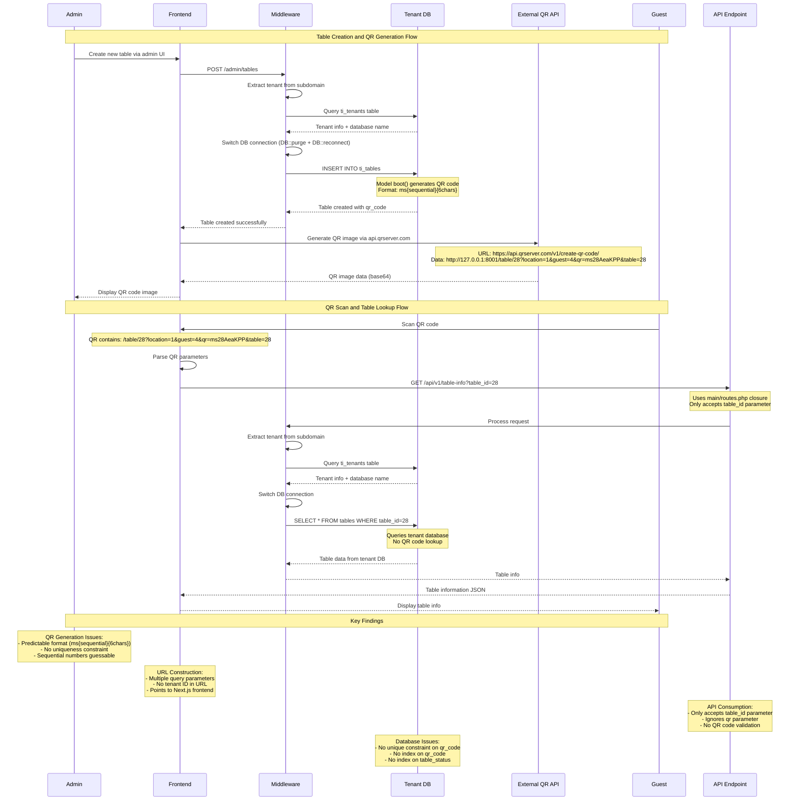

# Current QR Code Flow Sequence Diagram

**Investigation Date**: January 2025  
**Purpose**: Sequence diagram showing the current QR creation and consumption flow

## Current QR Code Flow

## Flow Analysis

### 1. Table Creation and QR Generation
- **Admin creates table** via admin UI
- **Tenant middleware** extracts subdomain and switches database
- **Model boot()** generates QR code using `ms{sequential}{6chars}` format
- **QR URL construction** includes multiple parameters but no tenant ID
- **External QR service** generates image via api.qrserver.com

### 2. QR Scan and Table Lookup
- **Guest scans QR** containing table information
- **Frontend parses** QR parameters
- **API call** made to `/api/v1/table-info` with `table_id` parameter
- **Tenant middleware** ensures database isolation
- **Database query** retrieves table information from tenant database

### 3. Key Issues Identified
- **QR Generation**: Predictable and vulnerable to guessing
- **API Consumption**: Only accepts `table_id`, ignores `qr` parameter
- **Database**: Missing constraints and indexes
- **URL Structure**: No tenant ID, relies on subdomain for isolation

## Security Concerns

1. **Predictable QR Codes**: Sequential numbers make QR codes guessable
2. **No Uniqueness**: Database lacks unique constraint on qr_code
3. **API Mismatch**: QR codes contain `qr` parameter but API only accepts `table_id`
4. **Missing Indexes**: No performance optimization for QR lookups
5. **External Dependency**: Relies on api.qrserver.com for QR images

## Multi-Tenant Isolation

- **Tenant Detection**: Properly implemented via subdomain extraction
- **Database Switching**: Correctly switches to tenant database
- **URL Structure**: No tenant ID in QR URLs, relies on subdomain
- **API Protection**: All routes protected with tenant middleware

This sequence diagram shows the complete current flow from table creation to QR consumption, highlighting the security issues and implementation details discovered during the investigation.