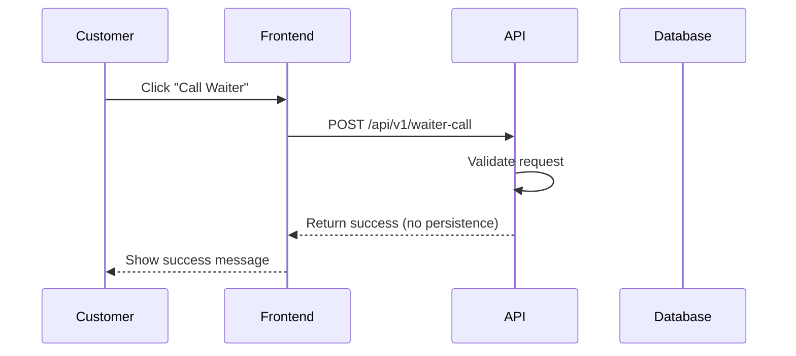
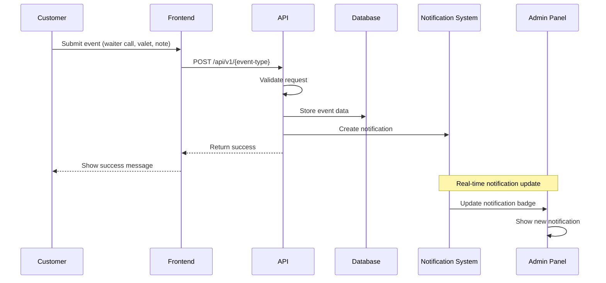

# Notification Sources and Events

**Existing endpoints and events** that can be reused for the Admin Header Notifications feature. This document maps frontend events to backend handlers and identifies where notification creation should be integrated.

## 📋 Event Sources Overview

### Frontend Event Sources
1. **Waiter Call Requests** - Customer calls for waiter assistance
2. **Table Notes** - Customer leaves notes for specific tables
3. **Valet Parking Requests** - Customer requests valet service

### Backend Integration Points
- **API Endpoints**: Existing routes that handle frontend events
- **Database Writes**: Where event data is stored
- **Table Information**: How to fetch table details for notifications

## 🔔 Waiter Call Events

### Frontend Implementation
**Location**: `frontend/app/table/[table_id]/page.tsx` ↩︎ [frontend/app/table/[table_id]/page.tsx:14-178]

**Valet parking link**:
```tsx
<MotionLink 
  href={`/table/${table_id}/valet?qr=${qr || ''}`}
  className="relative group"
  whileHover="hover"
  initial="initial"
  animate="animate"
>
```
↩︎ [frontend/app/table/[table_id]/page.tsx:136-141]

**Valet page**: `frontend/app/table/[table_id]/valet/page.tsx` ↩︎ [frontend/app/table/[table_id]/valet/page.tsx:1-185]

### Backend API Endpoint
**Location**: `routes/api.php:183-196` ↩︎ [routes/api.php:183-196]

**Current implementation**:
```php
Route::post('/waiter-call', function (Request $request) {
    $request->validate([
        'table_id' => 'required|string',
        'message' => 'required|string|max:500'
    ]);
    
    // For now, just return success since the table doesn't exist
    // In production, you would create this table or use an existing one
    return response()->json([
        'success' => true,
        'message' => 'Waiter called successfully',
        'call_id' => uniqid()
    ]);
});
```
↩︎ [routes/api.php:183-196]

### Request/Response Shape
**Request**:
```json
{
    "table_id": "string",
    "message": "string (max 500 chars)"
}
```

**Response**:
```json
{
    "success": true,
    "message": "Waiter called successfully",
    "call_id": "unique_id"
}
```

### Issues with Current Implementation
1. **No persistence**: Waiter calls are not stored in database
2. **No notification creation**: No integration with notification system
3. **No tenant context**: Missing tenant-specific data handling
4. **No table validation**: Table ID is not validated against actual tables

## 🚗 Valet Parking Events

### Frontend Implementation
**Valet page**: `frontend/app/table/[table_id]/valet/page.tsx` ↩︎ [frontend/app/table/[table_id]/valet/page.tsx:1-185]

**Form data structure**:
```tsx
const [formData, setFormData] = useState({
    name: "",
    car: "",
    plate: ""
})
```
↩︎ [frontend/app/table/[table_id]/valet/page.tsx:19-23]

**Form submission**:
```tsx
const handleSubmit = async (e: React.FormEvent) => {
    e.preventDefault()
    setIsSubmitting(true)

    // Simulate API call
    await new Promise(resolve => setTimeout(resolve, 1000))

    setIsSubmitting(false)
    setIsSuccess(true)
}
```
↩︎ [frontend/app/table/[table_id]/valet/page.tsx:30-39]

### Backend API Endpoint
**Status**: **Unknown** - No valet parking API endpoint found

**Required endpoint**:
```php
Route::post('/valet-request', function (Request $request) {
    $request->validate([
        'table_id' => 'required|string',
        'name' => 'required|string|max:255',
        'car' => 'required|string|max:255',
        'plate' => 'required|string|max:20'
    ]);
    
    // Create valet request record
    // Create notification for admin
    
    return response()->json([
        'success' => true,
        'message' => 'Valet request submitted successfully',
        'request_id' => uniqid()
    ]);
});
```

### Request/Response Shape
**Request**:
```json
{
    "table_id": "string",
    "name": "string (max 255 chars)",
    "car": "string (max 255 chars)",
    "plate": "string (max 20 chars)"
}
```

**Response**:
```json
{
    "success": true,
    "message": "Valet request submitted successfully",
    "request_id": "unique_id"
}
```

## 📝 Table Notes Events

### Frontend Implementation
**Status**: **Unknown** - No table notes functionality found in frontend

**Required frontend implementation**:
```tsx
// Table notes component
const TableNotes = ({ table_id }: { table_id: string }) => {
    const [note, setNote] = useState("")
    
    const handleSubmit = async (e: React.FormEvent) => {
        e.preventDefault()
        
        const response = await fetch('/api/v1/table-notes', {
            method: 'POST',
            headers: { 'Content-Type': 'application/json' },
            body: JSON.stringify({
                table_id,
                note,
                timestamp: new Date().toISOString()
            })
        })
        
        const result = await response.json()
        if (result.success) {
            setNote("")
            // Show success message
        }
    }
    
    return (
        <form onSubmit={handleSubmit}>
            <textarea 
                value={note}
                onChange={(e) => setNote(e.target.value)}
                placeholder="Leave a note for the staff..."
                maxLength={500}
            />
            <button type="submit">Send Note</button>
        </form>
    )
}
```

### Backend API Endpoint
**Status**: **Unknown** - No table notes API endpoint found

**Required endpoint**:
```php
Route::post('/table-notes', function (Request $request) {
    $request->validate([
        'table_id' => 'required|string',
        'note' => 'required|string|max:500',
        'timestamp' => 'required|date'
    ]);
    
    // Create table note record
    // Create notification for admin
    
    return response()->json([
        'success' => true,
        'message' => 'Note submitted successfully',
        'note_id' => uniqid()
    ]);
});
```

### Request/Response Shape
**Request**:
```json
{
    "table_id": "string",
    "note": "string (max 500 chars)",
    "timestamp": "ISO 8601 date string"
}
```

**Response**:
```json
{
    "success": true,
    "message": "Note submitted successfully",
    "note_id": "unique_id"
}
```

## 🗄️ Table Information Retrieval

### Database Schema
**Tables table**: `ti_tables` ↩︎ [db/paymydine.sql:2461-2530]

**Schema structure**:
```sql
CREATE TABLE `ti_tables` (
  `table_id` bigint unsigned NOT NULL AUTO_INCREMENT,
  `table_name` varchar(128) NOT NULL,
  `min_capacity` int NOT NULL,
  `max_capacity` int NOT NULL,
  `table_status` tinyint(1) NOT NULL,
  `extra_capacity` int NOT NULL DEFAULT '0',
  `is_joinable` tinyint(1) NOT NULL DEFAULT '1',
  `priority` int NOT NULL DEFAULT '0',
  `created_at` timestamp NULL DEFAULT NULL,
  `updated_at` timestamp NULL DEFAULT NULL,
  `qr_code` varchar(30) DEFAULT NULL,
  PRIMARY KEY (`table_id`)
) ENGINE=InnoDB AUTO_INCREMENT=32 DEFAULT CHARSET=utf8mb4;
```
↩︎ [db/paymydine.sql:2461-2530]

### Table Model
**Location**: `app/admin/models/Tables_model.php` ↩︎ [app/admin/models/Tables_model.php:1-80]

**Key methods**:
```php
public static function getDropdownOptions()
{
    return self::selectRaw('table_id, concat(table_name, " (", min_capacity, " - ", max_capacity, ")") AS display_name')
        ->dropdown('display_name');
}
```
↩︎ [app/admin/models/Tables_model.php:50-54]

**Relationships**:
```php
public $relation = [
    'morphToMany' => [
        'locations' => ['Admin\Models\Locations_model', 'name' => 'locationable'],
    ],
];
```
↩︎ [app/admin/models/Tables_model.php:42-46]

### Table Information Retrieval
**For notifications, we need**:
- **table_id**: Primary key from `ti_tables.table_id`
- **table_name**: Display name from `ti_tables.table_name`
- **location_id**: From table-location relationship
- **qr_code**: For QR code-based table identification

**Query example**:
```php
$table = DB::table('ti_tables')
    ->where('table_id', $tableId)
    ->first();

$tableInfo = [
    'table_id' => $table->table_id,
    'table_name' => $table->table_name,
    'qr_code' => $table->qr_code,
    'location_id' => $table->location_id ?? null
];
```

## 🔄 Event Processing Flow

### Current Flow (Waiter Calls)


### Required Flow (With Notifications)


## 🚨 Integration Points

### 1. Waiter Call Integration
**Current endpoint**: `POST /api/v1/waiter-call` ↩︎ [routes/api.php:183-196]

**Required changes**:
1. **Add database persistence**: Store waiter call requests
2. **Add notification creation**: Create admin notification
3. **Add tenant context**: Use tenant-specific database
4. **Add table validation**: Validate table exists

**Implementation location**: `routes/api.php:183-196`

### 2. Valet Request Integration
**Status**: **Unknown** - No valet endpoint exists

**Required implementation**:
1. **Create API endpoint**: `POST /api/v1/valet-request`
2. **Add database persistence**: Store valet requests
3. **Add notification creation**: Create admin notification
4. **Add tenant context**: Use tenant-specific database

**Implementation location**: `routes/api.php` (new endpoint)

### 3. Table Notes Integration
**Status**: **Unknown** - No table notes endpoint exists

**Required implementation**:
1. **Create API endpoint**: `POST /api/v1/table-notes`
2. **Add database persistence**: Store table notes
3. **Add notification creation**: Create admin notification
4. **Add tenant context**: Use tenant-specific database

**Implementation location**: `routes/api.php` (new endpoint)

## 📊 OpenAPI Specification Updates

### Current OpenAPI Spec
**Location**: `docs/api/openapi.yaml` ↩︎ [docs/api/openapi.yaml:1-921]

**Current waiter call endpoint**:
```yaml
/waiter-call:
  post:
    summary: Call waiter
    description: Request waiter assistance
    requestBody:
      required: true
      content:
        application/json:
          schema:
            type: object
            required:
              - table_id
              - message
            properties:
              table_id:
                type: string
                example: "7"
              message:
                type: string
                maxLength: 500
                example: "Need assistance with the menu"
    responses:
      '200':
        description: Waiter called successfully
        content:
          application/json:
            schema:
              type: object
              properties:
                success:
                  type: boolean
                  example: true
                message:
                  type: string
                  example: "Waiter called successfully"
                call_id:
                  type: string
                  example: "unique_id"
```
↩︎ [docs/api/openapi.yaml:1-921]

### Required OpenAPI Updates
**Add new endpoints**:
1. **Valet Request**: `POST /api/v1/valet-request`
2. **Table Notes**: `POST /api/v1/table-notes`
3. **Notification Management**: Admin API endpoints

## 🔧 Multi-tenant Considerations

### Tenant Database Switching
**Middleware**: `app/Http/Middleware/TenantDatabaseMiddleware.php` ↩︎ [app/Http/Middleware/TenantDatabaseMiddleware.php:1-48]

**Database switching logic**:
```php
if ($tenantInfo) {
    // Switch to tenant database
    Config::set('database.connections.mysql.database', $tenantInfo->database);
    
    // Reconnect with new database
    DB::purge('mysql');
    DB::reconnect('mysql');
    
    // Store tenant info in request for later use
    $request->attributes->set('tenant', $tenantInfo);
}
```
↩︎ [app/Http/Middleware/TenantDatabaseMiddleware.php:24-33]

### Tenant Context for Notifications
**Required for all event processing**:
1. **Use tenant database**: All notifications must be stored in tenant-specific database
2. **Validate tenant context**: Ensure events belong to correct tenant
3. **Isolate notifications**: Admin only sees notifications for their tenant

## 📚 Related Files

### Frontend
- `frontend/app/table/[table_id]/page.tsx` - Table home page ↩︎ [frontend/app/table/[table_id]/page.tsx:14-178]
- `frontend/app/table/[table_id]/valet/page.tsx` - Valet request page ↩︎ [frontend/app/table/[table_id]/valet/page.tsx:1-185]
- `frontend/lib/api-client.ts` - API client for frontend ↩︎ [frontend/lib/api-client.ts:135-593]

### Backend
- `routes/api.php` - API routes ↩︎ [routes/api.php:1-207]
- `app/admin/models/Tables_model.php` - Table model ↩︎ [app/admin/models/Tables_model.php:1-80]
- `app/Http/Middleware/TenantDatabaseMiddleware.php` - Tenant middleware ↩︎ [app/Http/Middleware/TenantDatabaseMiddleware.php:1-48]

### Database
- `db/paymydine.sql` - Database schema ↩︎ [db/paymydine.sql:2461-2530]

### Documentation
- `docs/api/openapi.yaml` - API specification ↩︎ [docs/api/openapi.yaml:1-921]

## 📋 Summary

**Current status**:
1. **Waiter calls**: Basic endpoint exists but no persistence or notifications
2. **Valet requests**: Frontend exists but no backend endpoint
3. **Table notes**: No implementation found
4. **Table information**: Database schema and model exist
5. **Multi-tenant**: Middleware exists but not used in current endpoints

**Required work**:
1. **Enhance waiter call endpoint**: Add persistence and notification creation
2. **Create valet request endpoint**: New API endpoint with notification integration
3. **Create table notes endpoint**: New API endpoint with notification integration
4. **Add tenant context**: Ensure all endpoints use tenant-specific database
5. **Update OpenAPI spec**: Document new endpoints and request/response shapes