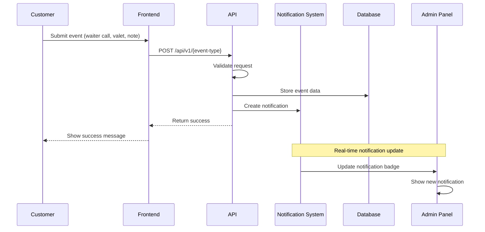

# Notification Ingestion Pipeline

**Frontend event processing and notification creation** for the Admin Header Notifications feature. This document maps frontend events to backend handlers and defines the notification creation workflow.

## 📋 Ingestion Pipeline Overview

### Event Flow


### Event Types
1. **Waiter Call** - Customer requests waiter assistance
2. **Valet Request** - Customer requests valet service
3. **Table Note** - Customer leaves note for table

## 🔔 Waiter Call Event Processing

### Frontend Event Source
**Location**: `frontend/app/table/[table_id]/page.tsx` ↩︎ [frontend/app/table/[table_id]/page.tsx:14-178]

**Current implementation**: **Unknown** - No waiter call functionality found in frontend

**Required frontend implementation**:
```tsx
// Waiter call component
const WaiterCallButton = ({ table_id }: { table_id: string }) => {
    const [isCalling, setIsCalling] = useState(false)
    const [message, setMessage] = useState("")
    
    const handleWaiterCall = async () => {
        setIsCalling(true)
        
        try {
            const response = await fetch('/api/v1/waiter-call', {
                method: 'POST',
                headers: { 'Content-Type': 'application/json' },
                body: JSON.stringify({
                    table_id,
                    message: message || "Customer needs assistance"
                })
            })
            
            const result = await response.json()
            if (result.success) {
                // Show success message
                toast.success("Waiter called successfully")
            }
        } catch (error) {
            toast.error("Failed to call waiter")
        } finally {
            setIsCalling(false)
        }
    }
    
    return (
        <div className="waiter-call-section">
            <textarea
                value={message}
                onChange={(e) => setMessage(e.target.value)}
                placeholder="Leave a message for the waiter..."
                maxLength={500}
            />
            <button 
                onClick={handleWaiterCall}
                disabled={isCalling}
                className="btn btn-primary"
            >
                {isCalling ? "Calling..." : "Call Waiter"}
            </button>
        </div>
    )
}
```

### Backend API Handler
**Current endpoint**: `routes/api.php:183-196` ↩︎ [routes/api.php:183-196]

**Current implementation**:
```php
Route::post('/waiter-call', function (Request $request) {
    $request->validate([
        'table_id' => 'required|string',
        'message' => 'required|string|max:500'
    ]);
    
    // For now, just return success since the table doesn't exist
    // In production, you would create this table or use an existing one
    return response()->json([
        'success' => true,
        'message' => 'Waiter called successfully',
        'call_id' => uniqid()
    ]);
});
```
↩︎ [routes/api.php:183-196]

**Required enhancement**:
```php
Route::post('/waiter-call', function (Request $request) {
    $request->validate([
        'table_id' => 'required|string',
        'message' => 'required|string|max:500'
    ]);
    
    try {
        // Get tenant context from middleware
        $tenant = $request->attributes->get('tenant');
        if (!$tenant) {
            return response()->json(['success' => false, 'error' => 'Tenant not found'], 400);
        }
        
        // Validate table exists
        $table = DB::table('ti_tables')
            ->where('table_id', $request->table_id)
            ->where('table_status', 1)
            ->first();
            
        if (!$table) {
            return response()->json(['success' => false, 'error' => 'Table not found'], 404);
        }
        
        // Store waiter call request
        $callId = DB::table('ti_waiter_calls')->insertGetId([
            'table_id' => $request->table_id,
            'message' => $request->message,
            'status' => 'pending',
            'created_at' => now(),
            'updated_at' => now()
        ]);
        
        // Create notification
        $notificationId = DB::table('ti_notifications')->insertGetId([
            'tenant_id' => $tenant->id,
            'type' => 'waiter_call',
            'title' => "Waiter Call - {$table->table_name}",
            'message' => $request->message,
            'table_id' => $request->table_id,
            'table_name' => $table->table_name,
            'payload' => json_encode([
                'call_id' => $callId,
                'customer_message' => $request->message,
                'urgency' => 'medium'
            ]),
            'status' => 'new',
            'priority' => 'medium',
            'created_at' => now(),
            'updated_at' => now()
        ]);
        
        return response()->json([
            'success' => true,
            'message' => 'Waiter called successfully',
            'call_id' => $callId,
            'notification_id' => $notificationId
        ]);
        
    } catch (\Exception $e) {
        Log::error('Waiter call failed', [
            'error' => $e->getMessage(),
            'table_id' => $request->table_id,
            'tenant' => $tenant->id ?? 'unknown'
        ]);
        
        return response()->json([
            'success' => false,
            'error' => 'Failed to process waiter call'
        ], 500);
    }
});
```

### Database Schema for Waiter Calls
**Table name**: `ti_waiter_calls`

**Schema**:
```sql
CREATE TABLE `ti_waiter_calls` (
  `call_id` bigint unsigned NOT NULL AUTO_INCREMENT,
  `table_id` bigint unsigned NOT NULL,
  `message` text NOT NULL,
  `status` enum('pending', 'acknowledged', 'completed', 'cancelled') NOT NULL DEFAULT 'pending',
  `created_at` timestamp NULL DEFAULT CURRENT_TIMESTAMP,
  `updated_at` timestamp NULL DEFAULT CURRENT_TIMESTAMP ON UPDATE CURRENT_TIMESTAMP,
  PRIMARY KEY (`call_id`),
  KEY `idx_table_status` (`table_id`, `status`),
  KEY `idx_created_at` (`created_at`),
  CONSTRAINT `fk_waiter_calls_table` FOREIGN KEY (`table_id`) REFERENCES `ti_tables` (`table_id`) ON DELETE CASCADE
) ENGINE=InnoDB DEFAULT CHARSET=utf8mb4 COLLATE=utf8mb4_unicode_ci;
```

## 🚗 Valet Request Event Processing

### Frontend Event Source
**Location**: `frontend/app/table/[table_id]/valet/page.tsx` ↩︎ [frontend/app/table/[table_id]/valet/page.tsx:1-185]

**Current implementation**:
```tsx
const handleSubmit = async (e: React.FormEvent) => {
    e.preventDefault()
    setIsSubmitting(true)

    // Simulate API call
    await new Promise(resolve => setTimeout(resolve, 1000))

    setIsSubmitting(false)
    setIsSuccess(true)
}
```
↩︎ [frontend/app/table/[table_id]/valet/page.tsx:30-39]

**Required enhancement**:
```tsx
const handleSubmit = async (e: React.FormEvent) => {
    e.preventDefault()
    setIsSubmitting(true)

    try {
        const response = await fetch('/api/v1/valet-request', {
            method: 'POST',
            headers: { 'Content-Type': 'application/json' },
            body: JSON.stringify({
                table_id: params.table_id,
                name: formData.name,
                car: formData.car,
                plate: formData.plate
            })
        })
        
        const result = await response.json()
        if (result.success) {
            setIsSuccess(true)
        } else {
            throw new Error(result.error || 'Failed to submit valet request')
        }
    } catch (error) {
        console.error('Valet request failed:', error)
        // Show error message
    } finally {
        setIsSubmitting(false)
    }
}
```

### Backend API Handler
**Status**: **Unknown** - No valet request endpoint exists

**Required implementation**:
```php
Route::post('/valet-request', function (Request $request) {
    $request->validate([
        'table_id' => 'required|string',
        'name' => 'required|string|max:255',
        'car' => 'required|string|max:255',
        'plate' => 'required|string|max:20'
    ]);
    
    try {
        // Get tenant context from middleware
        $tenant = $request->attributes->get('tenant');
        if (!$tenant) {
            return response()->json(['success' => false, 'error' => 'Tenant not found'], 400);
        }
        
        // Validate table exists
        $table = DB::table('ti_tables')
            ->where('table_id', $request->table_id)
            ->where('table_status', 1)
            ->first();
            
        if (!$table) {
            return response()->json(['success' => false, 'error' => 'Table not found'], 404);
        }
        
        // Store valet request
        $requestId = DB::table('ti_valet_requests')->insertGetId([
            'table_id' => $request->table_id,
            'customer_name' => $request->name,
            'car_make' => $request->car,
            'license_plate' => $request->plate,
            'status' => 'pending',
            'created_at' => now(),
            'updated_at' => now()
        ]);
        
        // Create notification
        $notificationId = DB::table('ti_notifications')->insertGetId([
            'tenant_id' => $tenant->id,
            'type' => 'valet_request',
            'title' => "Valet Request - {$table->table_name}",
            'message' => "Customer {$request->name} needs valet service for {$request->car} ({$request->plate})",
            'table_id' => $request->table_id,
            'table_name' => $table->table_name,
            'payload' => json_encode([
                'request_id' => $requestId,
                'customer_name' => $request->name,
                'car_make' => $request->car,
                'license_plate' => $request->plate,
                'estimated_duration' => '2 hours'
            ]),
            'status' => 'new',
            'priority' => 'medium',
            'created_at' => now(),
            'updated_at' => now()
        ]);
        
        return response()->json([
            'success' => true,
            'message' => 'Valet request submitted successfully',
            'request_id' => $requestId,
            'notification_id' => $notificationId
        ]);
        
    } catch (\Exception $e) {
        Log::error('Valet request failed', [
            'error' => $e->getMessage(),
            'table_id' => $request->table_id,
            'tenant' => $tenant->id ?? 'unknown'
        ]);
        
        return response()->json([
            'success' => false,
            'error' => 'Failed to process valet request'
        ], 500);
    }
});
```

### Database Schema for Valet Requests
**Table name**: `ti_valet_requests`

**Schema**:
```sql
CREATE TABLE `ti_valet_requests` (
  `request_id` bigint unsigned NOT NULL AUTO_INCREMENT,
  `table_id` bigint unsigned NOT NULL,
  `customer_name` varchar(255) NOT NULL,
  `car_make` varchar(255) NOT NULL,
  `license_plate` varchar(20) NOT NULL,
  `status` enum('pending', 'acknowledged', 'in_progress', 'completed', 'cancelled') NOT NULL DEFAULT 'pending',
  `created_at` timestamp NULL DEFAULT CURRENT_TIMESTAMP,
  `updated_at` timestamp NULL DEFAULT CURRENT_TIMESTAMP ON UPDATE CURRENT_TIMESTAMP,
  PRIMARY KEY (`request_id`),
  KEY `idx_table_status` (`table_id`, `status`),
  KEY `idx_created_at` (`created_at`),
  CONSTRAINT `fk_valet_requests_table` FOREIGN KEY (`table_id`) REFERENCES `ti_tables` (`table_id`) ON DELETE CASCADE
) ENGINE=InnoDB DEFAULT CHARSET=utf8mb4 COLLATE=utf8mb4_unicode_ci;
```

## 📝 Table Notes Event Processing

### Frontend Event Source
**Status**: **Unknown** - No table notes functionality found in frontend

**Required frontend implementation**:
```tsx
// Table notes component
const TableNotes = ({ table_id }: { table_id: string }) => {
    const [note, setNote] = useState("")
    const [isSubmitting, setIsSubmitting] = useState(false)
    
    const handleSubmit = async (e: React.FormEvent) => {
        e.preventDefault()
        setIsSubmitting(true)
        
        try {
            const response = await fetch('/api/v1/table-notes', {
                method: 'POST',
                headers: { 'Content-Type': 'application/json' },
                body: JSON.stringify({
                    table_id,
                    note,
                    timestamp: new Date().toISOString()
                })
            })
            
            const result = await response.json()
            if (result.success) {
                setNote("")
                toast.success("Note submitted successfully")
            } else {
                throw new Error(result.error || 'Failed to submit note')
            }
        } catch (error) {
            console.error('Table note failed:', error)
            toast.error("Failed to submit note")
        } finally {
            setIsSubmitting(false)
        }
    }
    
    return (
        <form onSubmit={handleSubmit} className="table-notes-form">
            <textarea
                value={note}
                onChange={(e) => setNote(e.target.value)}
                placeholder="Leave a note for the staff..."
                maxLength={500}
                rows={4}
            />
            <div className="form-actions">
                <button 
                    type="submit" 
                    disabled={isSubmitting || !note.trim()}
                    className="btn btn-primary"
                >
                    {isSubmitting ? "Submitting..." : "Send Note"}
                </button>
            </div>
        </form>
    )
}
```

### Backend API Handler
**Status**: **Unknown** - No table notes endpoint exists

**Required implementation**:
```php
Route::post('/table-notes', function (Request $request) {
    $request->validate([
        'table_id' => 'required|string',
        'note' => 'required|string|max:500',
        'timestamp' => 'required|date'
    ]);
    
    try {
        // Get tenant context from middleware
        $tenant = $request->attributes->get('tenant');
        if (!$tenant) {
            return response()->json(['success' => false, 'error' => 'Tenant not found'], 400);
        }
        
        // Validate table exists
        $table = DB::table('ti_tables')
            ->where('table_id', $request->table_id)
            ->where('table_status', 1)
            ->first();
            
        if (!$table) {
            return response()->json(['success' => false, 'error' => 'Table not found'], 404);
        }
        
        // Store table note
        $noteId = DB::table('ti_table_notes')->insertGetId([
            'table_id' => $request->table_id,
            'note' => $request->note,
            'timestamp' => $request->timestamp,
            'status' => 'new',
            'created_at' => now(),
            'updated_at' => now()
        ]);
        
        // Create notification
        $notificationId = DB::table('ti_notifications')->insertGetId([
            'tenant_id' => $tenant->id,
            'type' => 'table_note',
            'title' => "Table Note - {$table->table_name}",
            'message' => $request->note,
            'table_id' => $request->table_id,
            'table_name' => $table->table_name,
            'payload' => json_encode([
                'note_id' => $noteId,
                'note' => $request->note,
                'timestamp' => $request->timestamp
            ]),
            'status' => 'new',
            'priority' => 'low',
            'created_at' => now(),
            'updated_at' => now()
        ]);
        
        return response()->json([
            'success' => true,
            'message' => 'Note submitted successfully',
            'note_id' => $noteId,
            'notification_id' => $notificationId
        ]);
        
    } catch (\Exception $e) {
        Log::error('Table note failed', [
            'error' => $e->getMessage(),
            'table_id' => $request->table_id,
            'tenant' => $tenant->id ?? 'unknown'
        ]);
        
        return response()->json([
            'success' => false,
            'error' => 'Failed to process table note'
        ], 500);
    }
});
```

### Database Schema for Table Notes
**Table name**: `ti_table_notes`

**Schema**:
```sql
CREATE TABLE `ti_table_notes` (
  `note_id` bigint unsigned NOT NULL AUTO_INCREMENT,
  `table_id` bigint unsigned NOT NULL,
  `note` text NOT NULL,
  `timestamp` timestamp NOT NULL,
  `status` enum('new', 'read', 'archived') NOT NULL DEFAULT 'new',
  `created_at` timestamp NULL DEFAULT CURRENT_TIMESTAMP,
  `updated_at` timestamp NULL DEFAULT CURRENT_TIMESTAMP ON UPDATE CURRENT_TIMESTAMP,
  PRIMARY KEY (`note_id`),
  KEY `idx_table_status` (`table_id`, `status`),
  KEY `idx_created_at` (`created_at`),
  CONSTRAINT `fk_table_notes_table` FOREIGN KEY (`table_id`) REFERENCES `ti_tables` (`table_id`) ON DELETE CASCADE
) ENGINE=InnoDB DEFAULT CHARSET=utf8mb4 COLLATE=utf8mb4_unicode_ci;
```

## 🗄️ Table Information Retrieval

### Database Schema
**Tables table**: `ti_tables` ↩︎ [db/paymydine.sql:2461-2530]

**Schema structure**:
```sql
CREATE TABLE `ti_tables` (
  `table_id` bigint unsigned NOT NULL AUTO_INCREMENT,
  `table_name` varchar(128) NOT NULL,
  `min_capacity` int NOT NULL,
  `max_capacity` int NOT NULL,
  `table_status` tinyint(1) NOT NULL,
  `extra_capacity` int NOT NULL DEFAULT '0',
  `is_joinable` tinyint(1) NOT NULL DEFAULT '1',
  `priority` int NOT NULL DEFAULT '0',
  `created_at` timestamp NULL DEFAULT NULL,
  `updated_at` timestamp NULL DEFAULT NULL,
  `qr_code` varchar(30) DEFAULT NULL,
  PRIMARY KEY (`table_id`)
) ENGINE=InnoDB AUTO_INCREMENT=32 DEFAULT CHARSET=utf8mb4;
```
↩︎ [db/paymydine.sql:2461-2530]

### Table Information Helper
**Location**: `app/helpers/TableHelper.php` (to be created)

**Helper function**:
```php
<?php

namespace App\Helpers;

use Illuminate\Support\Facades\DB;

class TableHelper
{
    /**
     * Get table information for notifications
     *
     * @param string $tableId
     * @return array|null
     */
    public static function getTableInfo($tableId)
    {
        $table = DB::table('ti_tables')
            ->where('table_id', $tableId)
            ->where('table_status', 1)
            ->first();
            
        if (!$table) {
            return null;
        }
        
        return [
            'table_id' => $table->table_id,
            'table_name' => $table->table_name,
            'qr_code' => $table->qr_code,
            'min_capacity' => $table->min_capacity,
            'max_capacity' => $table->max_capacity,
            'is_joinable' => $table->is_joinable,
            'priority' => $table->priority
        ];
    }
    
    /**
     * Validate table exists and is active
     *
     * @param string $tableId
     * @return bool
     */
    public static function validateTable($tableId)
    {
        return DB::table('ti_tables')
            ->where('table_id', $tableId)
            ->where('table_status', 1)
            ->exists();
    }
}
```

## 🔄 Idempotency and Deduplication

### Idempotency Strategy
**Deduplication key**: `(tenant_id, type, table_id, created_at ±60s)`

**Implementation**:
```php
// Check for duplicate notifications within 60 seconds
$duplicate = DB::table('ti_notifications')
    ->where('tenant_id', $tenant->id)
    ->where('type', $type)
    ->where('table_id', $tableId)
    ->where('created_at', '>=', now()->subMinutes(1))
    ->exists();

if ($duplicate) {
    return response()->json([
        'success' => true,
        'message' => 'Duplicate request ignored',
        'duplicate' => true
    ]);
}
```

### Rate Limiting
**Per table rate limiting**: Maximum 5 notifications per table per hour

**Implementation**:
```php
// Check rate limit
$recentCount = DB::table('ti_notifications')
    ->where('tenant_id', $tenant->id)
    ->where('table_id', $tableId)
    ->where('created_at', '>=', now()->subHour())
    ->count();

if ($recentCount >= 5) {
    return response()->json([
        'success' => false,
        'error' => 'Rate limit exceeded. Please wait before sending another request.'
    ], 429);
}
```

## 🚨 Error Handling and Retries

### Error Handling Strategy
**1. Validation Errors**: Return 400 with specific error messages
**2. Database Errors**: Log error and return 500 with generic message
**3. Tenant Errors**: Return 400 with tenant not found message
**4. Table Errors**: Return 404 with table not found message

### Retry Logic
**Frontend retry**: 3 attempts with exponential backoff

**Implementation**:
```tsx
const retryWithBackoff = async (fn: () => Promise<any>, retries = 3) => {
    for (let i = 0; i < retries; i++) {
        try {
            return await fn()
        } catch (error) {
            if (i === retries - 1) throw error
            await new Promise(resolve => setTimeout(resolve, Math.pow(2, i) * 1000))
        }
    }
}
```

### Logging
**Error logging**: Log all errors with context

**Implementation**:
```php
Log::error('Notification creation failed', [
    'error' => $e->getMessage(),
    'table_id' => $request->table_id,
    'tenant' => $tenant->id ?? 'unknown',
    'type' => $type,
    'trace' => $e->getTraceAsString()
]);
```

## 📊 Performance Considerations

### Database Optimization
**Indexes for performance**:
```sql
-- Notification table indexes
KEY `idx_tenant_status` (`tenant_id`, `status`)
KEY `idx_tenant_created` (`tenant_id`, `created_at`)
KEY `idx_type_status` (`type`, `status`)
KEY `idx_table_id` (`table_id`)

-- Event table indexes
KEY `idx_table_status` (`table_id`, `status`)
KEY `idx_created_at` (`created_at`)
```

### Caching Strategy
**Table information caching**: Cache table data for 5 minutes

**Implementation**:
```php
$table = Cache::remember("table_{$tableId}", 300, function() use ($tableId) {
    return DB::table('ti_tables')
        ->where('table_id', $tableId)
        ->where('table_status', 1)
        ->first();
});
```

## 📚 Related Files

### Frontend
- `frontend/app/table/[table_id]/page.tsx` - Table home page ↩︎ [frontend/app/table/[table_id]/page.tsx:14-178]
- `frontend/app/table/[table_id]/valet/page.tsx` - Valet request page ↩︎ [frontend/app/table/[table_id]/valet/page.tsx:1-185]

### Backend
- `routes/api.php` - API routes ↩︎ [routes/api.php:1-207]
- `app/Http/Middleware/TenantDatabaseMiddleware.php` - Tenant middleware ↩︎ [app/Http/Middleware/TenantDatabaseMiddleware.php:1-48]

### Database
- `db/paymydine.sql` - Database schema ↩︎ [db/paymydine.sql:2461-2530]

## 📋 Summary

**Current status**:
- **Waiter calls**: Basic endpoint exists but no persistence or notifications
- **Valet requests**: Frontend exists but no backend endpoint
- **Table notes**: No implementation found
- **Table information**: Database schema and model exist

**Required implementation**:
1. **Enhance waiter call endpoint**: Add persistence and notification creation
2. **Create valet request endpoint**: New API endpoint with notification integration
3. **Create table notes endpoint**: New API endpoint with notification integration
4. **Add frontend components**: Waiter call and table notes functionality
5. **Add table validation**: Ensure tables exist and are active
6. **Add idempotency**: Prevent duplicate notifications
7. **Add rate limiting**: Prevent spam notifications
8. **Add error handling**: Proper error responses and logging
9. **Add tenant context**: Ensure all operations use tenant-specific database