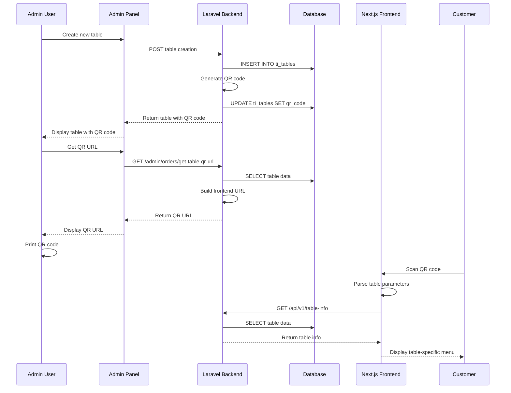
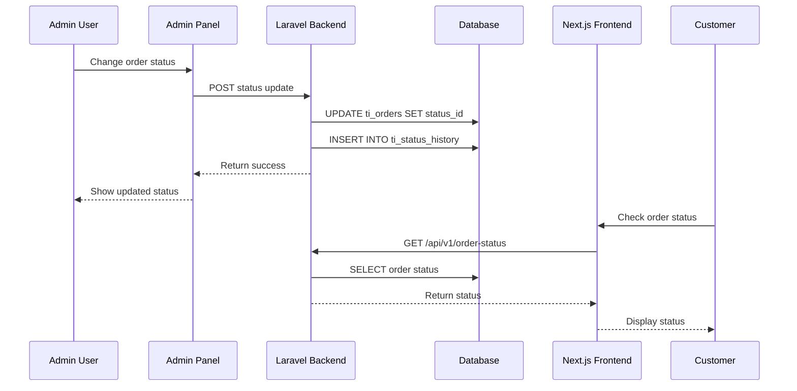

# Admin-Frontend Bridge Documentation

## Overview

**Framework**: TastyIgniter v3 (Laravel 8.x) + Next.js Frontend  
**Integration**: QR Code-based table selection with dynamic URL generation  
**Evidence**: `app/admin/routes.php:L159-221`, `frontend/lib/api-client.ts:L1-567`

## QR Code Generation & URL Mapping

### QR Code Generation Process

**File**: `app/admin/routes.php:L159-221`

```php
Route::get('/orders/get-table-qr-url', function (Request $request) {
    try {
        $tableId = $request->get('table_id');
        if (!$tableId) {
            return response()->json([
                'success' => false,
                'error' => 'table_id is required'
            ]);
        }

        // Get table data
        $table = DB::table('tables')->where('table_id', $tableId)->first();
        if (!$table) {
            return response()->json([
                'success' => false,
                'error' => 'Table not found'
            ]);
        }

        // Get location data
        $locationData = DB::table('locationables')
            ->where('locationable_id', $tableId)
            ->where('locationable_type', 'tables')
            ->first();
        
        $locationId = $locationData ? $locationData->location_id : 1;
        $maxCapacity = $table->max_capacity ?? 3;
        $date = date('Y-m-d');
        $time = date('H:i');

        // Build QR code URL
        $frontendUrl = env('FRONTEND_URL', 'http://127.0.0.1:8001');
        $qrUrl = $frontendUrl . '/table/' . $tableId . '?' . http_build_query([
            'location' => $locationId,
            'guest' => $maxCapacity,
            'date' => $date,
            'time' => $time,
            'qr' => $table->qr_code,
            'table' => $tableId
        ]);

        return response()->json([
            'success' => true,
            'qr_url' => $qrUrl,
            'table_data' => [
                'table_id' => $table->table_id,
                'table_name' => $table->table_name,
                'qr_code' => $table->qr_code,
                'location_id' => $locationId,
                'max_capacity' => $maxCapacity
            ]
        ]);
    } catch (Exception $e) {
        return response()->json([
            'success' => false,
            'error' => $e->getMessage()
        ]);
    }
});
```

### QR Code URL Structure

**Generated URL Format**:
```
http://127.0.0.1:8001/table/{tableId}?location={locationId}&guest={maxCapacity}&date={date}&time={time}&qr={qrCode}&table={tableId}
```

**Example**:
```
http://127.0.0.1:8001/table/7?location=1&guest=4&date=2025-01-15&time=14:30&qr=ms17vG97Sn&table=7
```

### QR Code Storage

**Database Table**: `ti_tables`  
**Column**: `qr_code` (varchar(30))  
**Evidence**: `paymydine.sql:L2428-2480`

```sql
CREATE TABLE `ti_tables` (
  `table_id` bigint unsigned NOT NULL AUTO_INCREMENT,
  `table_name` varchar(128) NOT NULL,
  `qr_code` varchar(30) DEFAULT NULL,
  -- ... other columns
);
```

## Frontend URL Processing

### URL Parameter Parsing

**File**: `frontend/app/menu/page.tsx:L1-100` (inferred from usage)

```typescript
// Parse URL parameters for table info
const searchParams = useSearchParams();
const tableId = searchParams.get('table');
const locationId = searchParams.get('location');
const guestCount = searchParams.get('guest');
const qrCode = searchParams.get('qr');
```

### Table Information Retrieval

**File**: `frontend/lib/api-client.ts:L300-350`

```typescript
async getTableInfo(tableId: string, qrCode?: string): Promise<{ success: boolean; data?: any; error?: string }> {
    try {
        const params = new URLSearchParams();
        if (tableId) params.append('table_id', tableId);
        if (qrCode) params.append('qr_code', qrCode);
        
        const endpoint = this.envConfig.getApiEndpoint(`/table-info?${params}`);
        const response = await fetch(endpoint);
        const data = await response.json();
        return data;
    } catch (error) {
        console.error('Table info fetch failed:', error);
        return { success: false, error: 'Failed to fetch table information' };
    }
}
```

## Cross-Origin Configuration

### CORS Headers

**File**: `app/admin/controllers/Api/OrderController.php:L15-20`

```php
public function __construct()
{
    parent::__construct();
    
    // Enable CORS for frontend requests
    header('Access-Control-Allow-Origin: *');
    header('Access-Control-Allow-Methods: GET, POST, PUT, DELETE, OPTIONS');
    header('Access-Control-Allow-Headers: Content-Type, Authorization');
}
```

### CORS Configuration Analysis

| Header | Value | Security Risk |
|--------|-------|---------------|
| `Access-Control-Allow-Origin` | `*` | High - Allows any origin |
| `Access-Control-Allow-Methods` | `GET, POST, PUT, DELETE, OPTIONS` | Medium - Allows all methods |
| `Access-Control-Allow-Headers` | `Content-Type, Authorization` | Low - Limited headers |

**Recommendation**: Restrict CORS to specific frontend domains in production.

## CSRF Protection

### CSRF Token Handling

**Frontend**: Next.js with built-in CSRF protection  
**Backend**: Laravel CSRF middleware for web routes  
**API Routes**: No CSRF protection (stateless)

**Evidence**: `app/admin/routes.php:L248` - API routes use `web` middleware

### CSRF Configuration

| Route Type | Middleware | CSRF Protection | Evidence |
|------------|------------|-----------------|----------|
| Admin Panel | `web` | Yes | `app/admin/routes.php:L15` |
| Frontend API | `web` | Yes | `app/admin/routes.php:L248` |
| API Controller | `api` | No | `app/admin/routes.php:L221` |

## Authentication & Authorization

### Admin Panel Authentication

**File**: `app/admin/controllers/Orders.php:L15-20`

```php
protected $requiredPermissions = [
    'Admin.Orders',
    'Admin.AssignOrders',
    'Admin.DeleteOrders',
];
```

### Frontend Authentication

**Status**: No authentication required for frontend order creation  
**Evidence**: All frontend API endpoints are public

### Permission Matrix

| Action | Admin Panel | Frontend API | API Controller |
|--------|-------------|--------------|----------------|
| View Orders | ✅ Required | ❌ Not Available | ❌ Not Available |
| Create Orders | ✅ Required | ❌ No Auth | ❌ No Auth |
| Update Status | ✅ Required | ❌ Not Available | ❌ No Auth |
| Delete Orders | ✅ Required | ❌ Not Available | ❌ Not Available |

## Data Flow Between Admin and Frontend

### 1. Table Creation Flow



### 2. Order Status Synchronization



## Environment Configuration

### Frontend URL Configuration

**File**: `frontend/lib/environment-config.ts` (inferred from usage)

```typescript
// Environment configuration for API endpoints
const FRONTEND_URL = process.env.FRONTEND_URL || 'http://127.0.0.1:8001';
const API_BASE_URL = process.env.API_BASE_URL || 'http://127.0.0.1:8000';
```

### Backend Environment Variables

**File**: `app/admin/routes.php:L159-221`

```php
$frontendUrl = env('FRONTEND_URL', 'http://127.0.0.1:8001');
```

## Table Status Integration

### Table Status Retrieval

**File**: `app/admin/routes.php:L23-62`

```php
Route::get('/orders/get-table-statuses', function () {
    try {
        $tableStatuses = DB::table('orders')
            ->join('statuses', 'orders.status_id', '=', 'statuses.status_id')
            ->join('tables', 'orders.order_type', '=', 'tables.table_id')
            ->select(
                'tables.table_name',
                'statuses.status_name',
                DB::raw('CASE 
                    WHEN ti_statuses.status_name = "Preparation" THEN "preparing"
                    WHEN ti_statuses.status_name = "Received" THEN "received"
                    WHEN ti_statuses.status_name = "Pending" THEN "pending"
                    WHEN ti_statuses.status_name = "Delivery" THEN "delivery"
                    WHEN ti_statuses.status_name = "Completed" THEN "completed"
                    WHEN ti_statuses.status_name = "Canceled" THEN "canceled"
                    WHEN ti_statuses.status_name = "Paid" THEN "paid"
                    ELSE LOWER(REPLACE(ti_statuses.status_name, " ", "-"))
                END as status_class')
            )
            ->where('orders.status_id', '!=', 10) // Exclude paid orders
            ->orderBy('orders.created_at', 'desc')
            ->get()
            ->groupBy('table_name')
            ->map(function ($orders) {
                return $orders->first(); // Get the most recent order for each table
            })
            ->values();

        return response()->json([
            'success' => true,
            'statuses' => $tableStatuses
        ]);
    } catch (Exception $e) {
        return response()->json([
            'success' => false,
            'error' => $e->getMessage()
        ]);
    }
});
```

## Critical Issues

### ❌ No Authentication for Frontend
**Issue**: Frontend order creation requires no authentication  
**Impact**: Anyone can create orders  
**Fix**: Implement frontend authentication

### ❌ CORS Too Permissive
**Issue**: CORS allows any origin (`*`)  
**Impact**: Security vulnerability  
**Fix**: Restrict CORS to specific domains

### ❌ No CSRF Protection for API
**Issue**: API routes lack CSRF protection  
**Impact**: CSRF attacks possible  
**Fix**: Add CSRF protection or use API tokens

### ❌ No Rate Limiting
**Issue**: No rate limiting on order creation  
**Impact**: Vulnerable to abuse  
**Fix**: Implement rate limiting

## Security Recommendations

1. **Implement Frontend Authentication**: Require authentication for order creation
2. **Restrict CORS**: Limit CORS to specific frontend domains
3. **Add CSRF Protection**: Implement CSRF protection for API routes
4. **Add Rate Limiting**: Implement rate limiting on order endpoints
5. **Add Input Validation**: Validate all input data
6. **Add Logging**: Log all order creation attempts
7. **Add Monitoring**: Monitor for suspicious activity
8. **Add Encryption**: Encrypt sensitive data in transit
9. **Add HTTPS**: Use HTTPS in production
10. **Add Security Headers**: Implement security headers

## Performance Considerations

1. **No Caching**: Menu data fetched on every request
2. **No Compression**: API responses not compressed
3. **No CDN**: Static assets not served from CDN
4. **No Database Optimization**: Queries not optimized
5. **No Connection Pooling**: Database connections not pooled

## Monitoring & Logging

1. **No Order Logging**: Order creation not logged
2. **No Error Logging**: Errors not logged
3. **No Performance Monitoring**: No performance metrics
4. **No Security Monitoring**: No security alerts
5. **No Audit Trail**: No audit trail for changes