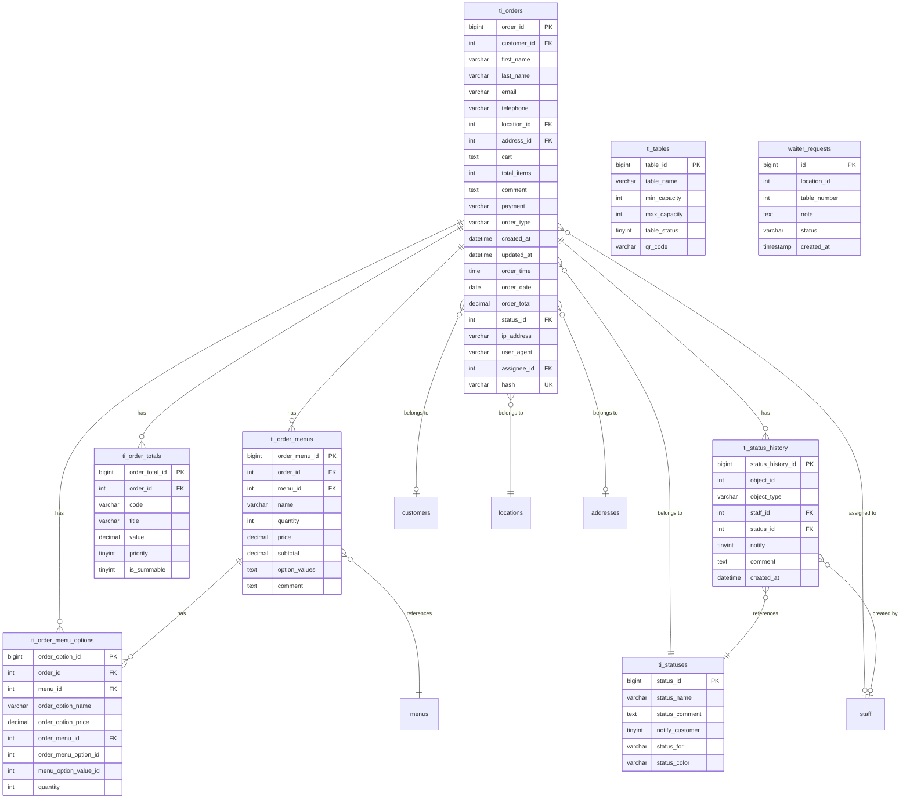

# Entity Relationship Diagram & Data Dictionary

## Database Schema Overview

**Framework**: TastyIgniter v3 (Laravel 8.x)  
**Database**: MySQL with `ti_` prefix  
**Evidence**: `paymydine.sql:L1814-1900`

## Core Order Tables

### `ti_orders` - Main Order Table
**Source**: `paymydine.sql:L1814-1850`

| Column | Type | Null | Default | Key | Description |
|--------|------|------|---------|-----|-------------|
| `order_id` | `bigint unsigned` | NO | AUTO_INCREMENT | PK | Primary key |
| `customer_id` | `int` | YES | NULL | FK→customers | Customer reference |
| `first_name` | `varchar(128)` | NO | - | - | Customer first name |
| `last_name` | `varchar(128)` | NO | - | - | Customer last name |
| `email` | `varchar(96)` | NO | - | - | Customer email |
| `telephone` | `varchar(128)` | NO | - | - | Customer phone |
| `location_id` | `int` | NO | - | FK→locations | Restaurant location |
| `address_id` | `int` | YES | NULL | FK→addresses | Delivery address |
| `cart` | `text` | NO | - | - | Serialized cart data |
| `total_items` | `int` | NO | - | - | Total item count |
| `comment` | `text` | YES | NULL | - | Order comments |
| `payment` | `varchar(128)` | NO | - | - | Payment method |
| `order_type` | `varchar(128)` | NO | - | - | Table ID or delivery type |
| `created_at` | `datetime` | NO | - | - | Creation timestamp |
| `updated_at` | `datetime` | NO | - | - | Update timestamp |
| `order_time` | `time` | NO | - | - | Order time |
| `order_date` | `date` | NO | - | - | Order date |
| `order_total` | `decimal(15,4)` | YES | NULL | - | Total amount |
| `status_id` | `int` | NO | - | FK→statuses | Current status |
| `ip_address` | `varchar(40)` | NO | - | - | Customer IP |
| `user_agent` | `varchar(128)` | NO | - | - | Browser info |
| `assignee_id` | `int` | YES | NULL | FK→staff | Assigned staff |
| `assignee_group_id` | `int unsigned` | YES | NULL | - | Staff group |
| `invoice_prefix` | `varchar(128)` | YES | NULL | - | Invoice prefix |
| `invoice_date` | `datetime` | YES | NULL | - | Invoice date |
| `hash` | `varchar(40)` | YES | NULL | UNIQUE | Order hash |
| `processed` | `tinyint(1)` | YES | NULL | - | Processed flag |
| `status_updated_at` | `datetime` | YES | NULL | - | Status change time |
| `assignee_updated_at` | `datetime` | YES | NULL | - | Assignment time |
| `order_time_is_asap` | `tinyint(1)` | NO | 0 | - | ASAP flag |
| `delivery_comment` | `text` | YES | NULL | - | Delivery notes |

**Indexes**:
- PRIMARY KEY (`order_id`)
- UNIQUE KEY `ti_orders_hash_index` (`hash`)

### `ti_order_menus` - Order Items
**Source**: `paymydine.sql:L1754-1784`

| Column | Type | Null | Default | Key | Description |
|--------|------|------|---------|-----|-------------|
| `order_menu_id` | `bigint unsigned` | NO | AUTO_INCREMENT | PK | Primary key |
| `order_id` | `int` | NO | - | FK→orders | Order reference |
| `menu_id` | `int` | NO | - | FK→menus | Menu item reference |
| `name` | `varchar(128)` | NO | - | - | Item name |
| `quantity` | `int` | NO | - | - | Quantity ordered |
| `price` | `decimal(15,4)` | YES | NULL | - | Unit price |
| `subtotal` | `decimal(15,4)` | YES | NULL | - | Line total |
| `option_values` | `text` | YES | NULL | - | Serialized options |
| `comment` | `text` | YES | NULL | - | Item comments |

**Indexes**:
- PRIMARY KEY (`order_menu_id`)

### `ti_order_totals` - Order Calculations
**Source**: `paymydine.sql:L1785-1813`

| Column | Type | Null | Default | Key | Description |
|--------|------|------|---------|-----|-------------|
| `order_total_id` | `bigint unsigned` | NO | AUTO_INCREMENT | PK | Primary key |
| `order_id` | `int unsigned` | NO | - | FK→orders | Order reference |
| `code` | `varchar(128)` | NO | - | - | Total type code |
| `title` | `varchar(128)` | NO | - | - | Display title |
| `value` | `decimal(15,4)` | NO | - | - | Amount |
| `priority` | `tinyint(1)` | NO | 0 | - | Sort order |
| `is_summable` | `tinyint(1)` | NO | 0 | - | Include in total |

**Indexes**:
- PRIMARY KEY (`order_total_id`)

### `ti_order_menu_options` - Menu Item Options
**Source**: `paymydine.sql:L1723-1753`

| Column | Type | Null | Default | Key | Description |
|--------|------|------|---------|-----|-------------|
| `order_option_id` | `bigint unsigned` | NO | AUTO_INCREMENT | PK | Primary key |
| `order_id` | `int` | NO | - | FK→orders | Order reference |
| `menu_id` | `int` | NO | - | FK→menus | Menu item reference |
| `order_option_name` | `varchar(128)` | NO | - | - | Option name |
| `order_option_price` | `decimal(15,4)` | YES | NULL | - | Option price |
| `order_menu_id` | `int` | NO | - | FK→order_menus | Order menu reference |
| `order_menu_option_id` | `int` | NO | - | - | Menu option reference |
| `menu_option_value_id` | `int` | NO | - | - | Option value reference |
| `quantity` | `int` | YES | 1 | - | Option quantity |

**Indexes**:
- PRIMARY KEY (`order_option_id`)

## Supporting Tables

### `ti_statuses` - Order Status Definitions
**Source**: `paymydine.sql:L2329-2359`

| Column | Type | Null | Default | Key | Description |
|--------|------|------|---------|-----|-------------|
| `status_id` | `bigint unsigned` | NO | AUTO_INCREMENT | PK | Primary key |
| `status_name` | `varchar(128)` | NO | - | - | Status name |
| `status_comment` | `text` | YES | NULL | - | Status description |
| `notify_customer` | `tinyint(1)` | YES | NULL | - | Notify customer |
| `status_for` | `varchar(128)` | NO | - | - | Object type |
| `status_color` | `varchar(128)` | NO | - | - | Display color |
| `created_at` | `timestamp` | YES | NULL | - | Creation time |
| `updated_at` | `timestamp` | YES | NULL | - | Update time |

**Status Values**:
- 1: "Received" (order)
- 2: "Pending" (order)
- 3: "Preparation" (order)
- 4: "Delivery" (order)
- 5: "Completed" (order)
- 6: "Confirmed" (reserve)
- 7: "Canceled" (reserve)
- 8: "Pending" (reserve)
- 9: "Canceled" (order)

### `ti_status_history` - Status Change Tracking
**Source**: `paymydine.sql:L2299-2325`

| Column | Type | Null | Default | Key | Description |
|--------|------|------|---------|-----|-------------|
| `status_history_id` | `bigint unsigned` | NO | AUTO_INCREMENT | PK | Primary key |
| `object_id` | `int` | NO | - | - | Object ID |
| `object_type` | `varchar(128)` | NO | - | - | Object type |
| `staff_id` | `int` | YES | NULL | FK→staff | Staff member |
| `status_id` | `int` | NO | - | FK→statuses | Status |
| `notify` | `tinyint(1)` | YES | NULL | - | Notify flag |
| `comment` | `text` | YES | NULL | - | Status comment |
| `created_at` | `datetime` | NO | - | - | Change time |
| `updated_at` | `timestamp` | NO | - | - | Update time |

### `ti_tables` - Restaurant Tables
**Source**: `paymydine.sql:L2428-2480`

| Column | Type | Null | Default | Key | Description |
|--------|------|------|---------|-----|-------------|
| `table_id` | `bigint unsigned` | NO | AUTO_INCREMENT | PK | Primary key |
| `table_name` | `varchar(128)` | NO | - | - | Table name |
| `min_capacity` | `int` | NO | - | - | Min capacity |
| `max_capacity` | `int` | NO | - | - | Max capacity |
| `table_status` | `tinyint(1)` | NO | - | - | Table status |
| `extra_capacity` | `int` | NO | 0 | - | Extra capacity |
| `is_joinable` | `tinyint(1)` | NO | 1 | - | Joinable flag |
| `priority` | `int` | NO | 0 | - | Display priority |
| `created_at` | `timestamp` | YES | NULL | - | Creation time |
| `updated_at` | `timestamp` | YES | NULL | - | Update time |
| `qr_code` | `varchar(30)` | YES | NULL | - | QR code |

### `waiter_requests` - Waiter Service Requests
**Source**: `app/admin/database/migrations/2024_05_10_000000_create_waiter_requests_table.php:L11-26`

| Column | Type | Null | Default | Key | Description |
|--------|------|------|---------|-----|-------------|
| `id` | `bigint unsigned` | NO | AUTO_INCREMENT | PK | Primary key |
| `location_id` | `int` | NO | - | - | Location reference |
| `table_number` | `int` | NO | - | - | Table number |
| `note` | `text` | YES | NULL | - | Request note |
| `status` | `varchar(255)` | NO | 'pending' | - | Request status |
| `created_at` | `timestamp` | YES | NULL | - | Creation time |
| `updated_at` | `timestamp` | YES | NULL | - | Update time |

**Indexes**:
- PRIMARY KEY (`id`)
- KEY `waiter_requests_location_id_index` (`location_id`)
- KEY `waiter_requests_location_id_table_number_index` (`location_id`, `table_number`)

## Entity Relationship Diagram

## Foreign Key Constraints

### ❌ CRITICAL: Missing Foreign Key Constraints

**No foreign key constraints are enforced in the database schema.** This is a significant data integrity risk.

**Implied Relationships** (enforced in code only):
- `ti_orders.customer_id` → `customers.customer_id`
- `ti_orders.location_id` → `locations.location_id`
- `ti_orders.status_id` → `ti_statuses.status_id`
- `ti_orders.assignee_id` → `staff.staff_id`
- `ti_order_menus.order_id` → `ti_orders.order_id`
- `ti_order_menus.menu_id` → `menus.menu_id`
- `ti_order_totals.order_id` → `ti_orders.order_id`
- `ti_order_menu_options.order_id` → `ti_orders.order_id`
- `ti_status_history.object_id` → `ti_orders.order_id` (when object_type='orders')
- `ti_status_history.status_id` → `ti_statuses.status_id`

**Code Evidence**:
- Relationships defined in `app/admin/models/Orders_model.php:L70-80`
- Status history creation in `app/admin/traits/LogsStatusHistory.php:L50-80`

## Data Integrity Issues

1. **No Foreign Key Constraints**: Referential integrity not enforced at database level
2. **No Unique Constraints**: Duplicate orders possible
3. **No Check Constraints**: Invalid status transitions possible
4. **No Triggers**: No automatic data validation

## Recommendations

1. **Add Foreign Key Constraints**: Enforce referential integrity
2. **Add Unique Constraints**: Prevent duplicate orders
3. **Add Check Constraints**: Validate status transitions
4. **Add Triggers**: Automatic data validation
5. **Add Indexes**: Improve query performance on frequently accessed columns