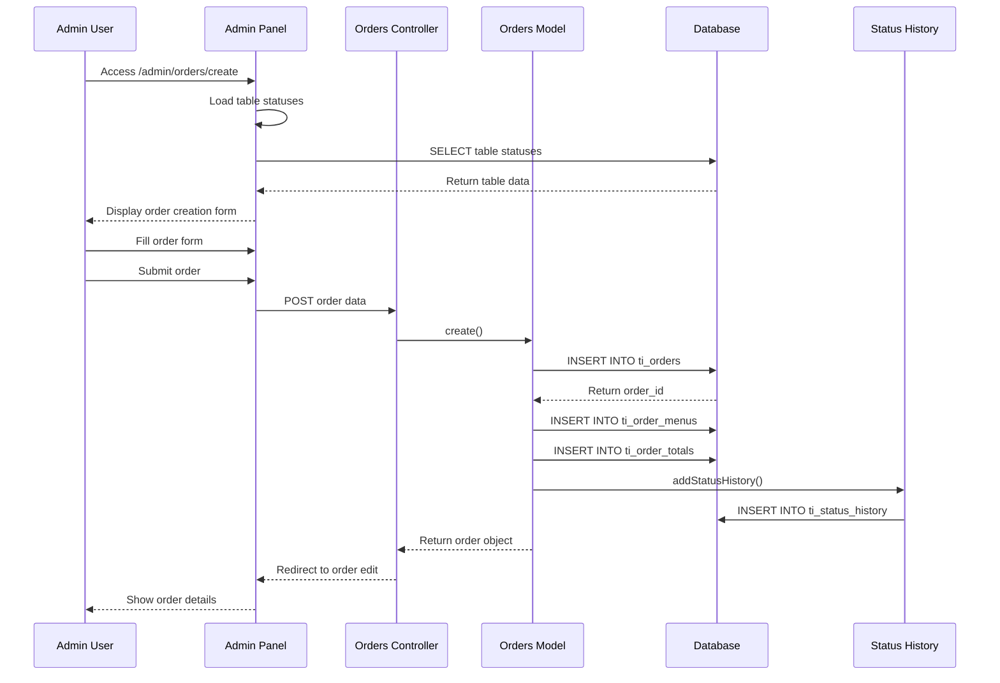
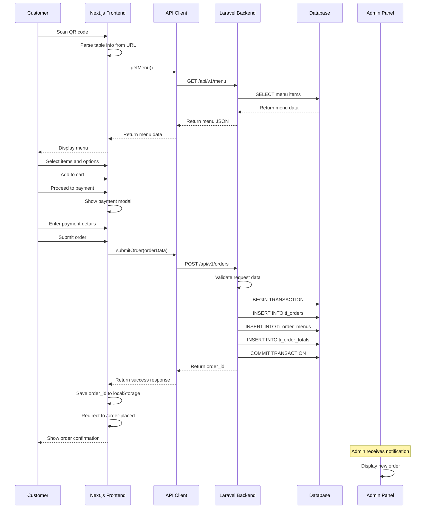
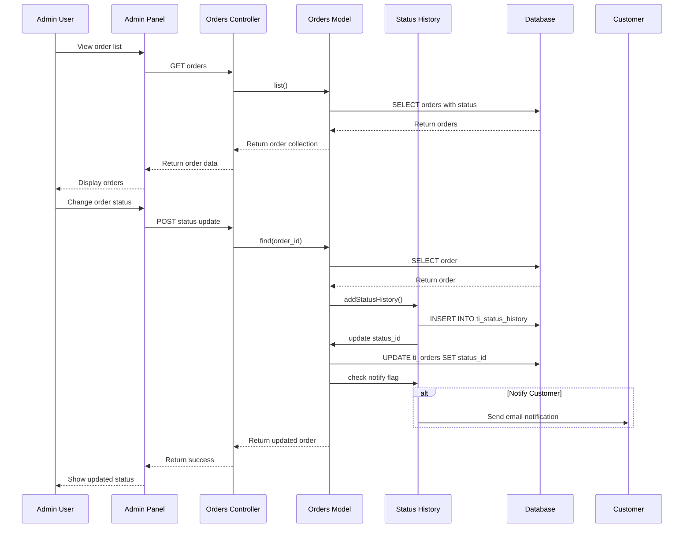
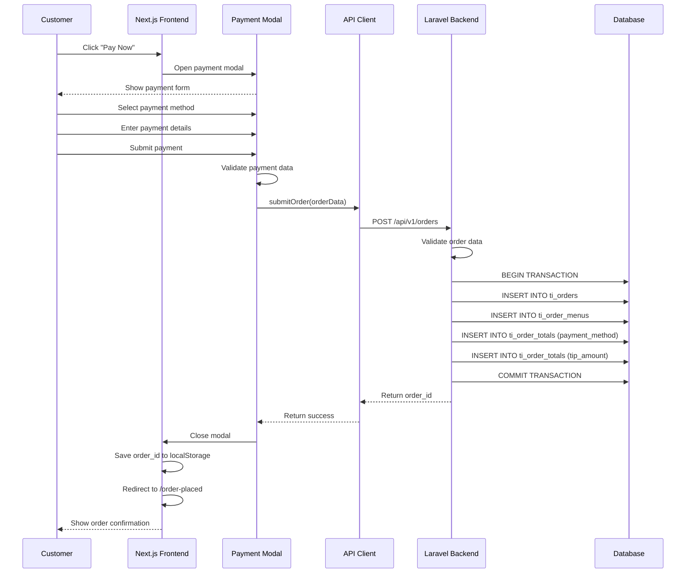
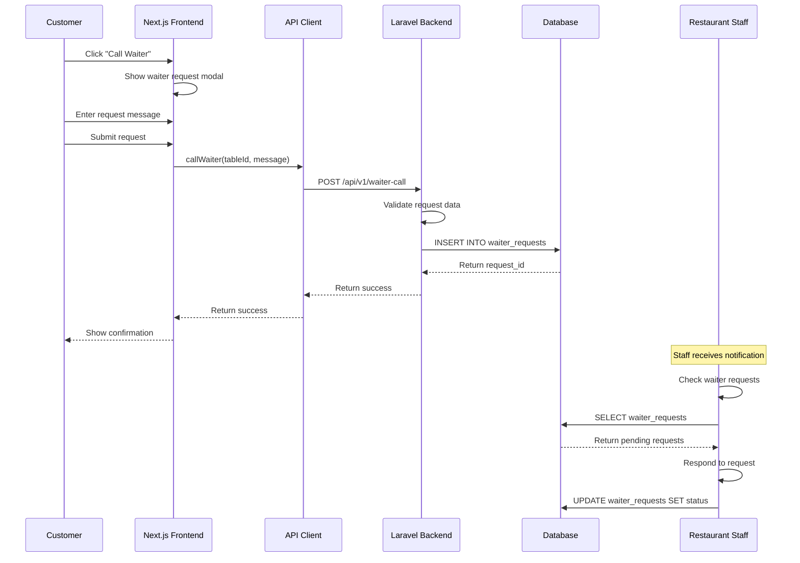
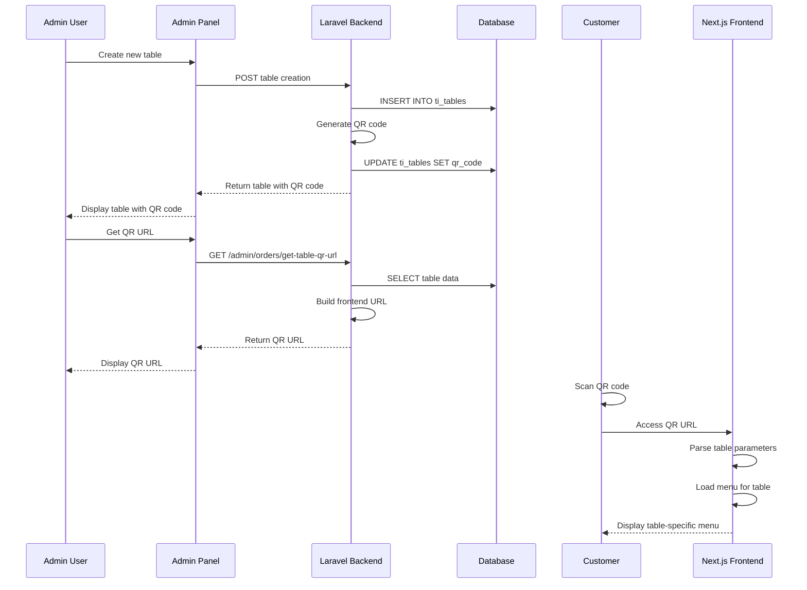

# Sequence Diagrams - Order Flow Analysis

## 1. Admin-Created Order Flow

**Evidence**: `app/admin/controllers/Orders.php:L11-127`, `app/admin/models/Orders_model.php:L1-554`

## 2. Frontend Customer Order Flow

**Evidence**: 
- Frontend: `frontend/lib/api-client.ts:L1-567`
- Backend: `app/admin/routes.php:L248-405`
- Menu: `frontend/app/menu/page.tsx:L1-1802`

## 3. Status Change Flow

**Evidence**: 
- Status update: `app/admin/controllers/Orders.php:L70-80`
- Status history: `app/admin/traits/LogsStatusHistory.php:L50-80`
- Status definitions: `paymydine.sql:L2329-2359`

## 4. Payment Flow

**Evidence**: 
- Payment modal: `frontend/app/menu/page.tsx:L300-400`
- Order submission: `frontend/lib/api-client.ts:L200-250`
- Backend processing: `app/admin/routes.php:L248-405`

## 5. Waiter Request Flow

**Evidence**: 
- Waiter request: `app/admin/controllers/Api/OrderController.php:L120-140`
- Database: `app/admin/database/migrations/2024_05_10_000000_create_waiter_requests_table.php:L11-26`
- Frontend: `frontend/lib/api-client.ts:L300-350`

## 6. QR Code Generation and Usage

**Evidence**: 
- QR generation: `app/admin/routes.php:L159-221`
- Table management: `paymydine.sql:L2428-2480`
- Frontend parsing: `frontend/app/menu/page.tsx:L1-100`

## Critical Issues Identified

### ❌ Missing Method in Order Creation
**Issue**: `$order->addOrderItem($item)` called but method doesn't exist  
**File**: `app/admin/controllers/Api/OrderController.php:L86`  
**Impact**: Order creation will fail with fatal error  
**Fix**: Implement method or use existing `addOrderMenus()`

### ❌ No Database Transactions
**Issue**: Order creation not wrapped in transactions  
**File**: `app/admin/routes.php:L248-405`  
**Impact**: Partial order creation possible on failure  
**Fix**: Wrap in `DB::transaction()`

### ❌ No Error Handling
**Issue**: Limited error handling in order creation  
**Impact**: Poor user experience on failures  
**Fix**: Add comprehensive error handling and rollback

## Performance Considerations

1. **N+1 Queries**: Order listing may cause N+1 queries
2. **No Caching**: Menu data fetched on every request
3. **No Rate Limiting**: Order creation endpoints not rate limited
4. **No Indexing**: Missing indexes on frequently queried columns

## Security Considerations

1. **No Authentication**: Order creation endpoints are public
2. **No CSRF Protection**: API endpoints lack CSRF protection
3. **No Input Sanitization**: Limited input validation
4. **No Rate Limiting**: Vulnerable to abuse