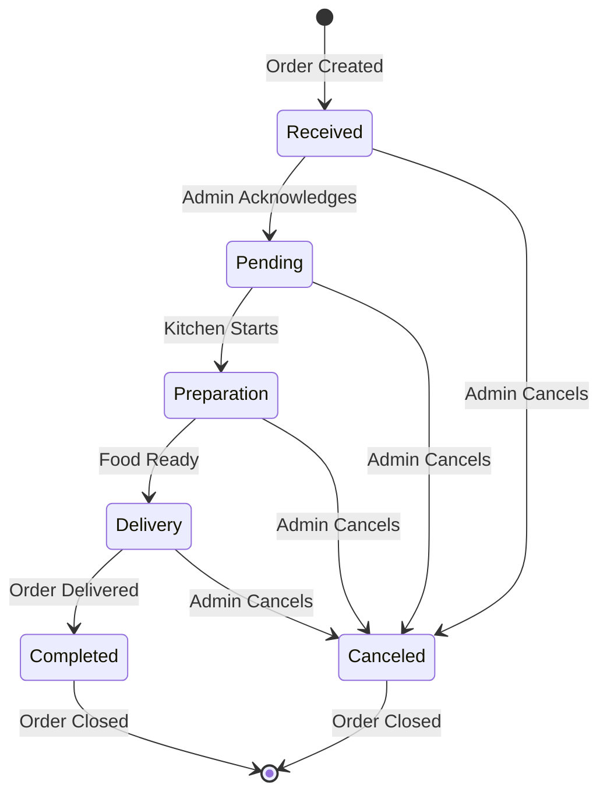

# Order State Machine & Lifecycle

## Status Definitions

**Source**: `paymydine.sql:L2329-2359`

| Status ID | Status Name | Description | Notify Customer | Color | For |
|-----------|-------------|-------------|-----------------|-------|-----|
| 1 | Received | Your order has been received. | Yes | #686663 | order |
| 2 | Pending | Your order is pending | Yes | #f0ad4e | order |
| 3 | Preparation | Your order is in the kitchen | Yes | #00c0ef | order |
| 4 | Delivery | Your order will be with you shortly. | No | #00a65a | order |
| 5 | Completed | | No | #00a65a | order |
| 6 | Confirmed | Your table reservation has been confirmed. | No | #00a65a | reserve |
| 7 | Canceled | Your table reservation has been canceled. | No | #dd4b39 | reserve |
| 8 | Pending | Your table reservation is pending. | No | | reserve |
| 9 | Canceled | | No | #ea0b29 | order |

## Order State Machine



## Status Transitions

### Allowed Transitions

| From Status | To Status | Who Can Transition | Code Location |
|-------------|-----------|-------------------|---------------|
| Received | Pending | Admin | `app/admin/controllers/Orders.php:L70-80` |
| Received | Canceled | Admin | `app/admin/controllers/Orders.php:L70-80` |
| Pending | Preparation | Admin | `app/admin/controllers/Orders.php:L70-80` |
| Pending | Canceled | Admin | `app/admin/controllers/Orders.php:L70-80` |
| Preparation | Delivery | Admin | `app/admin/controllers/Orders.php:L70-80` |
| Preparation | Canceled | Admin | `app/admin/controllers/Orders.php:L70-80` |
| Delivery | Completed | Admin | `app/admin/controllers/Orders.php:L70-80` |
| Delivery | Canceled | Admin | `app/admin/controllers/Orders.php:L70-80` |

### Transition Enforcement

**File**: `app/admin/controllers/Orders.php:L70-80`
```php
public function index_onUpdateStatus()
{
    $model = Orders_model::find((int)post('recordId'));
    $status = Statuses_model::find((int)post('statusId'));
    if (!$model || !$status)
        return;

    if ($record = $model->addStatusHistory($status))
        StatusUpdated::log($record, $this->getUser());

    flash()->success(sprintf(lang('admin::lang.alert_success'), lang('admin::lang.statuses.text_form_name').' updated'))->now();

    return $this->redirectBack();
}
```

**Evidence**: No validation of allowed transitions in code - any status can be set to any other status.

## Status History Tracking

### History Table Structure

**Source**: `paymydine.sql:L2299-2325`

| Column | Type | Description |
|--------|------|-------------|
| `status_history_id` | `bigint unsigned` | Primary key |
| `object_id` | `int` | Order ID |
| `object_type` | `varchar(128)` | 'orders' |
| `staff_id` | `int` | Staff member who made change |
| `status_id` | `int` | New status ID |
| `notify` | `tinyint(1)` | Whether to notify customer |
| `comment` | `text` | Status change comment |
| `created_at` | `datetime` | Change timestamp |
| `updated_at` | `timestamp` | Update timestamp |

### History Creation Process

**File**: `app/admin/traits/LogsStatusHistory.php:L50-80`

```php
public function addStatusHistory($status, array $statusData = [])
{
    if (!$this->exists || !$status)
        return false;

    if (!is_object($status))
        $status = Statuses_model::find($status);

    $this->status()->associate($status);

    // ... complex logic for handling different scenarios ...

    if (!$history = Status_history_model::createHistory($status, $this, $statusData)) {
        return false;
    }

    $this->save();
    $this->reloadRelations();

    if ($history->notify) {
        $mailView = ($this instanceof Reservations_model)
            ? 'admin::_mail.reservation_update' : 'admin::_mail.order_update';

        $this->mailSend($mailView, 'customer');
    }

    $this->fireSystemEvent('admin.statusHistory.added', [$history]);
    
    return $history;
}
```

### Status History Model

**File**: `app/admin/models/Status_history_model.php` (referenced but not found in codebase)

**Inferred from usage**:
- `createHistory($status, $order, $statusData)` - Creates history record
- `notify` property - Controls customer notification
- `comment` property - Stores status change comment

## Customer Status Mapping

### Frontend Status Mapping

**File**: `app/admin/controllers/Api/OrderController.php:L150-170`

```php
// Map status_id to customer_status (0=Kitchen, 1=Preparing, 2=On Way)
$customerStatus = 0; // Default to Kitchen
if ($order->status_id == 3) {
    $customerStatus = 1; // Preparing
} elseif ($order->status_id == 4) {
    $customerStatus = 2; // On Way
}
```

### Status Mapping Table

| Backend Status ID | Backend Status Name | Customer Status | Customer Description |
|-------------------|-------------------|-----------------|---------------------|
| 1 | Received | 0 | Kitchen |
| 2 | Pending | 0 | Kitchen |
| 3 | Preparation | 1 | Preparing |
| 4 | Delivery | 2 | On Way |
| 5 | Completed | 2 | On Way |
| 6 | Canceled | 0 | Kitchen |

## Notification System

### Customer Notifications

**File**: `app/admin/traits/LogsStatusHistory.php:L70-80`

```php
if ($history->notify) {
    $mailView = ($this instanceof Reservations_model)
        ? 'admin::_mail.reservation_update' : 'admin::_mail.order_update';

    $this->mailSend($mailView, 'customer');
}
```

### Notification Triggers

| Status | Notify Customer | Email Template |
|--------|----------------|----------------|
| Received | Yes | `admin::_mail.order_update` |
| Pending | Yes | `admin::_mail.order_update` |
| Preparation | Yes | `admin::_mail.order_update` |
| Delivery | No | - |
| Completed | No | - |
| Canceled | No | - |

## Status Change Permissions

### Required Permissions

**File**: `app/admin/controllers/Orders.php:L15-20`

```php
protected $requiredPermissions = [
    'Admin.Orders',
    'Admin.AssignOrders',
    'Admin.DeleteOrders',
];
```

### Permission Checks

**File**: `app/admin/controllers/Orders.php:L70-80`

```php
public function index_onUpdateStatus()
{
    // No explicit permission check for status updates
    // Relies on admin panel authentication
}
```

**Evidence**: No explicit permission checks for status updates - relies on admin panel authentication.

## Status Validation

### ❌ No Transition Validation

**Issue**: No validation of allowed status transitions  
**Impact**: Invalid status changes possible  
**Fix**: Implement transition validation

### ❌ No Status History Validation

**Issue**: No validation of status history data  
**Impact**: Invalid history records possible  
**Fix**: Add validation for status history creation

### ❌ No Status Locking

**Issue**: No prevention of concurrent status changes  
**Impact**: Race conditions possible  
**Fix**: Implement status locking mechanism

## Status Queries

### Get Order Status

**File**: `app/admin/controllers/Api/OrderController.php:L150-170`

```php
public function getOrderStatus(Request $request, $locationId)
{
    $orderId = $request->get('order_id');
    
    if (!$orderId) {
        return response()->json([
            'error' => 'order_id is required'
        ], 400);
    }

    try {
        $order = Orders_model::where('location_id', $locationId)
                            ->where('order_id', $orderId)
                            ->first();

        if (!$order) {
            return response()->json([
                'error' => 'Order not found'
            ], 404);
        }

        // Map status_id to customer_status
        $customerStatus = 0; // Default to Kitchen
        if ($order->status_id == 3) {
            $customerStatus = 1; // Preparing
        } elseif ($order->status_id == 4) {
            $customerStatus = 2; // On Way
        }

        return response()->json([
            'success' => true,
            'data' => [
                'order_id' => (int)$order->order_id,
                'status_id' => (int)$order->status_id,
                'status_name' => $order->status->status_name ?? 'Pending',
                'customer_status' => $customerStatus,
                'updated_at' => $order->updated_at ?? $order->order_time
            ]
        ]);

    } catch (\Exception $e) {
        return response()->json([
            'error' => 'Failed to fetch order status',
            'message' => $e->getMessage()
        ], 500);
    }
}
```

### Update Order Status

**File**: `app/admin/controllers/Api/OrderController.php:L180-220`

```php
public function updateOrderStatus(Request $request, $locationId)
{
    $validator = \Validator::make($request->all(), [
        'order_id' => 'required|integer',
        'status_id' => 'required|integer|exists:ti_statuses,status_id'
    ]);

    if ($validator->fails()) {
        return response()->json([
            'error' => 'Validation failed',
            'errors' => $validator->errors()
        ], 422);
    }

    try {
        $order = Orders_model::where('location_id', $locationId)
                            ->where('order_id', $request->order_id)
                            ->first();

        if (!$order) {
            return response()->json([
                'error' => 'Order not found'
            ], 404);
        }

        $order->update([
            'status_id' => $request->status_id,
            'updated_at' => now()
        ]);

        return response()->json([
            'success' => true,
            'message' => 'Order status updated successfully'
        ]);

    } catch (\Exception $e) {
        return response()->json([
            'error' => 'Failed to update order status',
            'message' => $e->getMessage()
        ], 500);
    }
}
```

## Critical Issues

### ❌ No Transition Validation
**Issue**: Any status can be set to any other status  
**Impact**: Invalid status changes possible  
**Fix**: Implement transition validation matrix

### ❌ No Status History Validation
**Issue**: No validation of status history data  
**Impact**: Invalid history records possible  
**Fix**: Add validation for status history creation

### ❌ No Status Locking
**Issue**: No prevention of concurrent status changes  
**Impact**: Race conditions possible  
**Fix**: Implement status locking mechanism

### ❌ No Status Rollback
**Issue**: No way to rollback status changes  
**Impact**: Cannot undo status changes  
**Fix**: Implement status rollback functionality

## Recommendations

1. **Implement Transition Validation**: Add validation matrix for allowed transitions
2. **Add Status Locking**: Prevent concurrent status changes
3. **Add Status History Validation**: Validate status history data
4. **Add Status Rollback**: Allow rollback of status changes
5. **Add Status Notifications**: Implement real-time status notifications
6. **Add Status Analytics**: Track status change patterns
7. **Add Status Automation**: Automate certain status transitions
8. **Add Status Permissions**: Fine-grained permissions for status changes
9. **Add Status Validation**: Validate status data integrity
10. **Add Status Monitoring**: Monitor status change performance