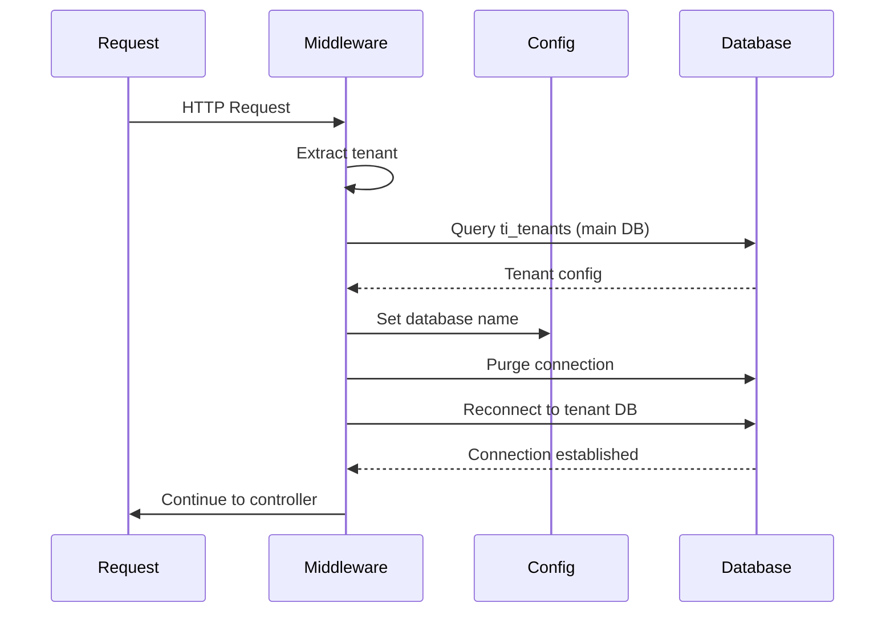
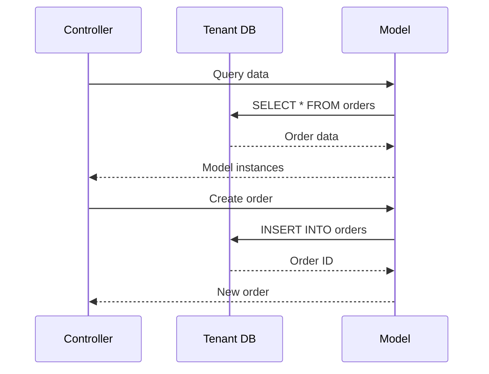

# Database Switching Mechanism

**How database connections are dynamically switched** per tenant using Laravel's database configuration system.

## 🔄 Database Switching Process

### 1. Tenant Detection
```php
// Get tenant from domain
$tenant = $this->extractTenantFromDomain($request);

if ($tenant) {
    // Find tenant in main database
    $tenantInfo = DB::connection('mysql')->table('ti_tenants')
        ->where('domain', $tenant . '.paymydine.com')
        ->where('status', 'active')
        ->first();
```
↩︎ [app/Http/Middleware/TenantDatabaseMiddleware.php:14-22]

### 2. Configuration Update
```php
if ($tenantInfo) {
    // Switch to tenant database
    Config::set('database.connections.mysql.database', $tenantInfo->database);
    
    // Reconnect with new database
    DB::purge('mysql');
    DB::reconnect('mysql');
    
    // Store tenant info in request for later use
    $request->attributes->set('tenant', $tenantInfo);
}
```
↩︎ [app/Http/Middleware/TenantDatabaseMiddleware.php:24-33]

## 🗄️ Database Configuration

### Default Connection
```php
'default' => env('DB_CONNECTION', 'mysql'),
```
↩︎ [config/database.php:15]

### MySQL Connection
```php
'mysql' => [
    'driver' => 'mysql',
    'url' => env('DATABASE_URL'),
    'host' => env('DB_HOST', '127.0.0.1'),
    'port' => env('DB_PORT', '3306'),
    'database' => env('DB_DATABASE', 'paymydine'),
    'username' => env('DB_USERNAME', 'paymydine'),
    'password' => env('DB_PASSWORD', ''),
    'unix_socket' => env('DB_SOCKET', ''),
    'charset' => 'utf8mb4',
    'collation' => 'utf8mb4_unicode_ci',
    'prefix' => env('DB_PREFIX', 'ti_'),
    'prefix_indexes' => true,
    'strict' => true,
    'engine' => null,
    'options' => extension_loaded('pdo_mysql') ? array_filter([
        PDO::MYSQL_ATTR_SSL_CA => env('MYSQL_ATTR_SSL_CA'),
    ]) : [],
],
```
↩︎ [config/database.php:31-50]

## 🔧 Middleware Implementation

### TenantDatabaseMiddleware Class
```php
class TenantDatabaseMiddleware
{
    public function handle(Request $request, Closure $next)
    {
        // Get tenant from domain
        $tenant = $this->extractTenantFromDomain($request);
        
        if ($tenant) {
            // Find tenant in main database
            $tenantInfo = DB::connection('mysql')->table('ti_tenants')
                ->where('domain', $tenant . '.paymydine.com')
                ->where('status', 'active')
                ->first();
            
            if ($tenantInfo) {
                // Switch to tenant database
                Config::set('database.connections.mysql.database', $tenantInfo->database);
                
                // Reconnect with new database
                DB::purge('mysql');
                DB::reconnect('mysql');
                
                // Store tenant info in request for later use
                $request->attributes->set('tenant', $tenantInfo);
            } else {
                // Tenant not found or inactive
                return response()->json(['error' => 'Restaurant not found or inactive'], 404);
            }
        } else {
            // No tenant detected from domain
            return response()->json(['error' => 'Invalid domain'], 400);
        }
        
        return $next($request);
    }
}
```
↩︎ [app/Http/Middleware/TenantDatabaseMiddleware.php:10-44]

## 🔄 Connection Lifecycle

### 1. Initial Connection


### 2. Database Operations


## 🏢 Multi-Tenant Database Structure

### Main Database (Shared)
- **ti_tenants**: Tenant registry and configuration
- **ti_users**: System users and admin accounts
- **ti_settings**: Global system settings

### Tenant Database (Per Restaurant)
- **ti_orders**: Restaurant orders
- **ti_menus**: Restaurant menu items
- **ti_tables**: Restaurant tables
- **ti_customers**: Restaurant customers
- **ti_locations**: Restaurant locations

## 🔒 Security Considerations

### Connection Isolation
- **Separate connections**: Each tenant has isolated database connection
- **No cross-tenant access**: Impossible to access other tenant data
- **Connection purging**: Old connections are properly closed

### Configuration Security
- **Runtime changes**: Database name changed at runtime only
- **No persistence**: Configuration changes don't persist across requests
- **Validation**: Tenant must exist and be active

## 🚀 Performance Considerations

### Connection Pooling
- **Laravel connections**: Uses Laravel's built-in connection management
- **Connection reuse**: Same connection reused for multiple queries
- **Connection purging**: Connections are purged when switching tenants

### Query Optimization
- **Tenant context**: All queries automatically use tenant database
- **No cross-tenant queries**: Impossible to accidentally query wrong tenant
- **Index optimization**: Each tenant database can be optimized independently

## 🔍 Debugging and Monitoring

### Connection Information
```php
// Get current database name
$database = config('database.connections.mysql.database');

// Get tenant info from request
$tenant = $request->attributes->get('tenant');

// Log connection details
Log::info('Tenant database switched', [
    'tenant' => $tenant->name,
    'database' => $database,
    'domain' => $request->getHost()
]);
```

### Error Handling
```php
try {
    // Database operations
    $orders = Order::all();
} catch (Exception $e) {
    Log::error('Tenant database error', [
        'tenant' => $tenant->name,
        'database' => $database,
        'error' => $e->getMessage()
    ]);
    
    return response()->json(['error' => 'Database error'], 500);
}
```

## 🧪 Testing Considerations

### Unit Testing
- **Mock connections**: Mock database connections for testing
- **Tenant context**: Test with different tenant configurations
- **Connection switching**: Verify connection switching works correctly

### Integration Testing
- **Multi-tenant setup**: Test with multiple tenant databases
- **Data isolation**: Verify no cross-tenant data access
- **Error scenarios**: Test tenant not found, database errors

## 📚 Related Documentation

- **Tenant Detection**: [detection-and-routing.md](detection-and-routing.md) - How tenants are detected
- **Isolation Risks**: [isolation-risks.md](isolation-risks.md) - Security risks and validation
- **Database Schema**: [../database/README.md](../database/README.md) - Database design and relationships