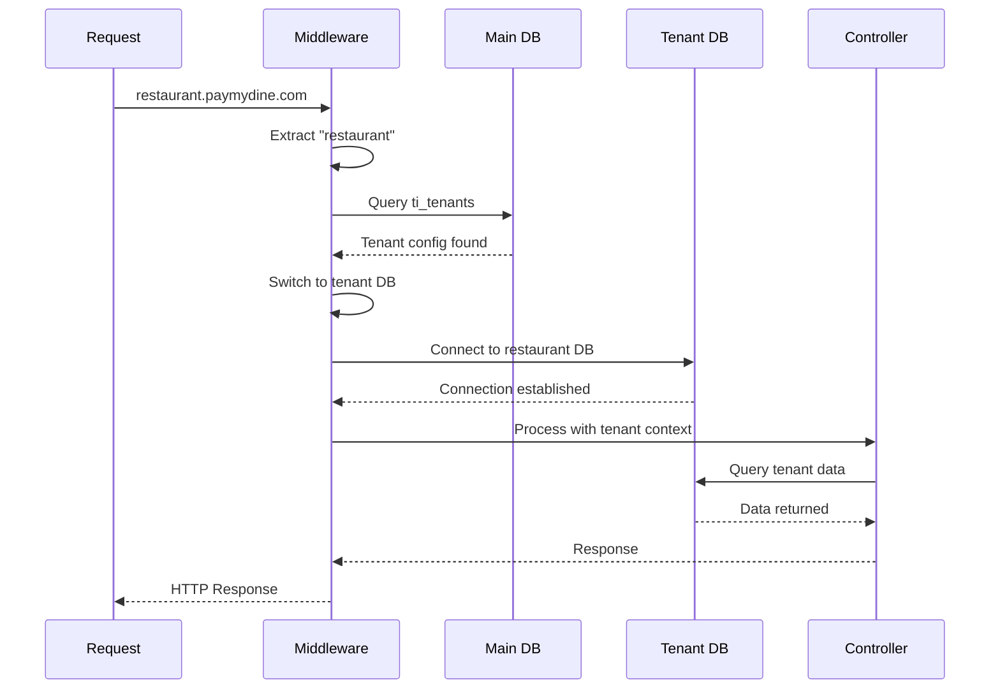
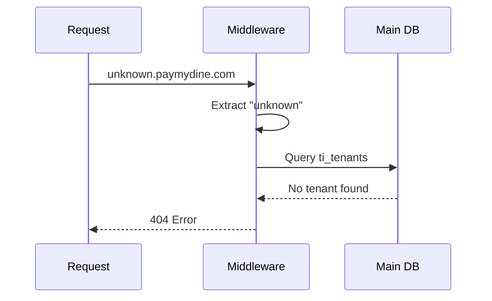

# Tenant Detection and Routing

**How tenant detection works** using subdomain-based routing with fallback mechanisms and error handling.

## 🔍 Tenant Detection Process

### 1. Subdomain Extraction
```php
// Extract tenant from domain
$tenant = $this->extractTenantFromDomain($request);
```
↩︎ [app/Http/Middleware/TenantDatabaseMiddleware.php:14-48]

### 2. Database Lookup
```php
// Find tenant in main database
$tenantInfo = DB::connection('mysql')->table('ti_tenants')
    ->where('domain', $tenant . '.paymydine.com')
    ->where('status', 'active')
    ->first();
```
↩︎ [app/Http/Middleware/TenantDatabaseMiddleware.php:19-22]

### 3. Connection Switch
```php
// Switch to tenant database
Config::set('database.connections.mysql.database', $tenantInfo->database);
DB::purge('mysql');
DB::reconnect('mysql');
```
↩︎ [app/Http/Middleware/TenantDatabaseMiddleware.php:25-30]

## 🌐 Subdomain Format

### Expected Format
- **Pattern**: `{tenant}.paymydine.com`
- **Examples**: 
  - `restaurant1.paymydine.com`
  - `mypizza.paymydine.com`
  - `cafe123.paymydine.com`

### Domain Extraction Logic
```php
private function extractTenantFromDomain(Request $request)
{
    $hostname = $request->getHost();
    // Extract subdomain logic
}
```
↩︎ [app/Http/Middleware/TenantDatabaseMiddleware.php:46-48]

## 🗄️ Tenant Database Schema

### ti_tenants Table
```sql
CREATE TABLE `ti_tenants` (
  `id` int NOT NULL AUTO_INCREMENT,
  `name` varchar(255) NOT NULL,
  `domain` varchar(255) NOT NULL,
  `database` varchar(255) NOT NULL,
  `email` varchar(255) NOT NULL,
  `phone` varchar(20) NOT NULL,
  `start` date NOT NULL,
  `end` date NOT NULL,
  `type` varchar(255) DEFAULT NULL,
  `country` varchar(255) NOT NULL,
  `description` varchar(1000) NOT NULL,
  `status` varchar(255) NOT NULL,
  `created_at` timestamp NULL DEFAULT CURRENT_TIMESTAMP,
  `updated_at` timestamp NULL DEFAULT CURRENT_TIMESTAMP ON UPDATE CURRENT_TIMESTAMP,
  PRIMARY KEY (`id`),
  UNIQUE KEY `unique_domain` (`domain`(191)),
  UNIQUE KEY `unique_database` (`database`(191))
) ENGINE=MyISAM AUTO_INCREMENT=24 DEFAULT CHARSET=utf8mb4;
```
↩︎ [db/paymydine.sql:2494-2530]

### Sample Tenant Data
```sql
INSERT INTO `ti_tenants` VALUES 
(23,'rosana','rosana.paymydine.com','rosana','rosana@test.com',
 '+4475685685','2025-04-12','2025-12-31','Organization','UK',
 'Rosana Restaurant','active','2025-04-12 01:03:34','2025-04-12 01:03:34');
```
↩︎ [db/paymydine.sql:2494-2530]

## 🔄 Request Flow

### Successful Tenant Detection


### Tenant Not Found


## 🚨 Error Handling

### Tenant Not Found
```php
// Tenant not found or inactive
return response()->json(['error' => 'Restaurant not found or inactive'], 404);
```
↩︎ [app/Http/Middleware/TenantDatabaseMiddleware.php:35-37]

### Invalid Domain
```php
// No tenant detected from domain
return response()->json(['error' => 'Invalid domain'], 400);
```
↩︎ [app/Http/Middleware/TenantDatabaseMiddleware.php:39-41]

## 🔧 Middleware Configuration

### Route Application
```php
Route::get('/redirect/qr', [QrRedirectController::class, 'handleRedirect'])
->middleware([\Igniter\Flame\Foundation\Http\Middleware\TenantDatabaseMiddleware::class]);
```
↩︎ [app/admin/routes.php:196-197]

### Bypass Middleware
```php
Route::get('/new', [SuperAdminController::class, 'showNewPage'])
    ->name('superadmin.new')
    ->middleware('superadmin.auth')
    ->withoutMiddleware([\Igniter\Flame\Foundation\Http\Middleware\TenantDatabaseMiddleware::class]);
```
↩︎ [app/admin/routes.php:200-203]

## 🌍 Frontend Tenant Detection

### Environment Configuration
```typescript
// Production environment - automatically detect from current domain
const protocol = typeof window !== 'undefined' ? window.location.protocol : 'https:';
const currentDomain = hostname || 'paymydine.com';

return {
  apiBaseUrl: `${protocol}//${currentDomain}`,
  frontendUrl: `${protocol}//${currentDomain}`,
  environment: 'production',
  tenantDetection: true,
  defaultTenant: 'paymydine'
};
```
↩︎ [frontend/lib/environment-config.ts:40-50]

### Multi-Tenant Config
```typescript
async detectTenant(): Promise<TenantConfig | null> {
  try {
    const response = await fetch('/api-server-multi-tenant.php/tenant-info');
    const data = await response.json();
    
    if (data.success) {
      this.tenantInfo = data.data;
      return this.tenantInfo;
    }
  } catch (error) {
    console.error('Failed to detect tenant:', error);
  }
  
  return null;
}
```
↩︎ [frontend/lib/multi-tenant-config.ts:20-35]

## 🔒 Security Considerations

### Domain Validation
- **Subdomain extraction**: Must validate against allowed patterns
- **SQL injection**: Parameterized queries for tenant lookup
- **Domain spoofing**: Validate against registered tenants only

### Access Control
- **Tenant isolation**: No cross-tenant data access
- **Admin bypass**: Super admin routes bypass tenant middleware
- **Error handling**: Don't leak tenant information in errors

## 🚀 Deployment Considerations

### DNS Configuration
- **Wildcard subdomain**: `*.paymydine.com` → application server
- **SSL certificates**: Wildcard SSL for subdomains
- **Load balancing**: Route subdomains to same application instance

### Database Setup
- **Tenant creation**: New database per tenant
- **Schema migration**: Apply schema to new tenant databases
- **Backup strategy**: Per-tenant database backups

## 🔍 Troubleshooting

### Common Issues
1. **Tenant not found**: Check `ti_tenants` table for domain
2. **Database connection failed**: Verify tenant database exists
3. **Subdomain not extracted**: Check hostname parsing logic
4. **Middleware not applied**: Verify route middleware configuration

### Debug Information
- **Tenant ID**: Logged in request attributes
- **Database name**: Stored in tenant info
- **Domain**: Original request hostname
- **Status**: Tenant active/inactive status

## 📚 Related Documentation

- **Database Switching**: [db-switching.md](db-switching.md) - How database connections are switched
- **Isolation Risks**: [isolation-risks.md](isolation-risks.md) - Security risks and validation
- **Architecture**: [../architecture/README.md](../architecture/README.md) - Overall system architecture